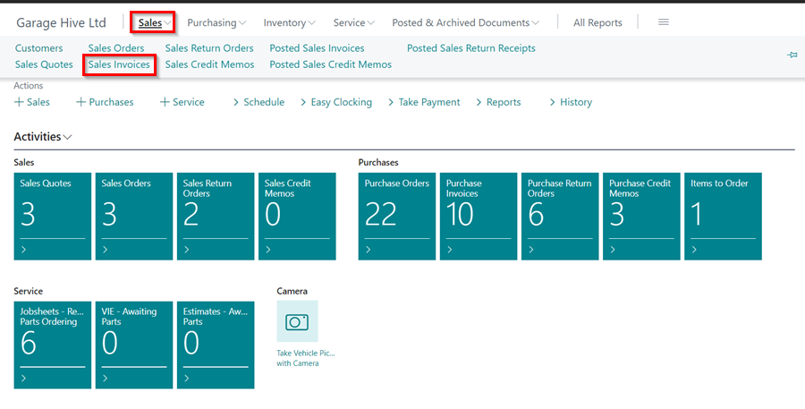
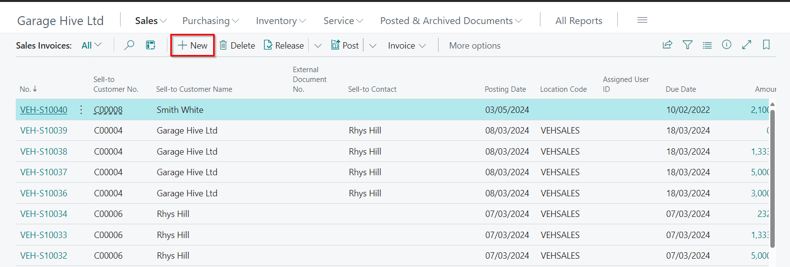
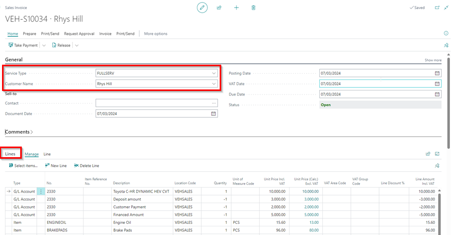
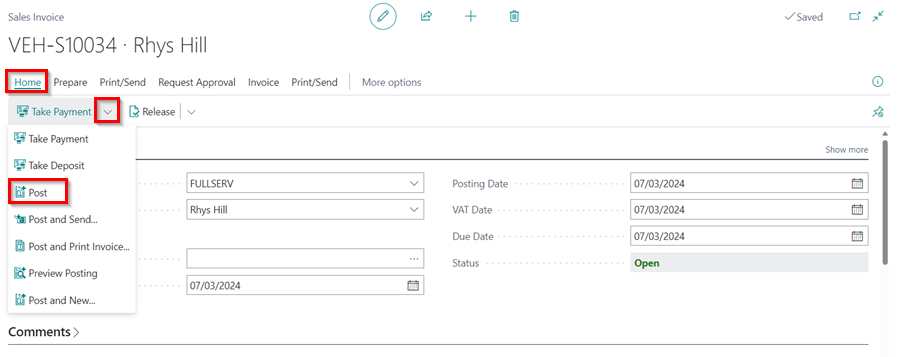
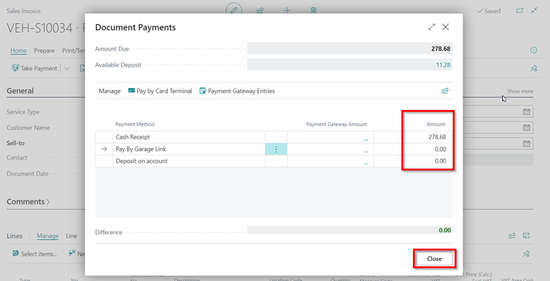

# Creating a Parts Sales Invoice in Garage Hive
**Parts Sales Invoice** is the document on which you register your parts sales to customers and invite them to pay according to the delivery and payment terms agreed upon. To manage the shipment process, use [Sales Orders](garagehive-using-parts-sales-order.html), in which sales invoicing is integrated. 
 

To create a **Sales Invoice**:
1. You can create a new **Sales Invoice** by selecting **Sales** from the navigation menu, followed by **Sales Invoice** in the **Parts Sales Admin** role centre, or by creating one from a [Sales Quote](garagehive-creating-sales-quote.html){:target="_blank"}; select **Home** from the **Sales Quote** menu bar, followed by **Make Invoice**.

   

2. In the **Sales Invoice** list, select **New** from the action bars.

   

3. In the **General** FastTab, you can add a **Service Type**, or leave the **Service Type** blank. Select the customer to add to the quote in the **Customer Name** field, then go to the **Lines** sub-page to add the items, and double-check that the correct price and quantity are added.

   

4. When the customer pays the bill, you can proceed with posting the document and taking payment. select the **Post** option from the **Take Payment** split button dropdown menu under **Home** in the menu bar.

   

5.  Confirm that you want to **Post**, and then select the method of payment and enter the amount in the **Amount** field. Click **Close**.

   

[Go back to top](#top)

 

### **See Also**

[Creating a Parts Sales Quote in Garage Hive](garagehive-creating-sales-quote.html){:target="_blank"} \
[Using Parts Sales Order in Garage Hive](garagehive-using-parts-sales-order.html){:target="_blank"} \
[Using Parts Sales Return Order in Garage Hive](garagehive-using-sales-return-order.html){:target="_blank"} \
[Item Substitution Management in Garage Hive](garagehive-item-substitution-management.html){:target="_blank"}
