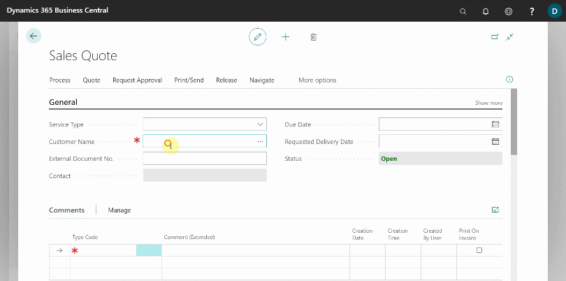
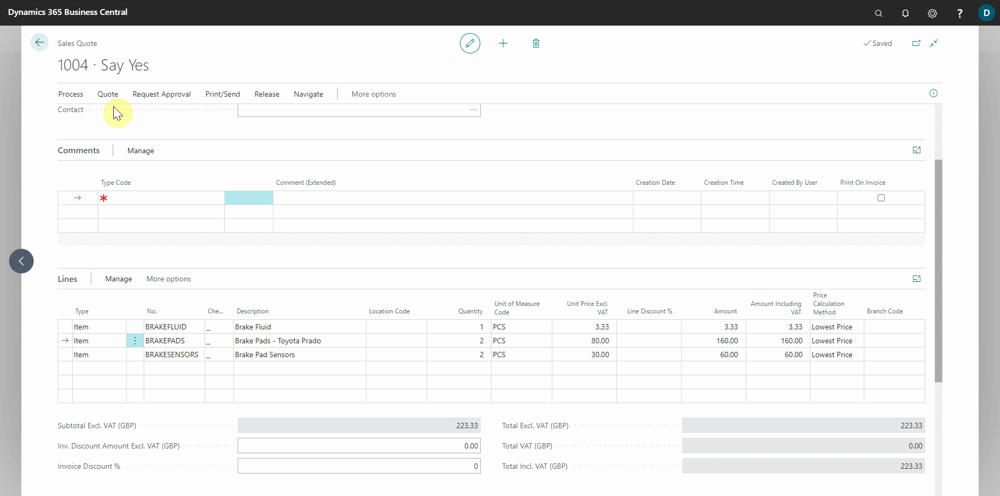

# Creating a Parts Sales Quote in Garage Hive
**Parts Sales Quote** is a document that you create to make offers to customers to sell parts on specific delivery and payment terms. You can change and resend the sales quote as many times as necessary while negotiating with the customer. When the customer accepts the offer, you convert the **Parts Sales Quote** into a sales invoice or a sales order and complete the sale. To create a **Sales Quote**:
1. Select **Sales** and then **Sales Quotes** from the **Parts Sales Admin** role centre's navigation menu. If you're working from the **Service Advisor** role centre, use the top-right corner search icon to look for **Sales Quote**.
2. In the **Sales Quotes** list, select **New** from the action bars.

   

3. In the **General** FastTab, you can add a **Service Type**, or leave the **Service Type** blank. Select the customer to add to the quote in the **Customer Name** field, then go to the **Lines** sub-page to add the items, and double-check that the correct price and quantity are added.

   

4. You can now preview and email the quote to the customer by selecting **Print/Send** from the actions bar, followed by **Email Quote**.

   

5. When the customer receives and confirms the quote, you can proceed with the supply of the parts by creating a **Sales Order** to confirm the parts order or a **Sales Invoice** to confirm the order and receive payment. Choose Process from the actions bar, followed by **Make Order** or **Make Invoice**.

   

 

### **See Also**

[Using Parts Sales Order in Garage Hive](garagehive-using-parts-sales-order.html) \
[Creating a Sales Parts Invoice](garagehive-creating-sales-invoice.html) \
[Using Parts Sales Return Order in Garage Hive](garagehive-using-sales-return-order.html) \
[Item Substitution Management in Garage Hive](garagehive-item-substitution-management.html)