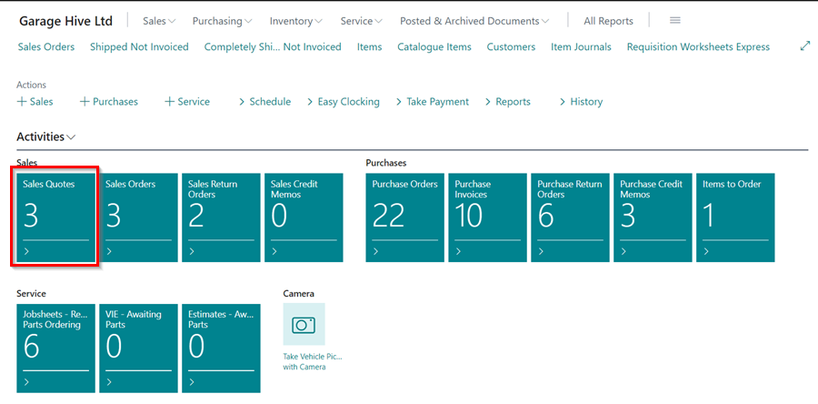
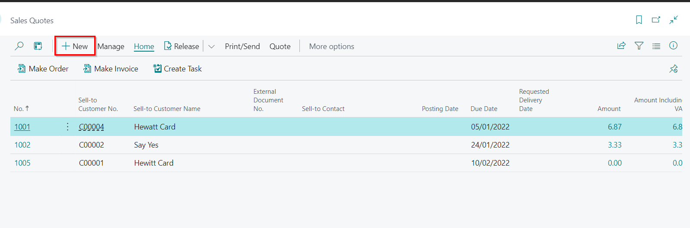
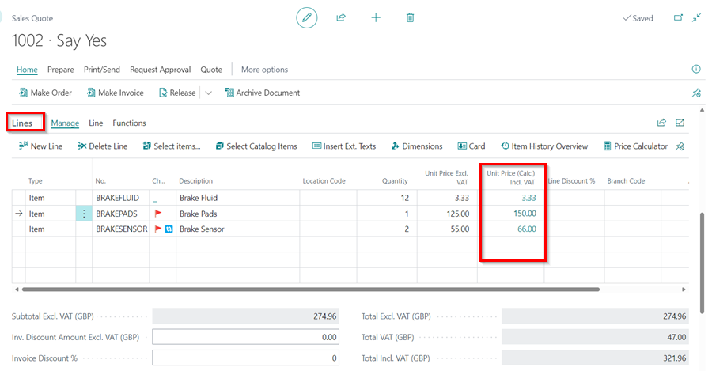
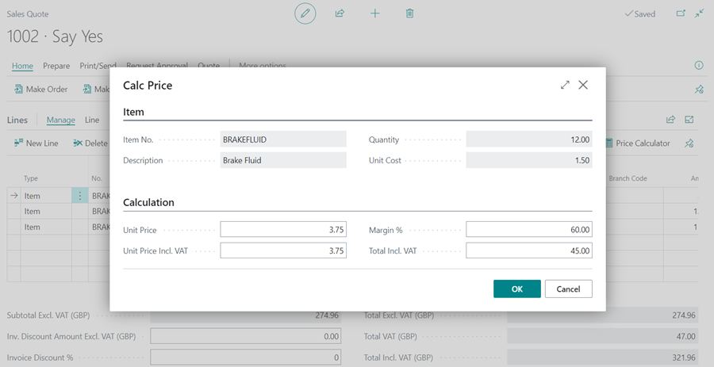
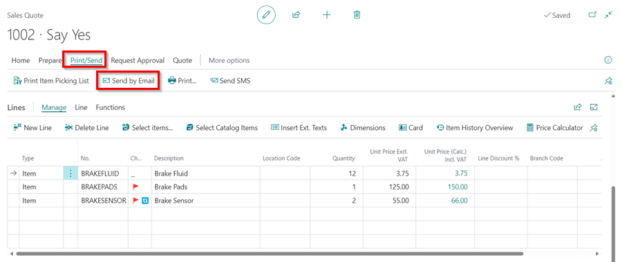
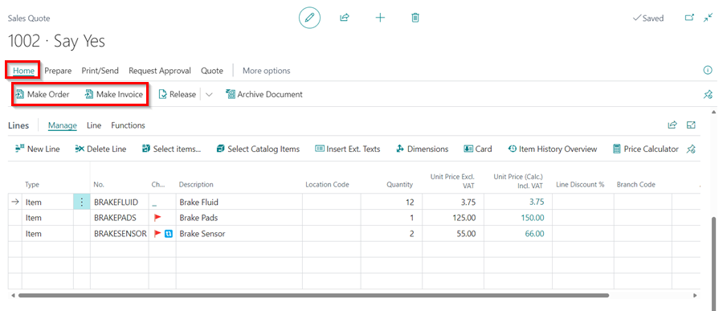

# Creating a Parts Sales Quote in Garage Hive
**Parts Sales Quote** is a document that you create as an estimate of the cost of parts to sell to customers. You can change and resend the sales quote as many times as necessary while negotiating with the customer. If the customer accepts the offer, you convert the **Parts Sales Quote** into a sales invoice or a sales order and complete the sale. 

To create a **Sales Quote**:
1. Select the **Sales Quotes** tile from the **Parts Sales Admin** role centre; If you're working from the **Service Advisor** role centre, use the top-right corner search icon to look for **Sales Quote**.

   

2. In the **Sales Quotes** list page, select **New** from the action bars.

   

3. Select the customer to add to the quote in the **Customer Name** field, then go to the **Lines** sub-page to add the items, and double-check that the correct price and quantity are added.
4. The column **(Unit Price (Calc.) Inc. VAT)** assists you in calculating the selling price and margin.

   

5. Click on the amount in the column, and enter the **Unit Price** or **Margin %** in the **Edit - Calc Price** window. For example, you can enter a margin of 60 % for all items.

   

6. You can now preview and email the quote to the customer by selecting **Print/Send** from the menu bar, followed by **Send by Email**.

   

7. When the customer receives and confirms the quote, you can proceed with the supply of the parts by creating a **Sales Order** to confirm the parts order or a **Sales Invoice** to confirm the order and receive payment. Choose **Home** from the menu bar, followed by **Make Order** or **Make Invoice**.

   

[Go back to top](#top)

 

### **See Also**

[Using Parts Sales Order in Garage Hive](garagehive-using-parts-sales-order.html){:target="_blank"} \
[Creating a Sales Parts Invoice](garagehive-creating-sales-invoice.html){:target="_blank"} \
[Using Parts Sales Return Order in Garage Hive](garagehive-using-sales-return-order.html){:target="_blank"} \
[Item Substitution Management in Garage Hive](garagehive-item-substitution-management.html){:target="_blank"}