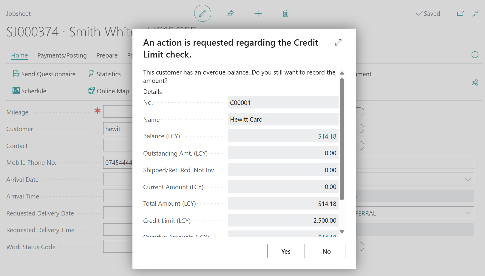
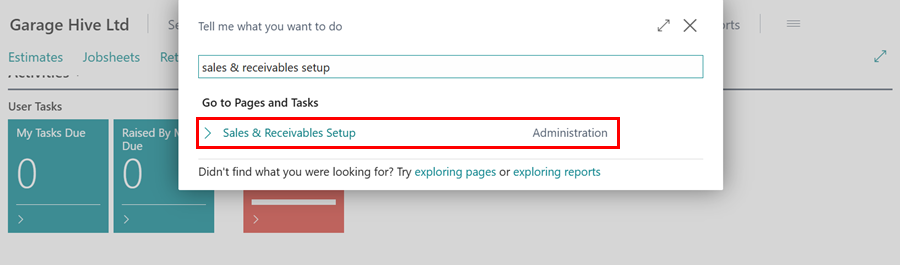
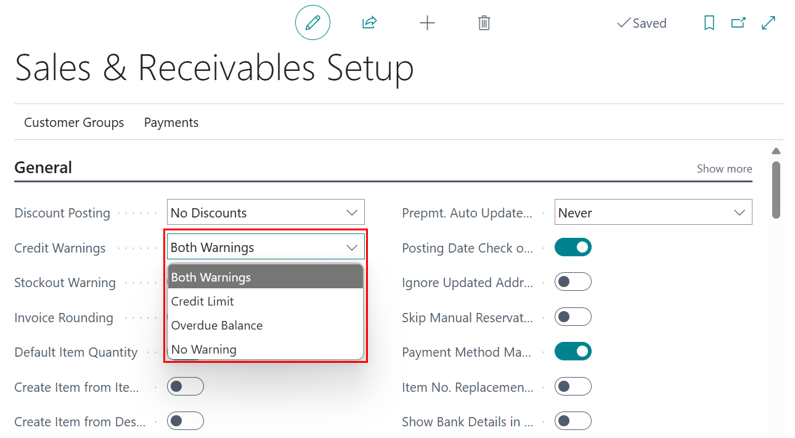

## In this article
1. [Enabling and Disabling Customer Credit Limit and Overdue Balances Notifications](#enabling-and-disabling-customer-credit-limit-and-overdue-balances-notifications)
2. [Automatically Blocking Customers Who Exceed Credit Limits](#automatically-blocking-customers-who-exceed-credit-limits)

### Enabling and Disabling Customer Credit Limit and Overdue Balances Notifications
1. The **Credit Limit and overdue Balance** notification, appears when a customer is added to a new service document.

   

2. To enable or disable this notification, choose the  icon in the top right corner, enter **Sales & Receivables Setup**, and select the related link.

   

3. Under **General** FastTab, in the **Credit Warnings** field, select either of the following:
   * Both Warnings - This enables both warning when credit limit is exceeded, or when there is an overdue balance.
   * Credit Limit - This enables the warning when credit limit is exceeded.
   * Overdue Balances - This enables the warning when there is an overdue balance.
   * No Warning - This disables both warnings for credit limit, and overdue balance.

   

[Go back to top](#top)

### Automatically Blocking Customers Who Exceed Credit Limits
Automatically blocking customers who have exceeded their credit limit ensures that no documents are created or posted for them until the balance owed goes below the credit limit set. Here's how to set up automatic customer blocking:
1. In the top right corner, choose the  icon, enter **Sales & receivables Setup**, and select the related link.

   

2. Select the **Block Cust. With Overdue Cred. Limit** slider on the **Sales & Receivables Setup** page to enable the automatic blocking of customers who have exceeded their credit limit.

   

3. If a customer should not be allowed further bookings, set the block on the **Customer Cards** page. Ensure the **Credit Limit** is defined and select **All** in the **Blocked** field to prevent any transactions once the credit limit is exceeded.

   

4. In **User Management** page, you can control which users can change credit limits and unblock customers. For more information, click [here](garagehive-user-management.html#enabling-data-permissions-for-a-user).

[Go back to top](#top)