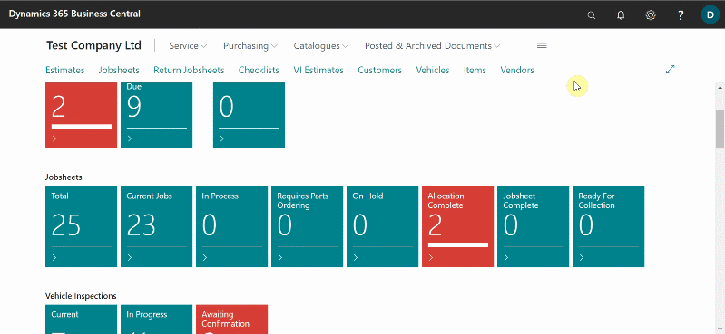
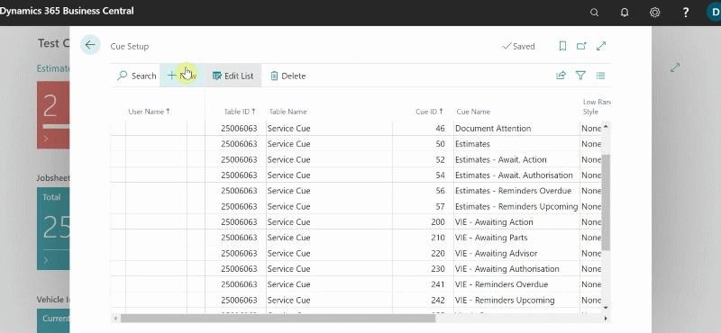
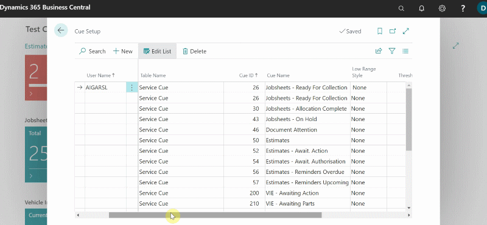

# Set Up of the Cues and Actions Tiles on the Role Centre
You can set up the **Cues and Actions Tiles** that appear on the Role Centre to include an indicator that changes colour based on the data values in the Cues. To do this:
1. In the top right corner, choose the  icon, enter **Cue Setup**, and then select the related link.
2. The **Cue Setup** page appears. The page lists the current setup as it is. The setup that apply to all users have a blank **User Name** field, those that apply to a specific user include user's name in the **User Name** field.

   

3. Select **New** from the menu bar. Fill in the fields as described below:

   | Field         | Description                                                                                                                                                                                 |
   | :------------ | :------------------------------------------------------------------------------------------------------------------------------------------------------------------------------------------ |
   | **User Name** | Leave this field blank to set up for all user, or select the user name to set of a specific user.                                                                                           |
   | **Table ID**  | Use the drop down list to find the table in which contains the cue to setup.  The **Table Name** will be automatically filled in based on the **Table ID** selection.                       |
   | **Cue ID**    | This is the ID of the Cue that you want to setup. Use the drop down list to find the Cue that you want. The **Cue Name** will be automatically filled in based on the **Cue ID** selection. |

      

4. To set up the colour for a **Cue**, set the fields as described in the following table:

   | Field                  | Description                                                                                                                                                                            |
   | :--------------------- | :------------------------------------------------------------------------------------------------------------------------------------------------------------------------------------- |
   | **Low Range Style**    | Specifies the colour of the tile when the Cue's value is below the value of the **Threshold 1** field.                                                                                 |
   | **Threshold 1**        | Specifies the value at or above which the tile changes to the colour specified by the **Middle Range Style** field.                                                                    |
   | **Middle Range Style** | Specifies the colour of the tile when Cue's value is greater than or equal to the value of the **Threshold 1** field but less than or equal to the value of the **Threshold 2** field. |
   | **Threshold 2**        | Specifies the value above which the tile changes to the colour specified by the **High Range Style** field.                                                                            |
   | **High Range Style**   | Specifies the colour to use when the Cue's value is above the value of the **Threshold 2** field.                                                                                      |

5. The following table lists the colours that correspond to the options of the **Low Range Style**, **Middle Range Style**, and **High Range Style** fields:

   | Option           | Colour                                |
   | :--------------- | :------------------------------------ |
   | **None**         | No color (same color as the Cue tile) |
   | **Favourable**   | Green                                 |
   | **Unfavourable** | Red                                   |
   | **Ambiguous**    | Yellow                                |
   | **Subordinate**  | Gray                                  |

      

