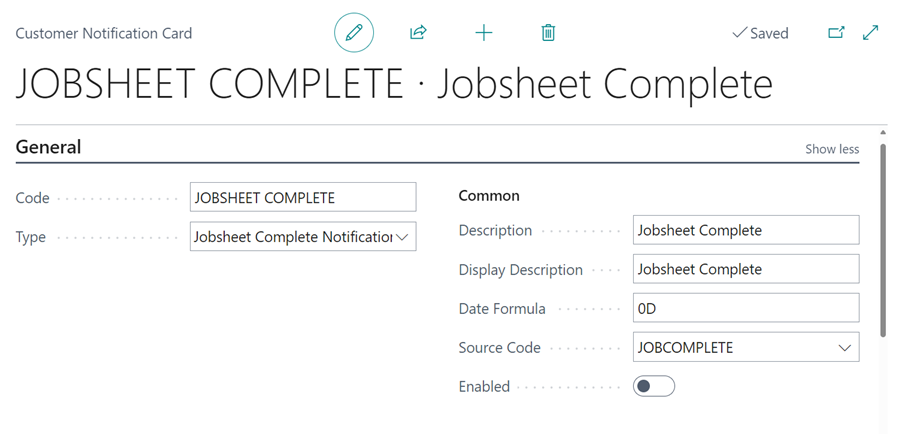
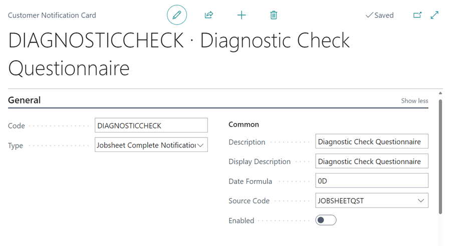

# Types of Customer Notifications in Garage Hive

In Garage Hive, customer notifications are system settings that allow the system to communicate specific information to the customer, such as MOT Reminders, Booking Reminders, Survey Notifications, or other customer notifications. These notifications enable the garage owner to engage the customer effectively while also keeping the customer up to date on important information. Let's look at the different customer notifications available in Garage Hive.

   

## In this article
1. [Vehicle Date Reminder Notification](#vehicle-date-reminder-notification)
2. [Booking Reminder Notification](#booking-reminder-notification)
3. [Booking Confirmation Notification](#booking-confirmation-notification)
4. [Survey Notification](#-urvey-notification)
4. [Checklist Notification](#checklist-notification)
5. [Job Authorisation Notification](#job-authorisation-notification)
6. [Jobsheet Complete Notification](#jobsheet-complete-notification)
7. [Jobsheet Questionnaire Notification](#jobsheet-questionnaire-notification)

### Vehicle Date Reminder Notification
**Vehicle Date Reminder** notifications are used in the system when you need to notify the customer about upcoming due dates for recurring work on their vehicle, such as MOT reminders, and service reminders.
Read **[this article](garagehive-vehicle-date-reminders.html){:target="_blank"}** to learn more about setting up and using **Vehicle Date Reminders**.
Here is an example of an **MOT Reminder** notification setup.

   

[Go back to top](#top)

### Booking Reminder Notification
**Booking Reminder** notifications are used in the system to send reminders to customers the day before their previously made booking. This helps customers remember their booking and show up on time; if there are any changes, they communicate in advance.
Read **[this article](garagehive-booking-reminders.html){:target="_blank"}** to learn more on how to setup and use the **Booking Reminder** notification.
Here is an example of a **Booking Reminder** notification setup.

   

[Go back to top](#top)

### Booking Confirmation Notification
**Booking Confirmation** notifications are used in the system to send confirmations to customers right after they make a booking. The confirmation is sent to the customer to ensure that the customer is aware that the booking has been made successfully and to possibly share the details of the booking.
Read **[this article](garagehive-booking-confirmation.html){:target="_blank"}** to learn more on how to setup and use the **Booking Confirmation** notification.
Here is an example of a **Booking Confirmation** notification setup.

   

[Go back to top](#top)

### Survey Notification
**Survey Notification** is a system notification that automatically sends a survey link to customers right after their job is completed. Surveys help in determining the NPS score, which is a measure of customer loyalty and satisfaction.
Read **[this article](garagehive-surveys-setting-up-customer-surveys.html){:target="_blank"}** to learn more on how to setup and use the **Survey Notification**.
Here is an example of a **Survey Notification** setup.

   

[Go back to top](#top)

### Job Authorisation Notification
**Job Authorisation Notification** is used to send customers an online authorization link for approval. The customer online authorisation link gives the customer access to the online document, which they can view and approve at their own time.
Read **[this article](garagehive-online-documents-setting-up-online-documents.html#customer-notification-set-up){:target="_blank"}** to understand more about the **Job Authorisation Notification**.
Here is an example of a **Job Authorisation Notification** setup.

   

[Go back to top](#top)

### Checklist Notification
**Checklist Notification** is used to send a link to the online checklist to the customer, this helps to share visual material of the inspection report. 
Here is an example of a **Checklist Notification** setup.

   

### Jobsheet Complete Notification
The **Jobsheet Complete Notification** is used to send a notification to the customer when the job is marked as complete. Read **[this article](garagehive-jobsheet-complete-notification.html){:target="_blank"}** Here is an example of a **Jobsheet Complete Notification** setup.

   

### Jobsheet Questionnaire Notification
**Jobsheet Questionnaire Notification** is used to gather additional information about a job before the customer arrives by sending a **Diagnostic Questionnaire**. Read **[this article](garagehive-diagnostic-questionnaire.html){:target="_blank"}** to understand more about the **Diagnostic Questionnaire**. Here is an example of a **Diagnostic Check Questionnaire** setup.

   

[Go back to top](#top)