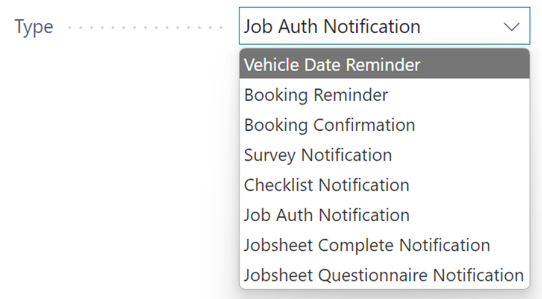
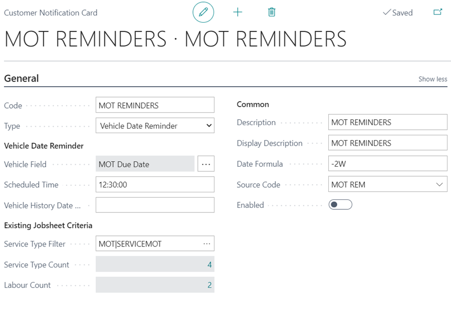
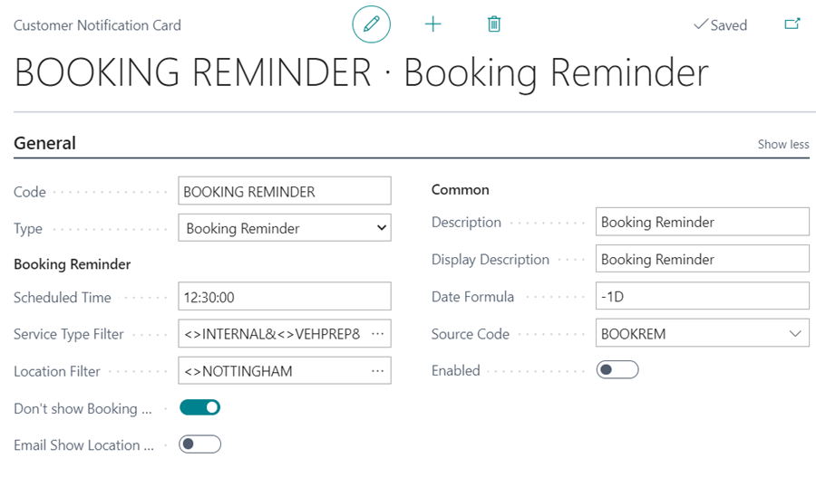
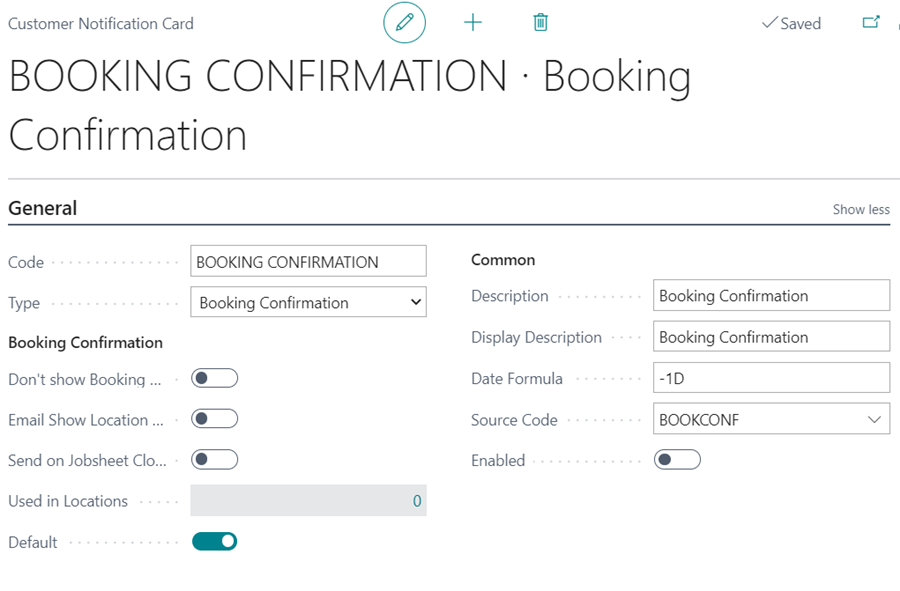
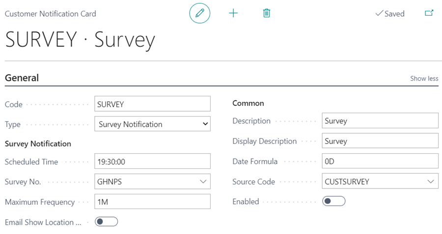
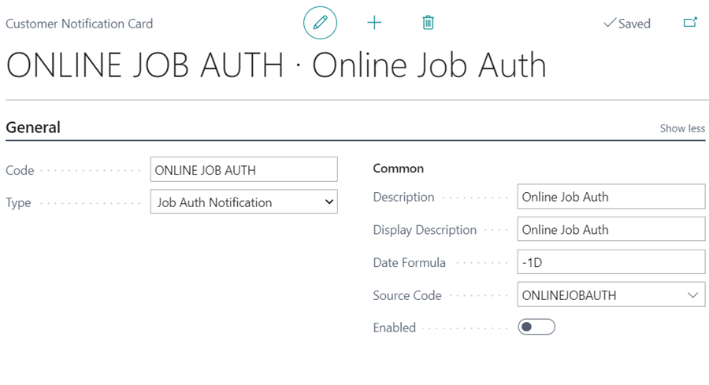
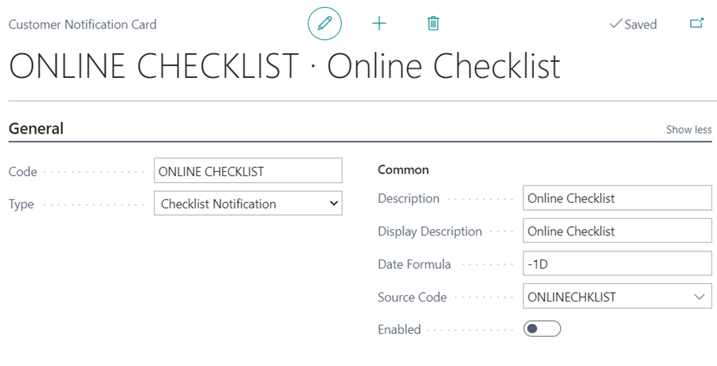

# Types of Customer Notifications in Garage Hive

In Garage Hive, customer notifications are system settings that allow the system to communicate specific information to the customer, such as MOT Reminders, Booking Reminders, Survey Notifications, and so on. These notifications enable the garage owner to engage the customer effectively while also keeping the customer up to date on important information. Let's look at the different customer notifications available in Garage Hive.

   

## In this article
1. [Vehicle date reminder notification](#vehicle-date-reminder-notification)
2. [Booking reminder notification](#booking-reminder-notification)
3. [Booking confirmation notification](#booking-confirmation-notification)
4. [Survey notification](#-urvey-notification)
4. [Checklist notification](#checklist-notification)
5. [Job authorisation notification](#job-authorisation-notification)

### Vehicle date reminder notification
**Vehicle Date Reminder** notifications are used in the system when you need to notify the customer about upcoming due dates for recurring work on their vehicle, such as MOT reminders, service reminders, and so on.
Here is an example of an **MOT Reminder** notification setup.

   
   
Read [this article](garagehive-vehicle-date-reminders.html) to learn more about setting up and using **Vehicle Date Reminders**.

### Booking reminder notification
**Booking Reminder** notifications are used in the system to send reminders to customers the day before their previously made booking. This helps customers remember their booking and show up on time; if there are any changes, they communicate in advance.
Here is an example of a **Booking Reminder** notification setup.

   

Read [this article](garagehive-booking-reminders.html) to learn more on how to setup and use the **Booking Reminder** notification.

### Booking confirmation notification
**Booking Confirmation** notifications are used in the system to send confirmations to customers right after they make a booking. The confirmation is sent to the customer to ensure that the customer is aware that the booking has been made successfully and to possibly share the details of the booking.
Here is an example of a **Booking Confirmation** notification setup.

   

Read [this article](garagehive-booking-confirmation.html) to learn more on how to setup and use the **Booking Confirmation** notification.

### Survey notification
**Survey Notification** is a system notification that automatically sends a survey link to customers right after their job is completed. Surveys help in determining the NPS score, which is a measure of customer loyalty and satisfaction.
Here is an example of a **Survey Notification** setup.

   

Read [this article](garagehive-surveys-setting-up-customer-surveys.html) to learn more on how to setup and use the **Survey Notification**.

### Job authorisation notification
**Job Authorisation Notification** is used to send customers an online authorization link for approval. The customer online authorisation link gives the customer access to the online document, which they can view and approve at their own time.
Here is an example of a **Job Authorisation Notification** setup.

   

Read [this article](garagehive-online-documents-setting-up-online-documents.html#customer-notification-set-up) to understand more about the **Job Authorisation Notification**.

### Checklist notification
**Checklist Notification** is used to send a link to the online checklist to the customer, this helps to share visual material of the inspection report. 
Here is an example of a **Checklist Notification** setup.

   

