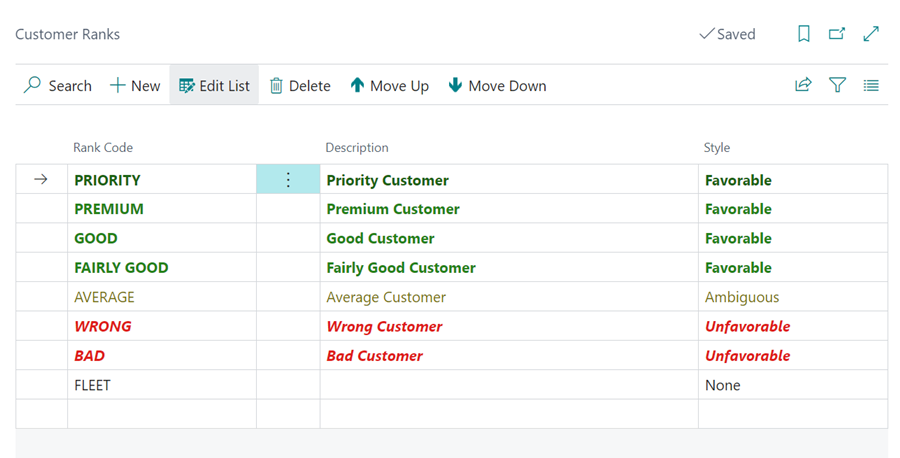

# We are still working on this article!
We are currently reviewing this article before it is published, check back later.

# How to Use Customer Ranking in Garage Hive
Garage Hive's customer ranking feature allows you to rate customers based on your experience with them at the garage. You can customise the rating criteria based on your preferences, such as customer loyalty, applicable discounts, previous purchase behaviour, quality of interaction, and more. Whenever a customer is ranked, the next time a new service document is created for them, you will receive a notification about their ranking.

## In this article
1. [Customer Ranking Setup](#customer-ranking-setup)
2. [How to Rank the Customers](#how-to-rank-the-customers)

### Customer Ranking Setup
1. In the top right corner, choose the  icon, enter **Customer Ranks**, and select the related link.

   

2. In the **Customer Ranks** page, enter the ranks that you would want rank your customer. In the column **Style** select each style that matches your the ranks, which also changes the colour of the rank.

   

3. When done adding the different ranks, exit the page.
4. To enable the notification on the customer rank each time a new service document is created for the customer, choose the  icon, enter **Service Mgt. Setup GH**, and select the related link.

   

5. Enable the **Prompt Customer Rank in Documents** slider, under the **General** FastTab.

   

[Go back to top](#top)

### How to Rank the Customers
1. To rank the existing customers, open the customer card of the customer you want to rank.
2. Under the **General** FastTab, there is **Customer Ranking** section. Click on the ellipsis (...) at the end of the **Rank Code** field.

   

3. Select the customer's rank in the **Code** field and add a comment in the **Comment** textbox. Click **OK**.

   

4. The customer ranking details will be added in the customer card.

   

5. The **Customer Ranking** details notification will be shown each time a new document is created for the customer.

   

[Go back to top](#top)