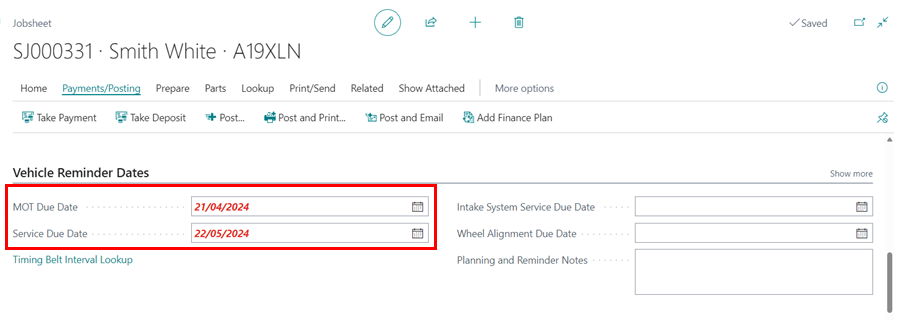

# Customising Vehicle Reminder Dates
1. [Adding a Default Period for a Vehicle Reminder Date](#adding-a-default-period-for-a-vehicle-reminder-date)
2. [Changing the Default Period for the Vehicle Reminder Date Colour to Change to Red When Due](#changing-the-default-period-for-the-vehicle-reminder-date-colour-to-change-to-red-When-due)
3. [Adding MOT and Service Dates to be Checked When Posting a Job](#adding-mot-and-service-dates-to-be-checked-when-posting-a-job)

### Adding a Default Period for a Vehicle Reminder Date
Vehicle reminder dates in the Jobsheet and Vehicle Card can be customised to have a default period. Here is how you can customise the dates from the **Service Labour List** page:
1. Select **Catalogues** and then **Labours** from the role centre **Navigation Menu**, or search for **Service Labour List** at the top-right corner search icon.
2. Choose the labour from the **Labour List** page to customise the date. In this case, we'll go with **Service Labour**.

   

3. In the **Service Labour** card, a field called **Default Period Date Formula** is under the **General** FastTab. Enter the number of days (D), months (M), or years (Y) after which the vehicle should have the **Service Labour** done. If your formula is a combination of days, months, or years, use a **+ (Plus sign)s** in between, for example, **1Y+6M**. When this field is left blank, the default period is **1 Year**. Exit the **Service Labour** card by pressing the **Esc** key.

   

4. Open any jobsheet that has **Service Labour** allocated to it to update the **Service Due Date**. There will be a notification at the top of the jobsheet that **Vehicle Reminder Dates Needs Updating**; select **Action List** from the notification.

   

5. The **Update Vehicle Dates** page displays the **Old Date** column, which contains the current date, the **New Date** column, which is empty, and the **Action List** column, which includes the actions you can take to fill in the **New Date** column. Select **Add 1 Year and 6 Months** on the **Service Due Date** row to update it to the 1 year and 6 months customisation you made. **Close** the page and check the **Service Due Date** field to see if it has been updated.

   

If you start to post the jobsheet without updating the **Service Due Date**, you will be prompted to do so before proceeding.

   

[Go back to top](#top)

### Changing the Default Period for the Vehicle Reminder Date Colour to Change to Red When Due
1. When the Vehicle Reminder Date is approaching, the date in the **Jobsheet** card and the **Vehicle List** page turns red. 

   * **Jobsheet**

      

   * **Vehicle List**

      

2. By default, the **Vehicle Reminder Dates** are set to turn red 30 days before the date. This can be changed to any number of days you want.
3. In the top right corner, choose the  icon, enter **Service Mgt. Setup GH**, and select the related link.

   

4. In the **Service Mgt. Setup GH** page, scroll down to **Default MOT Reminder Date Formula** and **Default Service Reminder Date Formula** and enter the number of days you want the colour to change before the due date. For example, -1W means one week before today, -30D means 30 days before today, 30D means 30 days after today. When you're finished, close the page.

   

5. The changes will be saved, and the **Vehicle Reminder Dates** will be updated as specified.

[Go back to top](#top)

### Adding MOT and Service Dates to be Checked When Posting a Job
Here's how to add the MOT and Service Dates notifications, similar to the mileage notification, when posting a job:
1. In the top right corner, choose the  icon, enter ****, and select the related link.

   

2. Under the **General** FastTab, enable the **Check MOT Due Date on Release** and **Check Service Due Date on Release** sliders.

   

3. You will now receive the following notification when you post a job.

   

[Go back to top](#top)