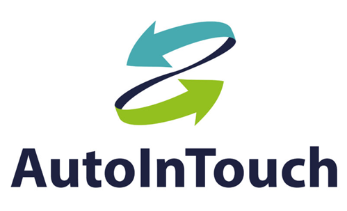
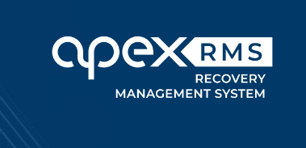

# Data Migration to Garage Hive from Other Garage Management Systems
Data migration to Garage Hive is the process of transferring data from one garage management system to Garage Hive system. The purpose of data migration is to ensure that the data is accurate, consistent and compatible with the Garage Hive. This process can involve different types of data, such as customer records, vehicle history, inventory stock, invoices, etc.

> Please contact the **Garage Hive Support Team** for assistance with this process:
> * **Phone** - [**02031461163**](tel:02031461163)
> * **Email** - [**getonboard@garagehive.co.uk**](mailto:getonboard@garagehive.co.uk)

The steps for data migration from other garage management systems to Garage Hive may vary depending on the specific system and preferences of each garage. However, a general outline of the process is as follows:

1. **Request a data export from the other garage management system.** This may require contacting their support team or following their instructions on how to export data from their system. The data export should be in a format that can be easily imported into Garage Hive, such as CSV or Excel files.
   
2. **Review and clean up the data export.** This may involve checking for errors, duplicates, missing values, formatting issues, etc. It may also involve deleting or modifying any data that is not relevant or needed for Garage Hive.
   
3. **Import the data into Garage Hive.** This may require contacting Garage Hive support team for assistance. The import should allow mapping the fields and columns from the data export to the corresponding fields and columns in Garage Hive. It should also validate and verify the imported data for accuracy and completeness.

4. **Test and verify the imported data in Garage Hive.** This may involve checking if all the records are correctly transferred, if all the functions and features are working properly with the new data, if there are any discrepancies or issues with the imported data, etc.
   
5. **Make any necessary adjustments or corrections to the imported data in Garage Hive.** This may involve editing or deleting any records that are incorrect or incomplete, adding any missing information or details, updating any settings or preferences, etc.

   

# Support Contact Details for Some of the Garage Management Systems
In the following list, please select the current system that you are using to view their contact details.

## Which is your current system?
1. [MAM Software](#mam-software)
2. [Techman](#techman)
3. [GA3](#ga3)
4. [Auto In Touch](#auto-in-touch)
5. [Apex RMS](#apex-rms)
6. [CAM Systems](#cam-systems)
7. [CarSys Software](#carsys-software)
8. [Click Dealer](#click-dealer)
9. [Dragon 2000](#dragon-2000)
10. [Garage Manager](#garage-manager)
11. [Garage Data Systems](#garage-data-systems)
12. [Gemini Systems](#gemini-systems)
13. [GS Onestop](#gs-onestop)
14. [Motasoft](#motasoft)
15. [MOT Manager](#mot-manager)
16. [Onyx Garage Invoice System](#onyx-garage-invoice-system)
17. [Pinnacle DMS by Pinewood](#pinnacle-dms-by-pinewood)
18. [TyreSoft](#tyresoft)

### MAM Software
   * **Phone** - [**01226352904**](tel:01226352904) 
   * **Email** - [**awolsupport@mamsoft.co.uk**](mailto:awolsupport@mamsoft.co.uk)

      

You will need to contact MAM Software directly for them to perform the data extract for you, simply inform them that you need the data required to import into another Garage Management System and they will send you a file to forward to us.

They will ask if you want a CD, We recommend asking them to log into your computer and leaving the file on your desktop instead.

We often notice that the reminder file provided during the standard export only contains expired dates, please ask them to ensure the reminders file is accurate.

[Go back to top](#top)
   
### Techman
   * **Phone** - [**01604936462**](tel:01604936462)
   * **Email** - [**info@techmangms.com**](mailto:info@techmangms.com)

      

You will need to contact Techman directly for them to perform the data extract for you, simply inform them that you need the data required to import into another Garage Management System and they will send you a file to forward to us.

[Go back to top](#top)

### GA3

   

To obtain the correctly formatted data from GA3 for us to import into Garage Hive you will need to ask [**SWS Solutions (UK) Ltd**](https://www.sws-solutions.co.uk/contact.php){:target="_blank"} to perform an export of your data. Please don't forget to ask for your vehicle history.

[Go back to top](#top)

### GA4

To export data in CSV format from GA4, go to the GA4 settings page. Under the **Documents (All)** tab, select **All Invoices**. Under **Customers**, **Vehicles**, and **Suppliers**, select **Export All** (refer to the image above). We will then be able to import this data into Garage Hive.

[Go back to top](#top)

### Auto In Touch
   * **Phone** - [**01934421320**](tel:01934421320)
   * **Email** - [**sales@mttltd.com**](mailto:sales@mttltd.com)

      

If you want to export data from Auto In Touch, contact their support team and request them to provide you with the necessary data export from your system in universally readable formats, such as CSV or XML.

[Go back to top](#top)

### Apex RMS
   * **Phone** - [**02031956757**](tel:02031956757)
   * **Email** - [**sales@apex-networks.com**](mailto:sales@apex-networks.com)

      

If you want to export data from Apex RMS, contact their support team and request them to provide you with the necessary data export from your system in universally readable formats, such as CSV or XML.

[Go back to top](#top)

### CAM Systems
   * **Phone** - [**01453891000**](tel:01453891000)

      

If you want to export data from CAM Systems, contact their support team and request them to provide you with the necessary data export from your system in universally readable formats, such as CSV or XML.

[Go back to top](#top)

### CarSys Software
   * **Phone** - [**02037885879**](tel:02037885879)

      

If you want to export data from CarSys Software, contact their support team and request them to provide you with the necessary data export from your system in universally readable formats, such as CSV or XML.

[Go back to top](#top)

### Click Dealer
   * **Phone** - [**01782478220**](tel:01782478220)
   * **Email** - [**help@clickdealer.co.uk**](mailto:help@clickdealer.co.uk)

      

If you want to export data from Click Dealer, contact their support team and request them to provide you with the necessary data export from your system in universally readable formats, such as CSV or XML.

[Go back to top](#top)

### Dragon 2000
   * **Phone** - [**01327222333**](tel:01327222333)
   * **Email** - [**sales@dragon2000.co.uk**](mailto:sales@dragon2000.co.uk)

      

If you want to export data from Dragon 2000, contact their support team and request them to provide you with the necessary data export from your system in universally readable formats, such as CSV or XML.

[Go back to top](#top)

### Garage Manager
   * **Phone** - [**+353860299090**](tel:+353860299090)
   * **Email** - [**sales@garagemanager.ie**](mailto:sales@dragon2000.co.uk)
 
      

If you want to export data from Garage Manager, contact their support team and request them to provide you with the necessary data export from your system in universally readable formats, such as CSV or XML.

[Go back to top](#top)

### Garage Data Systems
   * **Phone** - [**01482330735**](tel:01482330735)
   * **Email** - [**info@gds.co.uk**](mailto:info@gds.co.uk)
 
      

If you want to export data from Garage Data Systems (GDS), contact their support team and request them to provide you with the necessary data export from your system in universally readable formats, such as CSV or XML.

[Go back to top](#top)

### Gemini Systems
   * **Phone** - [**01522698911**](tel:01522698911)
 
      

If you want to export data from Gemini Systems, contact their support team and request them to provide you with the necessary data export from your system in universally readable formats, such as CSV or XML.

[Go back to top](#top)

### GS Onestop
   * **Phone** - [**01214110770**](tel:01214110770)
   * **Email** - [**support@gs-onestop.com**](mailto:support@gs-onestop.com)
 
      

If you want to export data from GS Onestop, contact their support team and request them to provide you with the necessary data export from your system in universally readable formats, such as CSV or XML.

[Go back to top](#top)

### Motasoft
   * **Phone** - [**01179428678**](tel:01179428678)
   * **Email** - [**support@motasoft.co.uk**](mailto:support@motasoft.co.uk)
 
      

If you want to export data from Motasoft, contact their support team and request them to provide you with the necessary data export from your system in universally readable formats, such as CSV or XML.

[Go back to top](#top)

### MOT Manager
   * **Phone** - [**03333444626**](tel:03333444626)
 
      

If you want to export data from MOT Manager, contact their support team and request them to provide you with the necessary data export from your system in universally readable formats, such as CSV or XML.

[Go back to top](#top)

### Onyx Garage Invoice System
   * **Phone** - [**01482503046**](tel:01482503046)
   * **Email** - [**support@onyxsoftware.co.uk**](mailto:support@onyxsoftware.co.uk)

      

If you want to export data from Onyx Garage Invoice System, contact their support team and request them to provide you with the necessary data export from your system in universally readable formats, such as CSV or XML.

[Go back to top](#top)

### Pinnacle DMS by Pinewood
   * **Phone** - [**01216976600**](tel:01216976600)

      

If you want to export data from Pinnacle DMS by Pinewood, contact their support team and request them to provide you with the necessary data export from your system in universally readable formats, such as CSV or XML.

[Go back to top](#top)

### TyreSoft
   * **Phone** - [**03455280388**](tel:03455280388)
   * **Email** - [**info@tyresoft.co.uk**](mailto:info@tyresoft.co.uk)

      

If you want to export data from TyreSoft, contact their support team and request them to provide you with the necessary data export from your system in universally readable formats, such as CSV or XML.

[Go back to top](#top)