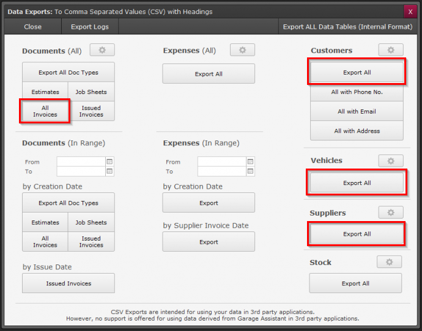

# Data Migration to Garage Hive from Other Garage Management Systems
Data migration to Garage Hive is the process of transferring data from one garage management system to Garage Hive system. The purpose of data migration is to ensure that the data is accurate, consistent and compatible with the Garage Hive. This process can involve different types of data, such as customer records, vehicle history, inventory stock, invoices, etc.

> Please contact the **Garage Hive Support Team** for assistance with this process:
> * **Phone** - [**02031461163**](tel:02031461163)
> * **Email** - [**getonboard@garagehive.co.uk**](mailto:getonboard@garagehive.co.uk)

The steps for data migration from other garage management systems to Garage Hive may vary depending on the specific system and preferences of each garage. However, a general outline of the process is as follows:

1. **Request a data export from the other garage management system.** This may require contacting their support team or following their instructions on how to export data from their system. The data export should be in a format that can be easily imported into Garage Hive, such as CSV or Excel files.
   
2. **Review and clean up the data export.** This may involve checking for errors, duplicates, missing values, formatting issues, etc. It may also involve deleting or modifying any data that is not relevant or needed for Garage Hive.
   
3. **Import the data into Garage Hive.** This may require contacting Garage Hive support team for assistance. The import should allow mapping the fields and columns from the data export to the corresponding fields and columns in Garage Hive. It should also validate and verify the imported data for accuracy and completeness.

4. **Test and verify the imported data in Garage Hive.** This may involve checking if all the records are correctly transferred, if all the functions and features are working properly with the new data, if there are any discrepancies or issues with the imported data, etc.
   
5. **Make any necessary adjustments or corrections to the imported data in Garage Hive.** This may involve editing or deleting any records that are incorrect or incomplete, adding any missing information or details, updating any settings or preferences, etc.

   

# Support Contact Details for Some of the Garage Management Systems
In the following list, please select the current system that you are using:

1. [MAM Software](#mam-software)
2. [Techman](#techman)
3. [GA3](#ga3)
4. [GA4](#ga4)
5. [Other Systems](#other-systems)

### MAM Software
You will need to contact MAM Software directly for them to perform the data extract for you, simply inform them that you need the data required to import into another Garage Management System and they will send you a file to forward to us.

They will ask if you want a CD, We recommend asking them to log into your computer and leaving the file on your desktop instead.

We often notice that the reminder file provided during the standard export only contains expired dates, please ask them to ensure the reminders file is accurate.

[Go back to top](#top)
   
### Techman
You will need to contact Techman directly for them to perform the data extract for you, simply inform them that you need the data required to import into another Garage Management System and they will send you a file to forward to us.

[Go back to top](#top)

### GA3
To obtain the correctly formatted data from GA3 for us to import into Garage Hive you will need to ask [**SWS Solutions (UK) Ltd**](https://www.sws-solutions.co.uk/contact.php){:target="_blank"} to perform an export of your data. Please don't forget to ask for your vehicle history.

[Go back to top](#top)

### GA4

To export data in CSV format from GA4, go to the GA4 settings page. Under the **Documents (All)** tab, select **All Invoices**. Under **Customers**, **Vehicles**, and **Suppliers**, select **Export All** (refer to the image above). We will then be able to import this data into Garage Hive.

[Go back to top](#top)

### Other Systems
If you want to export data from any other system, contact their support team and request them to provide you with the necessary data export from your system in universally readable formats, such as CSV or XML.

[Go back to top](#top)