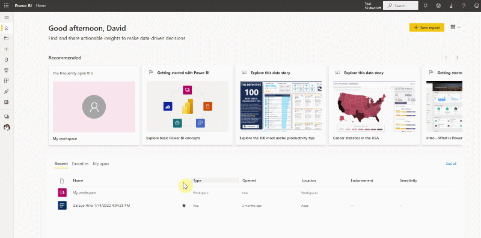

# How to Delete Your Old Power BI App and Install the New One
1. From a web browser, log in to the **PowerBi** platform and select the **Apps** icon on the left side menu.
2. Click on the three dots in the lower right corner of the app you want to delete, and then select **Delete**; this also deletes the app's workspace.

   

3. Now click on the following link to install the new application version of Power BI and follow the instructions [here](powerbi-installing-app.html).

   > # Power BI installation link: <ins>[Garage Hive Power BI App - V48 Download](https://app.powerbi.com/Redirect?action=InstallApp&appId=739eb02b-643e-4bc3-a9ae-61191a89452d&packageKey=382d5f61-862d-4c85-8be9-2b076a6a16besudkHLFz-thcDxGeqs-eb5rx8SGGZrL-ixHyPH3tlDY&ownerId=1bde89ad-b4ce-45df-a919-e1e08e47294d&buildVersion=48 "Power BI V48 Download")</ins>

 

### **See Also**
[Video - How to install the Garage Hive Power BI report](https://youtu.be/iO17qPjBAc0) \
[How to set your Average Labour Rate](garagehive-labour-rate.html) \
[Refreshing your Power BI data](powerbi-refresh-data.html) \
[Updating your Power BI App](powerbi-updating-app.html) \
[Updating your Power BI credentials](powerbi-updating-app.html)