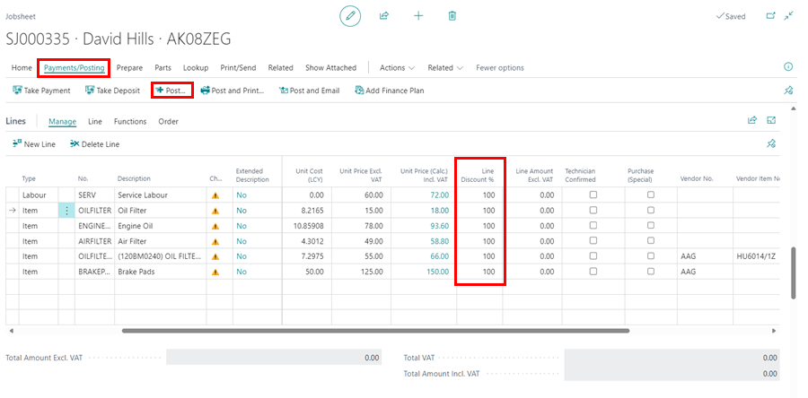
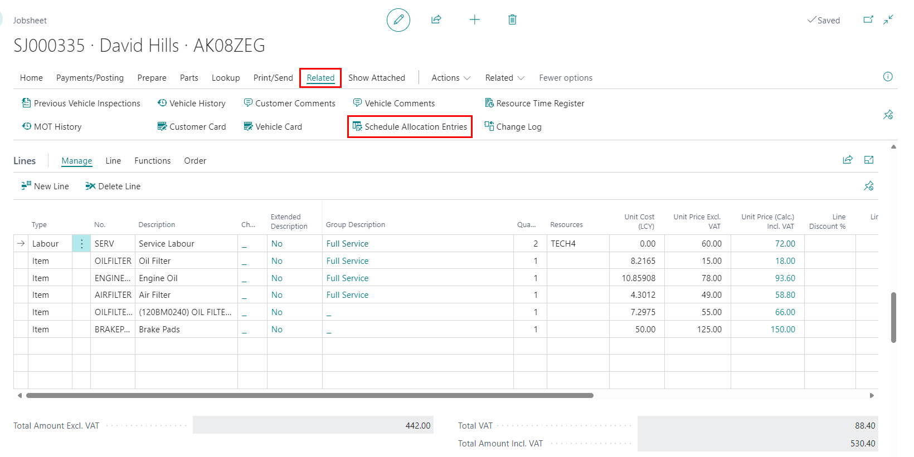
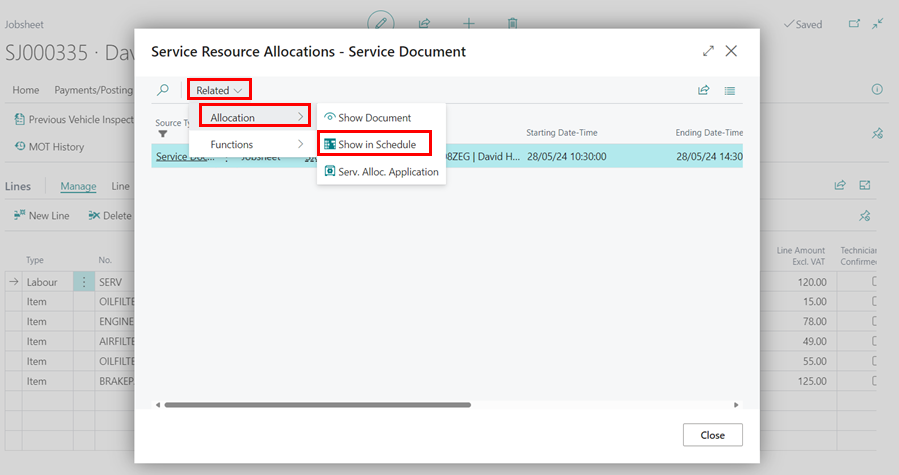
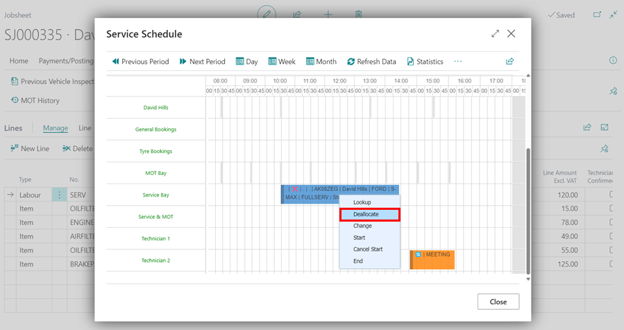
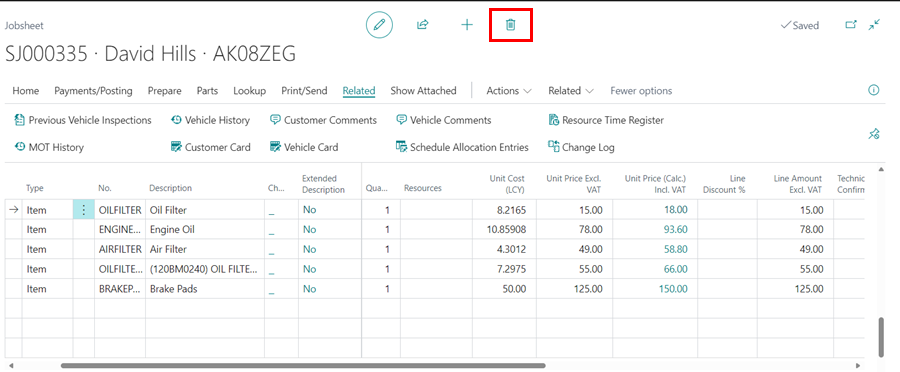

# Deleting a Job after a Technician has Clocked On to It
Attempting to delete a Jobsheet when a technician has clocked in will always result in an error.  To avoid this, before deleting a Jobsheet, consider what happened in each case.

## In this article
1. [Posting the Jobsheet for Record Without Deleting It](#posting-the-jobsheet-for-record-without-deleting-it)
2. [Delete the Jobsheet Entirely](#delete-the-jobsheet-entirely)

### Posting the Jobsheet for Record Without Deleting It

**Scenario 1** - If the technician clocks onto a job, performs a vehicle inspection (VI), and the value of repairs exceeds the value of the car, and you decide not to charge for the job because the planned work will not be completed, it is recommended that you invoice the job at £0 (100% discount), so that the technician's time is accounted for and there is a record of the job and VI that was completed.

   

[Go back to top](#top)

### Delete the Jobsheet Entirely

**Scenario 2** - If, on the other hand, a technician accidentally clocked onto a job that wasn't on site and isn't going to come in for repairs, then deleting the job would be appropriate. To do this, first deallocate all schedule allocation entries that the technician has clocked onto, and then delete the job.f
1. Select **Related** from the Jobsheet's menu bar, followed by **Schedule Allocation Entries**.

   

2. From the page that appears, select **Related**, followed by **Allocation** and then **Show in Schedule**.

   

3. Right-click the allocation in the schedule and select **Deallocate**.

   

4. For each schedule allocation entry, repeat steps **2** and **3**.
5. After you've deallocated all of the schedule allocation entries, delete the Jobsheet by clicking the delete icon at the top of the Jobsheet page.

   

[Go back to top](#top)
