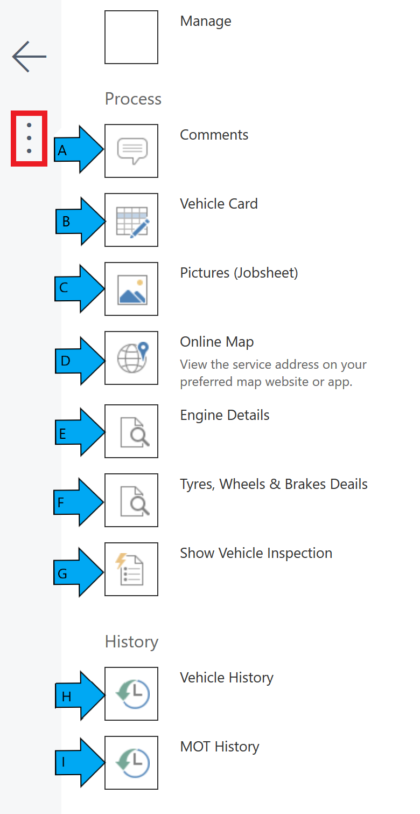
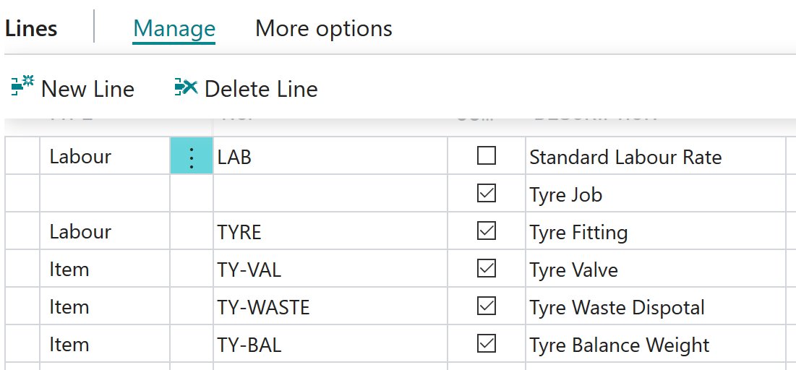
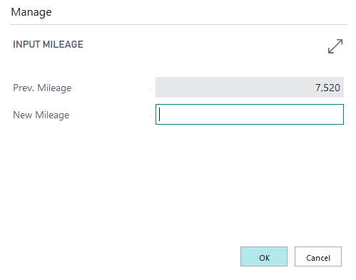

#   Device Users 



### What is a Device User?

A Device User will be able to work completely paperless. 

Their efficiencies and recovery rates can be reported on accurately.

### What can they do from their Devices? 

####    Within Easy Clocking 

See what can be done within: [Easy Clocking](/docs/garagehive-easy-clocking.html "Easy Clocking")

* A technician who is using the device will have the ability to clock in and out of work. 

* They will also be able to clock on and off jobs.

*   See which job they are currently working on. 

*   Clock onto a Break. 

*   Select Existing Jobsheet. 

####    Within a jobsheet. 

Select the  

A.      Add comments to the Jobsheet. 

B.    View the [Vehicle Card](/docs/garagehive-vehicle-card.html "Vehicle Card")

C.  Take photos of the vehicle. 

D.  View Online Map (For off site technicians/mobile tyre fitters to find addresses)

E.  View Engine Details. 

F.  View Tyres, Wheels & Brake Details. 

G.  Show and/or Create Vehicle Inspections.  -   [How to setup Checklists](garagehive-checklist-how-to-create.html "How to setup Checklists in Garage Hive") and [How to perform a Vehicle Inspection](garagehive-technicians-vehicle-inspections.html "How to perform a Vehicle Inspection").

H.  View Vehicle History - [ Service History](garagehive-how-to-view-service-history.html "Service History")

I.  View MOT History - [MOT History](garagehive-how-to-view-service-history.html "Service History")
-   This will include all previous MOT history, including any failures and advisories. 

####    Other options within the jobsheet. 

*   Add Items/ Labour lines to the job. 

*   Add Mileage to a jobsheet (Alert if they try to end a job without adding a mileage).

