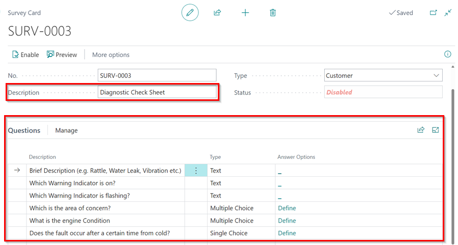
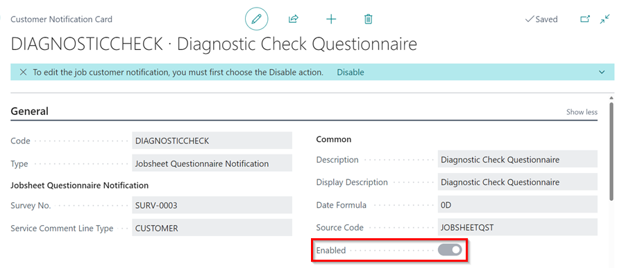
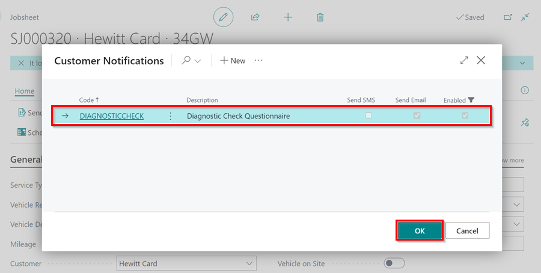

# How to Create and Send a Diagnostic Questionnaire to the Customer
Diagnostic questionnaires are used by garages to gather additional information about a job before the customer arrives. This helps the garage gain a better understanding of the issue and plan accordingly. By using this approach, the garage can be well-prepared and provide more efficient service to its customers.

## In this article
1. [Creating the Diagnostic Questionnaire](#creating-the-diagnostic-questionnaire)
2. [Sending Diagnostic Questionnaire to Customer](#sending-diagnostic-questionnaire-to-customer)
3. [Reviewing Answers from the Diagnostic Questionnaire](#reviewing-answers-from-the-diagnostic-questionnaire)

### Creating the Diagnostic Questionnaire
1. In the top right corner, choose the  icon, enter **Surveys**, and select the related link.

   

2. Click on **New** to create a new survey with the questions you would like to ask the customer in advance. Enter **Description** of the questionnaire, and the questions in the **Questions** FastTab.

   

3. Once done adding the questions, click on **Enable** in the menu bar, to activate the survey and then close the **Survey Card** window.

   

4. Now, select the search  icon, enter **Customer Notifications**, and select the related link to create a questionnaire notification.

   

5. Click on **New** to create a new **Customer Notification**.
6. Choose **Jobsheet Questionnaire Notification** as the **Type**, select the diagnostic questionnaire survey that you created in the **Survey No.** field, set **Service Comment Line Type** to **Customer**, enter the **Description**, and specify the **Date Formula** as **0D**.
7. Enable SMS, Email, or both, depending on where you want the customer to receive the questionnaire link and write the **Text** that will appear in the message body.

   

8. To activate the notification, click on the **Enabled** slider. Once enabled, the notification will be set for use.

   
   

[Go back to top](#top)

### Sending Diagnostic Questionnaire to Customer
To send the diagnostic questionnnaire to the customer:
1. Open the Jobsheet and select **Home**, followed by **Send Questionnaire**.

   

2. In the **Customer Notifications** window, select the questionnaire and click **OK** to send it to the customer.

   

[Go back to top](#top)

### Reviewing Answers from the Diagnostic Questionnaire
1. When the customer answers the questionnaire, you will get a notification in the **Attention Tile** as well as in the **Comments** FastTab.

   

2. From the Jobsheet, select **Show Attached**, and click on **Related Questionnaires** action.

   

3. This will open the **Customer Survey Entries**** window. Click on the number under **Answers Count** column or select the **Answers** action in the menu bar to access the questionnaire answers.
4. After reviewing the answers, click on **Mark as Reviewed**.

   

5. The technician can view the customer's answers by selecting **Related Questionnaires** under **Show Attached** in the menu bar.

   

[Go back to top](#top)