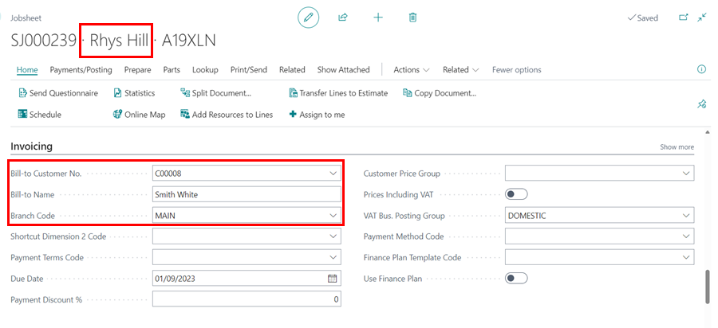
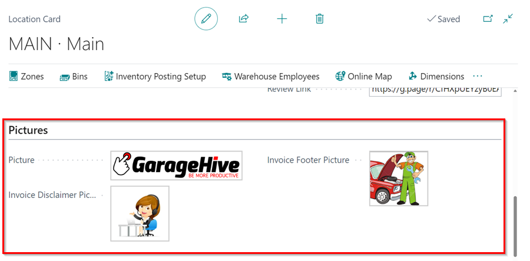

# Document Print Options Setup
Garage Hive has a number of ways for printing a document, depending on the system setup. You can modify or add details that should be included in the top, middle, or bottom sections of the document. This article will explain how to modify the system's options so that you can print a document in the way you would like.

## In this article
1. [Changing Print Options for the Top Section](#changing-print-options-for-the-top-section)
2. [Changing Print Options for the Middle Section](#changing-print-options-for-the-middle-section)
3. [Changing Print Options for the Bottom Section](#changing-print-options-for-the-bottom-section)
4. [Setting Default Print Options for Documents](#setting-default-print-options-for-documents)

### Changing Print Options for the Top Section
The following can be modified in the top section of a document:
1. By default the **Customer** name used is **Sell-to** unless the **Bill-to** customer is added in the **Invoicing** FastTab.

   

2. To promote the **Sell-to** customer name (Show the sell-to customer name even when the bill-to name is added), enable the **Promote Sell-to Cust. on Invoice** slider under the **Invoice Print Options** FastTab of the document.

   

3. To show the **Branch Details**, make sure the details of the branch are added in the in the Location card. Search for **Locations** in the top right corner  icon, click on the related link and select the location to add the details.

   

4. To view the branch details in the invoice, enable the **Show Branch Details** slider in the document's **Invoice Print Options** FastTab.

   

5. To print the **Customer VAT No.**, search for **Sales & Receivables Setup** in the top right corner  icon, and click on the related link. Scroll down to the **Document Print Option**, enable the **Print Customer VAT No.** slider.

   

6. To indicate that an invoice is a Tax Invoice, under the **Customer VAT No.** slider, select **Tax Invoice** in the field **Invoice Printout Naming** field.

   

7. When printed it will appear as shown below.

   

[Go back to top](#top)

### Changing Print Options for the Middle Section
The following can be modified in the middle section of a document:
1. The lines and column print out for the middle section can be modifying in the document under the **Invoice Print Options** FastTab.

   

2. For the line and column of the document, there are 9 print options available:

   | Line Layout        | Column Layout                   |
   | :----------------- | :------------------------------ |
   | Standard           | Standard                        |
   | Standard           | Hide labour Qty. and Unit Price |
   | Standard           | Show Totals Only                |
   | Group by Line Type | Standard                        |
   | Group by Line Type | Hide labour Qty. and Unit Price |
   | Group by Line Type | Show Totals Only                |
   | Custom Grouping    | Standard                        |
   | Custom Grouping    | Hide labour Qty. and Unit Price |
   | Custom Grouping    | Show Totals Only                |

3. To learn more about the invoice print options, and see how they appear follow this link, [Invoice Print Options available](/docs/golive-print-invoice.html#line-layout-options).

[Go back to top](#top)

### Changing Print Options for the Bottom Section
In the botton section you can add the **Invoice Footer Picture** or the **Invoice Disclaimer Picture**, and for the Jobsheet the **Jobsheet Disclaimer Picture**. To add these:
1. Search for **Company Information** in the  icon, at the top-right corner, and select the related link.

   

2. Scroll down to the **Report Design Templates**, and you can add the different picture options available.

   

3. If you have the **Show Branch Details** enabled in the document, then you need to add the pictures in the Location card. Search for **Locations** in the top right corner  icon, click on the related link and select the location to add the pictures. Scroll down to the **Pictures** FastTab and to add the pictures.

   

[Go back to top](#top)

### Setting Default Print Options for Documents
The default setting for printing documents, can be setup in the **Sales & Receivables Setup**. To set up:
1. Search for **Sales & Receivables Setup** in the  icon, at the top-right corner, and select the related link.

   

2. Scroll down to the **Document Print Options** FastTab. Here you will find the options to set the following documents' default print options:
   * **Service Documents:** Includes the Jobsheets, Estimates and Vehicle Inspection Estimates.
   * **Vehicle Sales Documents:** Includes the Vehicle Sales Invoices and Vehicle Sales Orders.
   * **Standard Documents:** Includes the standard Business Central Documents.

      
  
3. Adjust the default setting that you would like for the documents and close the page.

[Go back to top](#top)