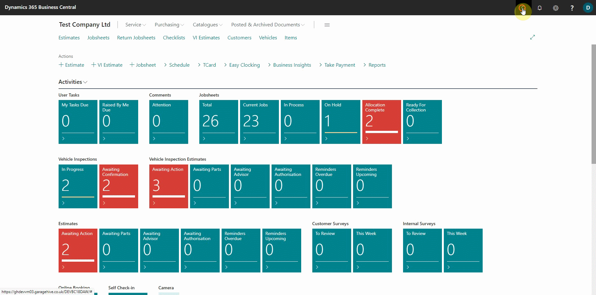
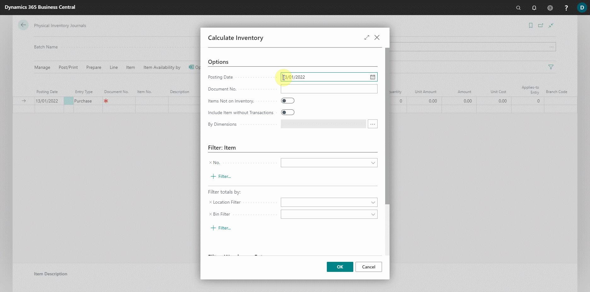
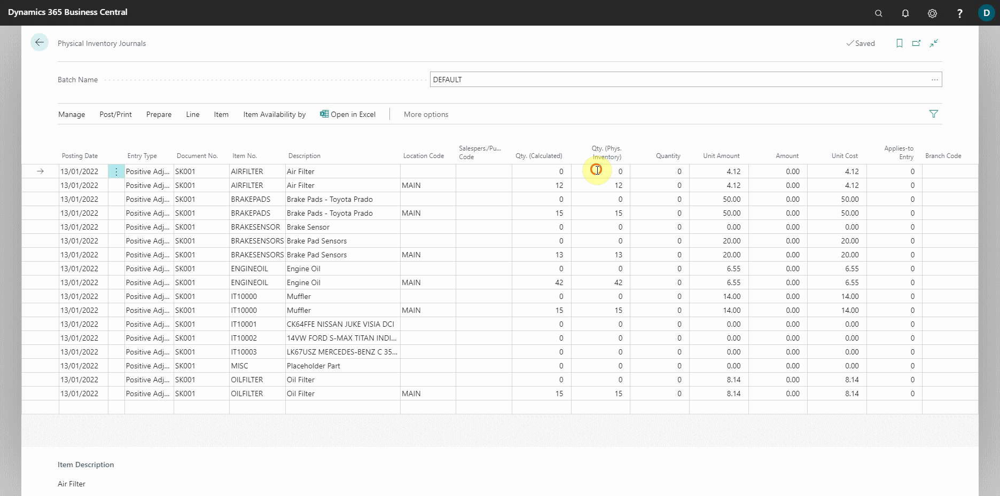
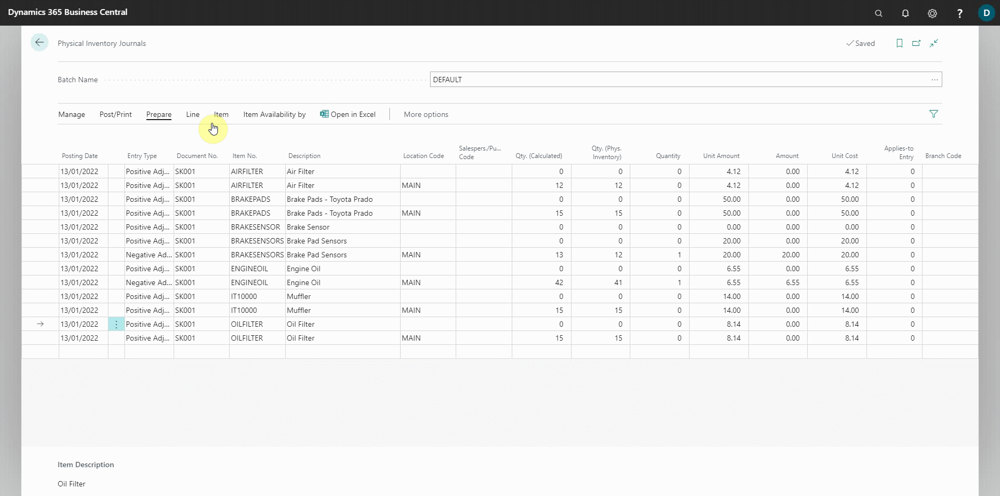

# Doing a Physical Stock Take in Garage Hive
Physical stock takes enable comparisons between items in the system and those that are physically available. This process ensures that discrepancies are found and resolved. The following describes how to use Garage Hive when doing a physical stock take:
1. In the top-right corner, choose the  icon, enter **Physical Inventory Journals**, and select the related link.
2. From the **Physical Inventory Journals** page, choose **Prepare** from the menu bar, and select **Calculate Inventory** from the submenus.

   

3. Enter today's date as the **Posting Date**, the **Document No.** as the number for your stock take number series, select the **Items Not on Inventory** slider to include items that have no stock in the system, and select the **Include Item without Transactions** slider to include items that have never been purchased or sold.
4. You can filter the items to do stock take by category or location under the **Filter** fields. Then click **OK**.
   
   

5. A table is created with all of the items' current quantities and amounts. The column that needs to be changed is **Qty(Physical Inventory)**, which should be filled in after physically counting the items.
6. Select **Post/Print** from the menu bar, and then **Print** from the submenus to print the table so that you can physically count and fill in the table at your store. 
7. Select the **Show qty. (Calculated)** slider to show the quantity of items in the system when printed, and then click the **Preview & Close** button at the bottom to preview and print.
   
   

8. After physically counting the items in your store, come back to the system table and fill in the **Qty. (Phys. Inventory)** column with the actual count that you have done. Currently the column is filled in with the same quantity as it is in the system.
9. The **Entry Type** column indicates the type of entry that will be created by the item journal line. It is **Positive Adjustment** by default if the quantity on the columns **Qty. (Calculated)** - from the system, and column **Qty. (Phys. Inventory)** - from the physical count are equal. When you fill in the **Qty. (Phys. Inventory)** column, the **Entry Type** column changes to either **Negative Adjustment** or **Positive Adjustment** depending on the discrepancy between physical and system quantities.

   

10. After filling out the **Qty (Phys. Inventory)** column and confirming that the quantities are correct and that the **Entry Type** column is accurate, select **Post/Print** from the menu bar, and then **Post** to post the item journals. This will make the quantities in the system equal to the quantities in physical.

   

[Go back to top](#top)

 

### **See Also**

[Webinar: Stock purchasing and stock take](https://www.youtube.com/watch?v=FYLwdVivC2E){:target="_blank"} \
[Re-ordering policies and requisition worksheets](/docs/garagehive-requisition-worksheet.html){:target="_blank"} 