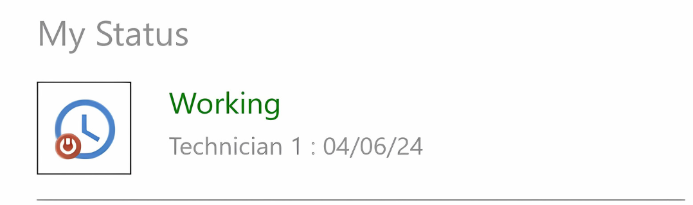
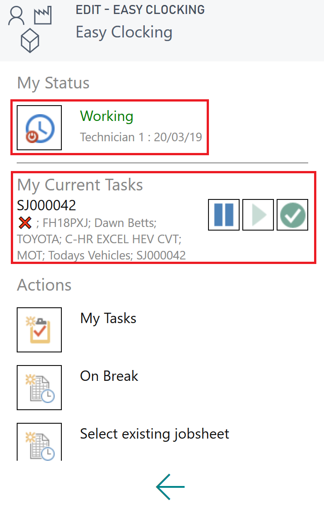
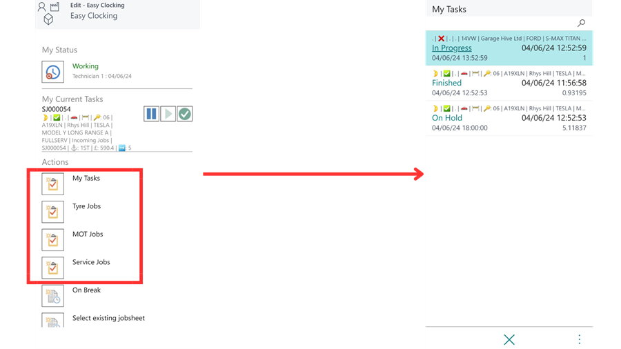
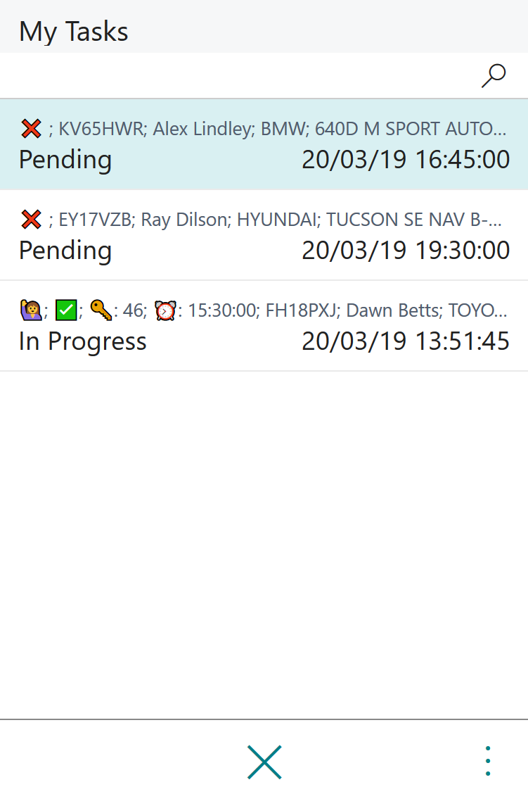
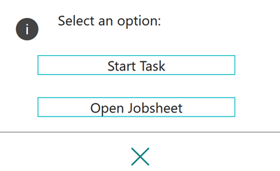
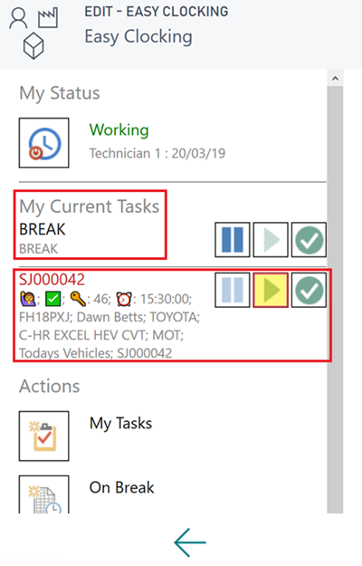
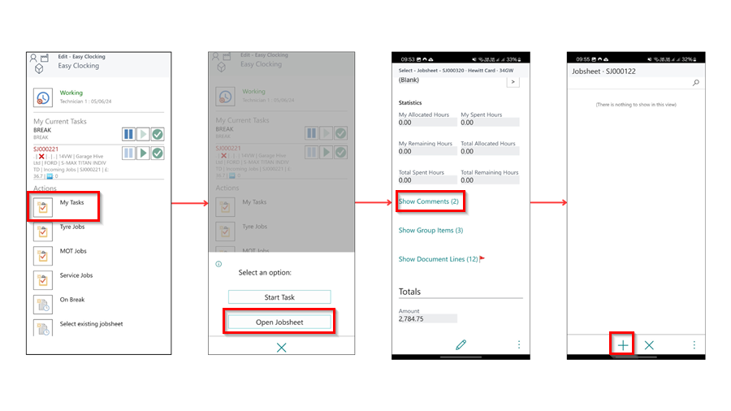
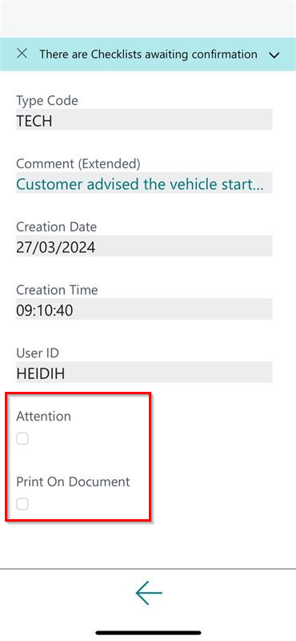

# Easy Clocking Functionality
Easy Clocking is where the technician will work for the majority of the time. The technician will use Easy Clocking for most of his daily tasks, such as:

   * Clocking in and out of work
   * Viewing their tasks for the day
   * Clocking on and off jobs
   * Clocking on and off breaks
   * Being able to view which job they are currently clocked on
   * Adding comments to jobs, with the ability to mark them for attention or print on document

___

1. To access Easy Clocking, click on the **Easy Clocking** tile on the home page of the Business Central App.
2. This opens the **Easy Clocking** page where there are several options to use:

      

   - **My Status** - The technician can see whether they are **Working** or **Not Working** (clocked into work or not), as well as their **Current Task** at that moment.

      

   - **My Current Tasks** - This is the current tasks that the technician is working on with the following controls:

      ⏸ - To place an allocation on hold. 

      ▶ - To start or resume an allocation. 

      ✅ - To complete/Finish an allocation. 

      

   - **My Tasks** - A technician can see all tasks that have been allocated to them for the specific day. This includes sections such as **Tyre Jobs**, **MOT Jobs**, and **Service Jobs** as set up in the system.

      

   - The task can be **Pending**, **In Progress**, **On Hold** or **Finished**.   
   - Within each allocation the technician can also see: 
      * Extended Status Codes - i.e. Customer Waiting 🙋‍/ Urgent 🚩/ Collection & Deliveries 🏠
      * Vehicle on Site - Yes ✅ / No ❌
      * Key Number - 🔑
      * Required Time for Completion - ⏰

      

   - To learn more about the meaning of the emojis found in an allocation, [click here](garagehive-understanding-the-schedule.html#understanding-the-emojis-in-an-allocation){:target="_blank"}.
   - When the technician clicks on a specific task, a dialogue box opens where they can select **Start Task** or **Open Jobsheet**. 

      

   - **On Break** - By pressing this button the technician will automatically pause the allocation he is on and clock them on to a break. 
   - They will see their current task as being 'on break' and the job they were on.
      
   > **Note:** To resume the job, the technician should press the ✅ next to "Break" and then select the ▶ icon for the job they wish to continue. 

      

   - **Select Existing Jobsheet** - A technician can select a job to clock on themselves. This will be useful if a technician wants to clock onto another job to help another technician.
   - **Adding comments to jobs** - To add a comment in a Jobsheet, click on **My Tasks** and then select **Open Jobsheet**. Scroll down on the Jobsheet and choose **Show Comments**. Then, click on the **+** sign at the bottom to add a comment.

      

   - After adding the comment, you can mark it for attention of the Service Advisor, or mark it to be printed on the document using the tick boxes **Attention** or **Print on Document** under the comment.

      

[Go back to top](#top)

### **See Also**

[Video: How to use the technicians Device on Garage Hive](https://www.youtube.com/watch?v=FKGxkYSX8bs){:target="_blank"}

 

