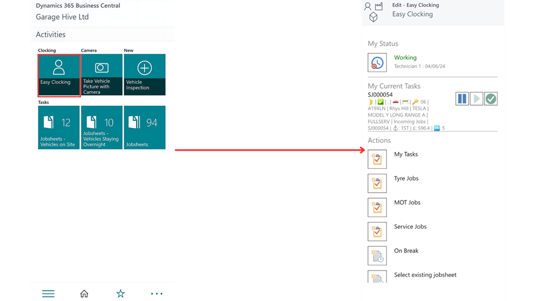
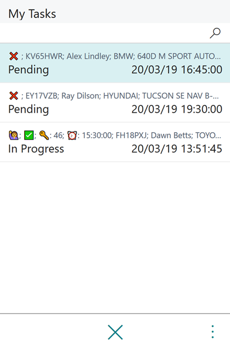

#   Easy Clocking 



Easy Clocking is where the Technician will work from the majority of the time. He will use Easy Clocking for most of his daily tasks such as: - 

*   Clocking in/out of work. 
*   Viewing their tasks for the day. 
*   Clocking on/off jobs. 
*   Clocking on/off breaks. 
*   Being able to view which job he is currently clocked on. 

###    Within the Easy Clocking Tab there are several options: -  

###  A.  **My Status** - The technician can see whether they are "**Working or Not Working"** *(Clocked into work or not)* as well as what their **Current Task** is at that moment in time. 

### Understanding the Controls 

⏸ - To place an allocation on hold. 

▶ - To resume an allocation. 

✅ - Complete/Finish an allocation. 

###  B. **My Tasks** - A technician can see all tasks which he has been allocated throughout that specific day. This will include all allocations: - 

*   Pending 
*   In Progress 
*   On Hold 
*   Finished.   

Within each allocation the technician can also see: - 

*   Extended Status Codes - i.e. Customer Waiting 🙋‍/ Urgent 🚩/ Collection & Deliveries 🏠
*   Vehicle on Site - Yes ✅ / No ❌
*   Key Number - 🔑
*   Required Time for Completion - ⏰

They can **Start Task** or **Open Jobsheet** by clicking on a specific task. 

### C.  **On Break** - By pressing this button the technician will automatically pause the allocation he is on and clock them on to a break. 

They will see their current task as being on break and the job they were on. **To resume the job they were press the :ballot_box_with_check: against the Break and the :arrow_forward: on the job they want to resume.** 

### D.  **Select Existing Jobsheet** - A technician can select a job to clock on themselves. This will be useful if a technician wants to clock onto another job to help another technician.

 

