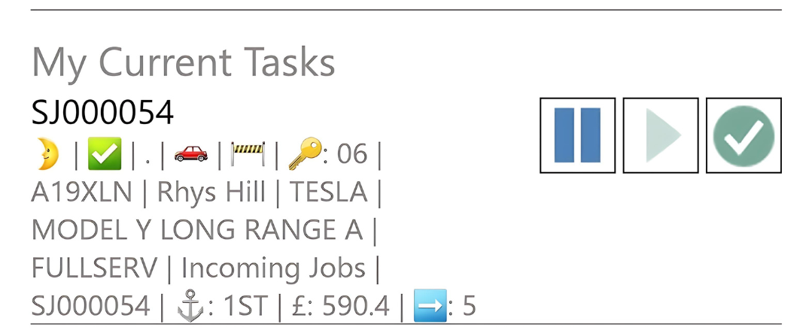

# Easy Clocking Functionality
Easy Clocking is where the technician will work for the majority of the time. The technician will use Easy Clocking for most of his daily tasks, such as:

   * Clocking in and out of work
   * Viewing their tasks for the day
   * Clocking on and off jobs
   * Clocking on and off breaks
   * Being able to view which job they are currently clocked on
   * Adding comments to jobs, with the ability to mark them for attention or print on document

___

1. To access Easy Clocking, click on the **Easy Clocking** tile on the home page of the Business Central App.
2. This opens the **Easy Clocking** page where there are several options to use:

      

   - **My Status** - The technician can see whether they are **Working** or **Not Working** (clocked into work or not), as well as their **Current Task** at that moment.

      

   - **My Current Status** - This is the current status that the technician is working on with the following control:

      ⏸ - To place an allocation on hold. 

      ▶ - To resume an allocation. 

      ✅ - To complete/Finish an allocation. 

      

   - **My Tasks** - A technician can see all tasks that have been allocated to them for the specific day. This includes sections such as **Tyre Jobs**, **MOT Jobs**, and **Service Jobs** as set up in the system.

      

   - The task can be **Pending**, **In Progress**, **On Hold** or **Finished**.   
   - Within each allocation the technician can also see: 
      * Extended Status Codes - i.e. Customer Waiting 🙋‍/ Urgent 🚩/ Collection & Deliveries 🏠
      * Vehicle on Site - Yes ✅ / No ❌
      * Key Number - 🔑
      * Required Time for Completion - ⏰

      

   - To learn more about the meaning of the emojis found in an allocation, [click here](garagehive-understanding-the-schedule.html#understanding-the-emojis-in-an-allocation){:target="_blank"}.
   - When the technician clicks on a specific task, a dialogue box opens where they can select **Start Task** or **Open Jobsheet**. 

      

   - **On Break** - By pressing this button the technician will automatically pause the allocation he is on and clock them on to a break. 
   - They will see their current task as being on break and the job they were on.
   - **Note:** To resume the job they were press the :ballot_box_with_check: against the Break and the :arrow_forward: on the job they want to resume.** 

      

   - **Select Existing Jobsheet** - A technician can select a job to clock on themselves. This will be useful if a technician wants to clock onto another job to help another technician.

[Go back to top](#top)

### **See Also**

[Video: How to use the technicians Device on Garage Hive](https://www.youtube.com/watch?v=FKGxkYSX8bs){:target="_blank"} \

 

