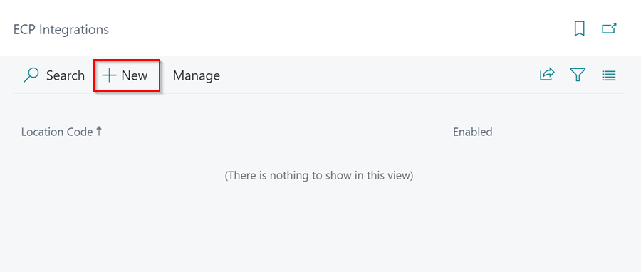
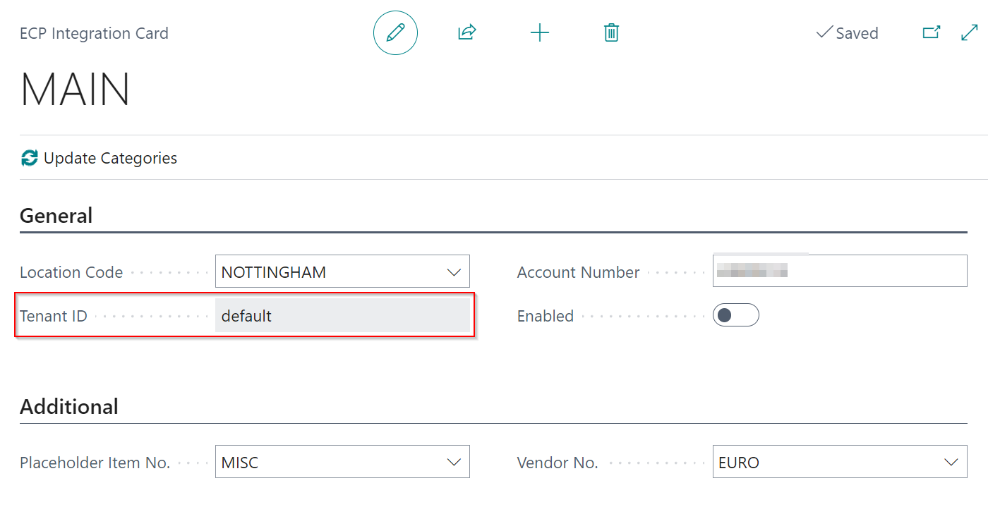
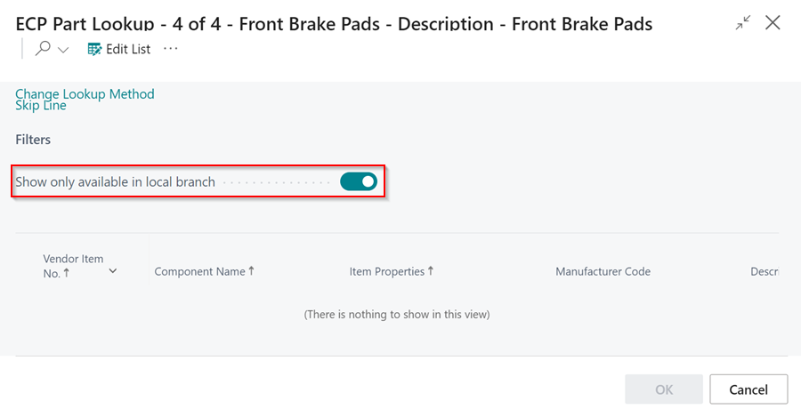
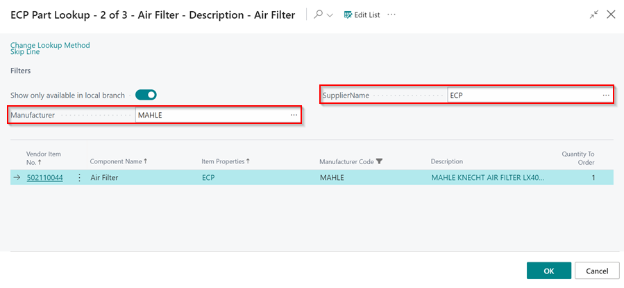
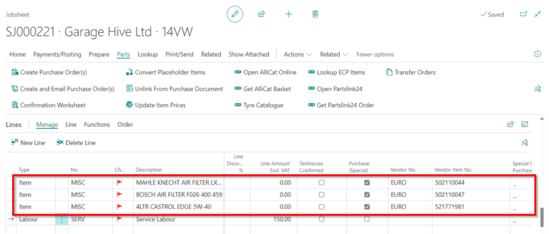
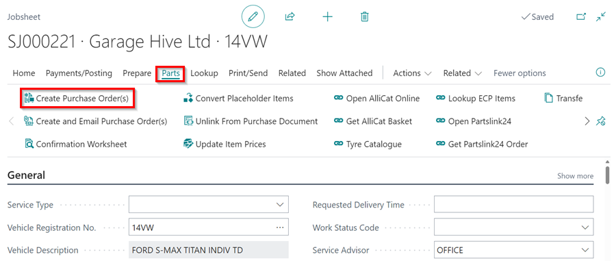
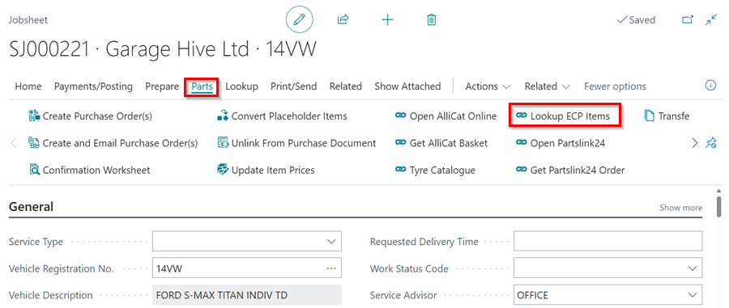
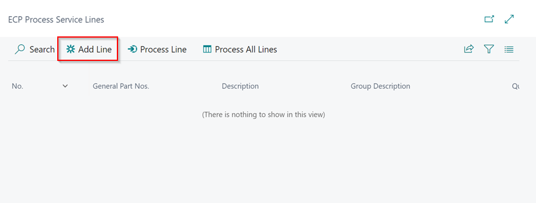
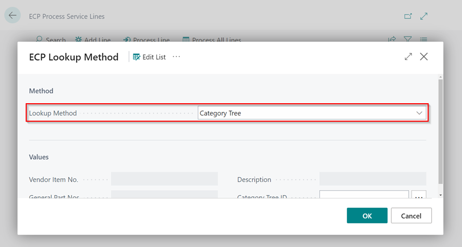
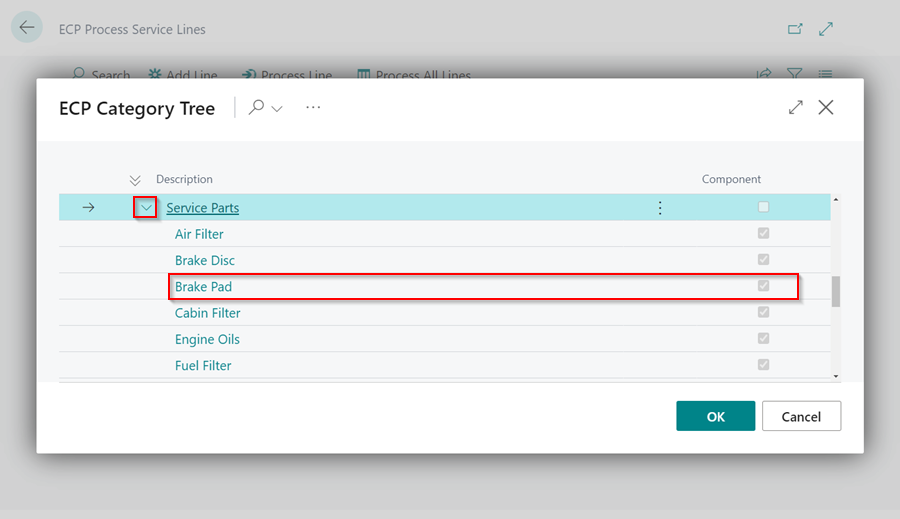

# LKQ Euro Car Parts (ECP) Integration With Garage Hive
LKQ Euro Car Parts (ECP) Integration offers seamless integration between Garage Hive and the **LKQ Euro Car Parts (ECP)** catalogues, allowing the process of **quoting**, **sourcing** and **ordering** the parts for vehicles to be efficient.

## In this article
1. [System Setup for ECP Integration](#system-setup-for-ecp-integration)
2. [Getting the Account Number](#getting-the-account-number)
3. [Search for Items in the Service Document from ECP](#search-for-items-in-the-service-document-from-ecp)
4. [Adding New Items from ECP to the Service Document](#adding-new-items=-from-ecp-to-the-service-document)
5. [Garage Hive Lookup Methods in ECP](#garage-hive-lookup-methods-in-ecp)

### System Setup for ECP Integration
To enable the LKQ ECP Integration in Garage Hive:
1. In the top-right corner, choose the  icon, enter **ECP Integrations**, and select the related link.

   

2. Select **New** in the **ECP Integrations** page, to create a new LKQ ECP Integration card.

   

3. Enter the **Location Code** for the location where you want the integration, select the **Placeholder Item No.** so the system knows which items in the document to lookup, and select the default **Vendor No.** from which to order the items added in the document. 

   

[Go back to top](#top)

### Getting the Account Number
You will require an **Account Number** before you can begin the process of linking your Garage Hive system to LKQ Euro Car Parts. If you have multiple locations, you should get an Account Number for each location.
1. ##### Existing LKQ Euro Car Parts Customers
   If you are an existing customer of LKQ Euro Car parts, please complete the form within the link below:

      > # LKQ ECP Integration Registration Form: <ins>[Form](https://forms.office.com/e/yvwPv6nRSH){:target="_blank"}</ins>

   Copy the **Tenant ID** in the **ECP Integration** page.
      
      

   

1. ##### New LKQ Euro Car Parts Customer
If you currently do not have an account with LKQ Euro Car Parts please contact your local branch in order to create a new Account.

[Go back to top](#top)

### Search for Items in the Service Document from ECP
The LKQ ECP integration is available in **VI Estimates**, **Estimates**, and **Jobsheets**. To add the items to order from LKQ ECP in the document:
1. Open the document that you want to add items, select **Parts**, followed by **Lookup ECP Items** in the menu bar.

   

1. This opens the **ECP Process Service Lines** page, which lists the items in the documents with a **Placeholder Item No.**. You can process each line individually by selecting a line and then selecting **Process Line**, or you can process all lines at once by selecting **Process All Lines** in the menu bar.

   

1. After selecting **Process All Lines**, the **ECP Part Lookup** page opens with a list of items pulled from the **ECP Catalogue**. By default it looks up the item using the **Description**, if the **General Part No.** or the **Vendor Item No.** is not available.

   

1. You can preview the **Item Properties** or **Descriptions** for the items before adding them to the document by clicking on the Item Property or Description of the item you want to view.

   

1. Select the item you want to add in the document and click **OK**.
1. If you selected **Process All Lines**, the **ECP Part Lookup** page for the next item will open. Repeat for each item. 
1. If an item is either from stock or needs to be ordered from another supplier, you can select **Skip Line**.

   

1. The **Show Only Available in Local Branch** slider is enabled by default, but if the item is not available in the LKQ ECP local branch, you can disable it to see if it is available in other branches.

   

1. You can also use the **Manufacturer** or **SupplierName** fields to filter the item list.

   

1. The Items will now be added to the document with the **Vendor No.** and the **Vendor Item No.**.

   

1. To order items from your LKQ ECP branch online, select **Parts**, then **Create Purchase Orders** in the menu bar.

   

1. Click **Yes** in the pop-up notification to order the item online, or **No** to create the Purchase Order only.

   

1. From the Purchase Order, you can convert the **Placeholder Item No.** to the **Vendor Item Nos.** which also updates the items in the Jobsheet, [learn more](garagehive-creating-a-placeholder-item.html#convert-a-placeholder-item-to-the-vendor-item-number){:target="_blank"}.

[Go back to top](#top)

### Adding New Items from ECP to the Service Document
To add a new line to the service document from LKQ ECP:
1. Open the document to add, select **Parts**, followed by **Lookup ECP Items** in the menu bar.

   

2. Select **Add Line** in the **ECP Process Service Lines** page.

   

3. This opens up the **ECP Lookup Method** page. Select the **Lookup Method** that you want to use, in this case we'll use **Category Tree**.

   

4. Click on the ellipsis(...) in the **Category Tree ID** field to select the category in the component for the item you want to add.
5. In the **ECP Category Tree** click on the submenu arrow (>) in the **Category** you want and select a **Component** for the item. Click **OK** to add the **Category Tree ID**.

   

6. Click **OK** in the **ECP Lookup Method** page, to view and select the item you want to add in the service document.
7. Select the item and click **OK**.

   

8. The item will be added to the document.

[Go back to top](#top)

### Garage Hive Lookup Methods in ECP
Garage Hive uses four different methods to lookup items in the **LKQ ECP Catalogue**.                        

1. **Description** - This uses the Description of the item.

2. **Vendor Item No.** - This uses the Vendor Item Number.
 
3. **General Part Numbers** - This uses the General Part Number of the item. General Part Numbers are the numbers that the system uses to identify items from external systems, such as Autodata.

4. **Category Tree** - This uses the category of an item, for example Service Parts category is used to lookup for Air Filters, Brake Pads and so on.

To change the lookup method for an item, after selecting **Process Line** or **Process All Lines**, the **Change Lookup Method** action is available in the **ECP Part Lookup** page.

   

Click the **Change Lookup Method** action and select the method you want to use in the **Lookup Method** field.

   

[Go back to top](#top)