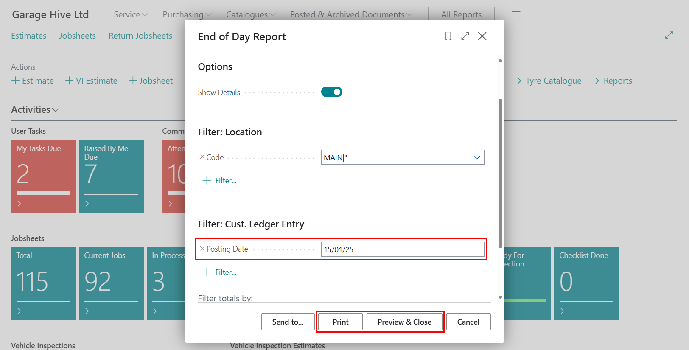

## End of Day Report 
The End of Day (EoD) report is designed to provide a summary of sales, service, and purchase-related data for a business day. It collects, filters and aggregates data from various tables in Garage Hive. Here is how to open the report:
1. In the the Role Centre, select **Reports**, followed by **End of Day** and then **End of Day Report**.

   

2. Enter the date for which you need the report in the **Posting Date** field.
3. Select **Show Details** to view additional details in the report.
4. Once done, click **Print** or **Preview & Close** to generate the report.

   

5. Reconcile the report by ensuring that the PDQ (card payment terminal) end-of-day totals match the payment totals in the report. Check all purchase orders and credit transactions posted for the selected day to confirm that the amounts match the data provided in the report. 
  
   

***If any errors are identified, such as incorrect payment methods or inaccurate amounts within purchase orders, amend them on the same day they were posted to maintain accurate records.***

   

