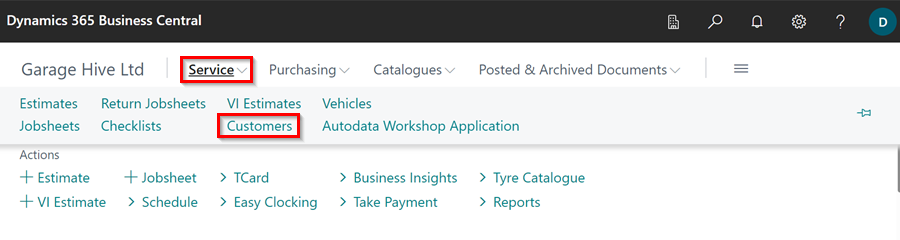
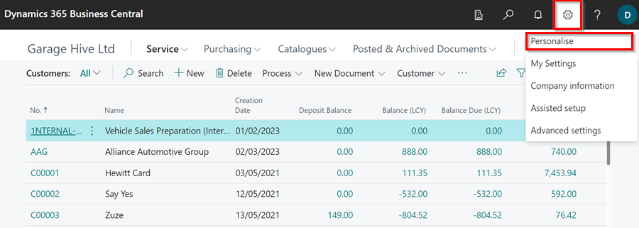
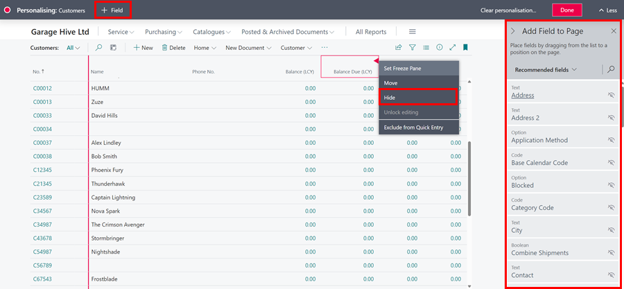
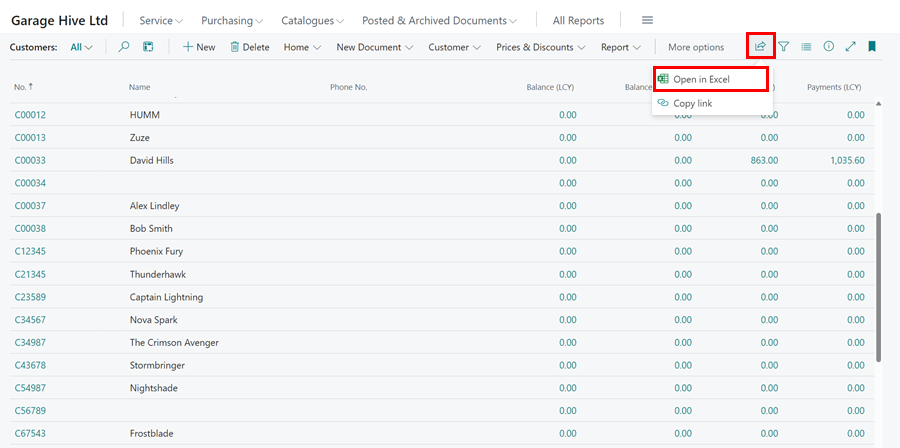

## How to Export Customer and Vehicle Information To Excel
Exporting customer or vehicle information in Garage Hive, includes exporting all the columns in your current view and opening them in excel. This means that you will have to [personalising the list](garagehive-personalising-garage-hive.html) and select the necessary columns to ensure that you export the desired information. Here's how to do it:
1. Click on **Service** in the Role Centre, and select **Customers** to open the customer list.

   

2. To personalise the columns that will be exported, click on the **Settings** icon located at the top-right corner of the page, and select **Personalise**.

   

3. Click on the **+Field** option at the top, which now adds the hidden columns to the right side of the screen. To add a new column, drag and drop it into place. To hide an existing column, click on it and select the **Hide** option from the available options. When finished click on **Done**.

   

4. To start the export of the **Customer Information**, click on the share icon and select **Open in Excel**.

   

5. Your browser will prompt you to open or save it as an Excel file.
6. This same procedure applies to all the **List** pages in Garage Hive, including the **Vehicle** information.

[Go back to top](#top)