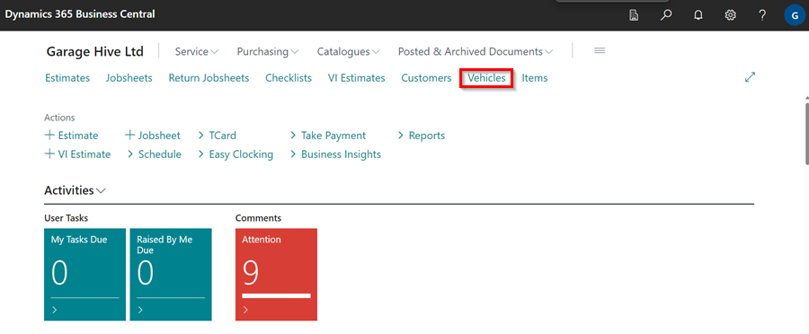
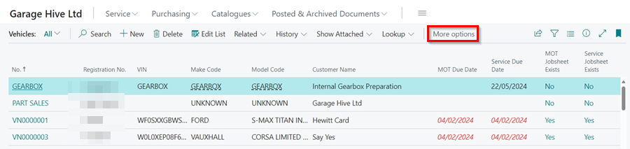
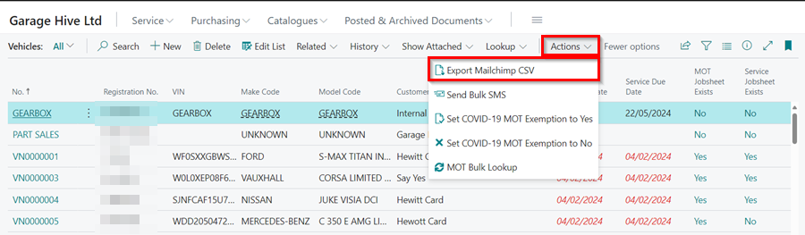
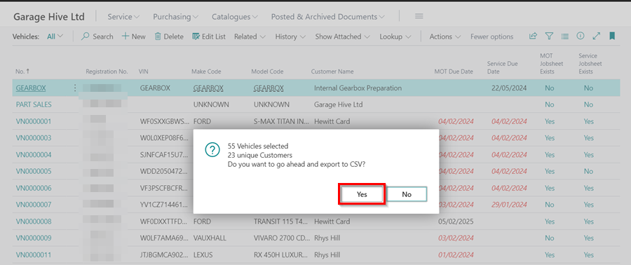

# We are still working on this article!
We are currently reviewing this article before it is published, check back later.

# Exporting Contacts for Mailchimp Emailing in Garage Hive
To ensure your contact list in MailChimp is up-to-date, you can export the contacts from Garage Hive in CSV format and import them into MailChimp. This allows you to easily send email newsletters to all your customers using MailChimp. Here is how to export the contacts:

1. Open the **Vehicle** list from the Role Centre/Home Screen.

   

2. Click on the **Actions** option in the menu bar of the vehicle list. If it's not visible, click on **more options**. 

   

3. From the **Actions** drop-down menu, select **Export MailChimp CSV**.

   

4. A pop-up dialogue box will appear, confirming the number of selected vehicles and the number of unique customers available. Click **Yes** to continue.

   

5. A CSV file will be downloaded on your computer, with all the contacts available.
 

[Go back to top](#top)