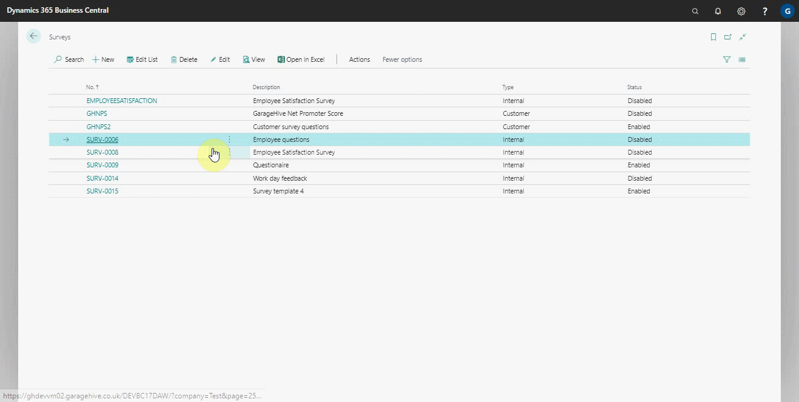
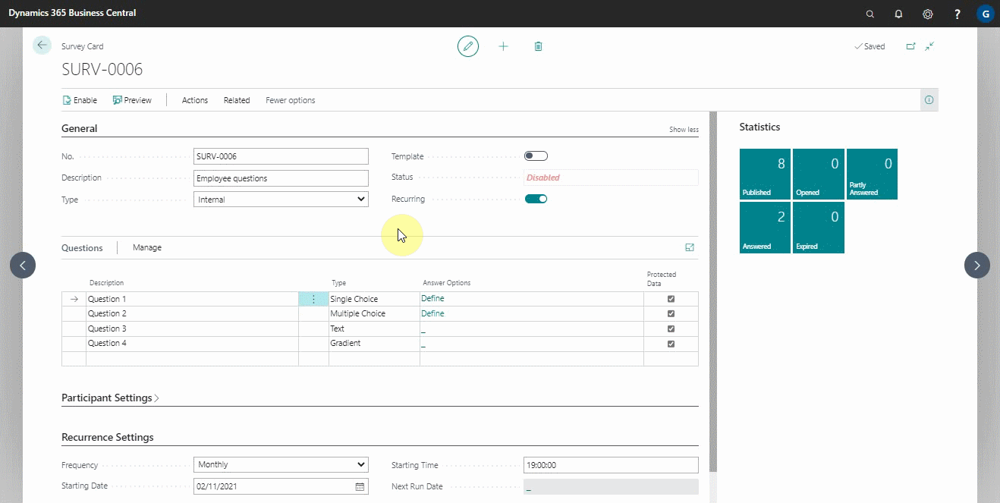

# Exporting an Internal Survey

Exporting an internal survey is a feature available in surveys to help you in sharing internal surveys file for external use with the extension **stx**. For example, you could export a survey to share with a member of Garage Hive Community.

### To export an internal survey:
1. In the top-right corner, choose the search icon, enter **Surveys**, and choose the related link.
2. Select the survey to export, then click **Actions** and then **Export** from the actions bar. Click **Yes** to export. You can also export multiple surveys at once.

   

3. The export action can also be applied from an open survey. Open the selected survey and select **Actions**, then **Export**.
4. The export action allows you export the survey file with the **stx** extension. Click **Yes** to export.

   

4. If you want the survey to be used as a template, which means the survey number will be preserved, make sure that the **Template** slider is on before exporting.
 
   

 

### **See Also**

[Setting up and sending internal surveys](garagehive-setting-up-and-sending-internal-surveys.html) \
[Scheduling recurring internal surveys](garagehive-scheduling-recurring-internal-surveys.html) \
[Reviewing internal surveys](reviewing-internal-surveys.html) \
[How to get started with external consultant survey](garagehive-how-to-get-started-with-external-consultant-survey.html) \
[Importing an internal survey](garagehive-importing-an-internal-survey.html)