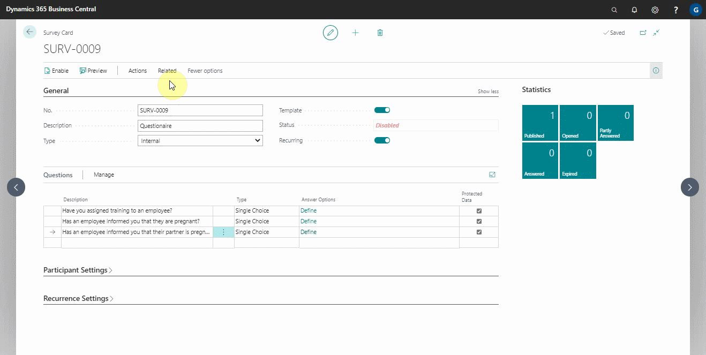

# Exporting an Internal Survey

Exporting an internal survey is a feature available in surveys to help you in sharing internal surveys file for external use with the extension **stx**. For example, you could export a survey to share with an external consultant.

### To export an internal survey:
1. Search for **Surveys** at the top-right corner, and select it from the results. A list of previously created surveys is displayed.
2. Select the survey to export, and click on **Actions** and select **Export** from the actions bar.
3. The export action allows you export the survey file with the **stx** extension, then click **Yes**.

   

**2. As a repeat user:**
As a repeat user, you will have already activated the **Template** field, and all you need to do now is use the feature:
1. Locate and select the survey to be updated. 

  

2. Select **Actions** from the action bar and then **Import** to import the survey. If you can't find the **Actions** option, click **More Options**.

  

3. If you are exporting a survey and you want it during import to be created with the same number, make sure you mark it as a template, by selecting the **Template** field.
 
   (gif)

 

### **See Also**

[Setting up and sending internal surveys](garagehive-setting-up-and-sending-internal-surveys.html) \
[Scheduling recurring internal surveys](garagehive-scheduling-recurring-internal-surveys.html) \
[Reviewing internal surveys](reviewing-internal-surveys.html) \
[How to get started with external consultant survey](garagehive-how-to-get-started-with-external-consultant-survey.html) \
[Importing an internal survey](garagehive-importing-an-internal-survey.html)