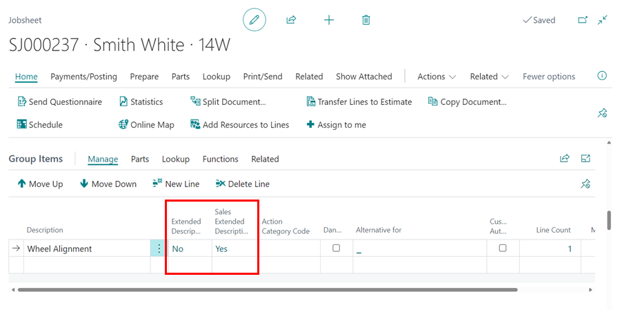
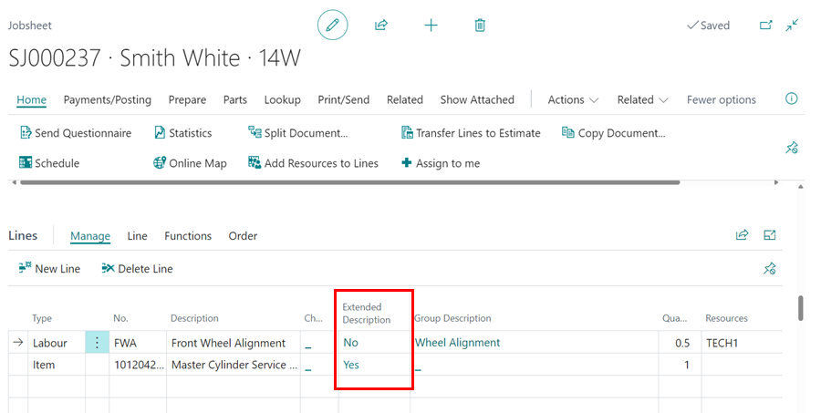

# We are still working on this article!
We are currently reviewing this article before it is published, check back later.

# Garage Hive Extended Descriptions
In Garage Hive, an extended description is a feature used to provide a more in-depth understanding of a specific item, work or subject. They help users in adding more information about what they are working on. There are three types of **Extended Descriptions** in Garage Hive:

1. **Extended Descriptions** - This section highlights completed tasks and provides additional information for a card in Garage Hive, such as an item or a Service Package.
2. **OB (Online Booking) Extended Descriptions** - Primarily used for advertisements in an online booking, **OB Extended Descriptions** provide your customers with compelling reasons why they should book now in an online booking.
3. **Sales Extended Description** - Normally printed in VIEs and Estimates, **Sales Extended Descriptions** explain your findings as well as why certain actions are required for the quoted work.

Here's how Extended Descriptions appear in Garage Hive and how to use them:

1. All types of **Extended Descriptions** can be added to a **Service Package** card. To add them in a Service Package, go to the Role Centre and choose **Catalogues**, then **Service Packages**.

   

2. Select the **Service Package** to which you want to add **Extended Descriptions**, and then in the **General** FastTab, click on the dash (-) in the fields **Extended Description** or **Sales Extended Description** to add either of them, and enter the description in the pop-up text box. When finished, click **Close**.

   

3. To add an **Online Booking Extended Description** to a Service Package card, scroll down to the **Online Booking** FastTab and click on the dash (-) in the **OB Extended Description** field, then enter the description in the pop-up text box. When you're done, click **Close**.

   

4. In a document, the **Extended Description** and **Sales Extended Description** can be added for **Group Items**. Click on the **Extended Description** or **Sales Extended Description** fields under the **Group Items** FastTab. In the pop-up text box, type the description. When finished, click **Close**.
5. When the field is **No**, no Extended Description is added; when it is **Yes**, an Extended Description is added.

   

6. **Extended Description** can also be added to an item from the **Lines** sub-page in a document.

   

7. The extended descriptions appear as follows in the various **printouts**, online booking, and online authorisation:
   
   - **Jobsheet** - Extended Description

      

   - **Vehicle Inspection Estimate** - Sales Extended Description

      

   - **Online Authorisation** - Sales Extended Description or Extended Description

      

   - **Online Booking** - Online Booking Extended Description
      When the customer clicks on **More Info.**, the OB Extended description is displayed.

      

[Go back to top](#top)
