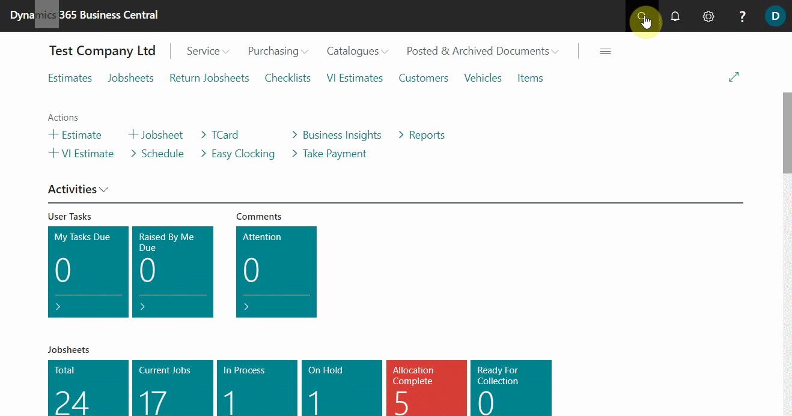
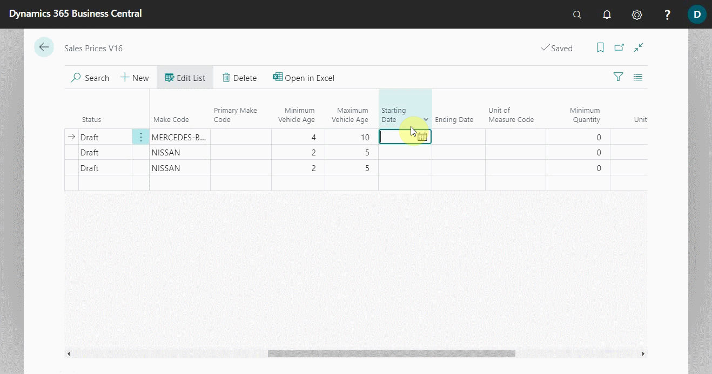

# Extending Price, Markup, and Discount Calculations 

When a company needs to use a specific price, markup, or discount for a specific item or labour, Garage Hive allows them to do so and even specify the time period for which the prices will be used. These prices, markups, and discounts supersede the standard prices available in an item or labour card.

## In this article

1. [Extending sales prices calculations](#extending-sales-prices-calculations)
2. [Extending sales markups calculations](#extending-sales-markups-calculations)
3. [Extending sales discounts calculations](#extending-sales-discounts-calculations)

### Extending sales prices calculations
To specify sales price for specific item(s) or labour(s):
1. In the top-right corner, choose the search icon, enter **Sales Prices V16**, and choose the related link. V16 is an abbreviation for Version 16, which was the version when this feature was released. This will be renamed as time goes on.

   

2. There are three statuses on the **Sales Prices V16** page lines:
- **Draft:** For use when editing lines.
- **Active:** To be used when the prices are ready to go live.
- **Inactive:** Returns to standard pricing.

   Choose **Draft** status when editing the lines.

   

3. On the page lines, specify the **Source Type**, which defines who the price should apply to, and the **Asset Type**, which determines what item(s) or labour(s) the price should apply to. In this case, we'll set the **Source Type** to **All Customers** and the **Asset Type** to **Labour**.

   

4. Then, select the **Product No.** as the number for the item(s) or labour(s) to apply the price. Specify the **Location Code** to which the price should apply and the **Make Code** or **Primary Code** for which vehicle the price should apply (if need be).

   

5. Add the **Starting Date** and **Ending Date** for the price, which means the price will only be valid for the specified period (this is optional).

   

6. Enter the **Unit of Measure Code** for the **Product No.** you selected (Where applicable), followed by the **Minimum Quantity** to apply the price and the **Unit Price** to use.

   

7. You can also specify other fields such as **Allow Line Disc.**, which means that the price you're using can use the discount in the document lines, **Price Includes VAT**, which means that the price includes VAT, and so on.

   

8. Make the status to be **Active**, in the first column.

   

9. The price set up will now be used for the item(s) and labour(s) specified.

### Extending sales markups calculations
To specify sales markup for specific item(s) or labour(s):
1. In the top-right corner, choose the search icon, enter **Sales Markups V16**, and choose the related link.

   

2. Choose **Draft** status when editing the lines. 
3. On the page lines, specify the **Source Type**, which defines who the markup should apply to, and the **Asset Type**, which determines what item(s) or labour(s) the markup should apply to. In this case, we'll set the **Source Type** to **All Customers** and the **Asset Type** to **Item Category**.

   

4. Then, select the **Product No.** as the number for the item(s) or labour(s) to apply the markup. Specify the **Location Code** to which the markup should apply and the **Make Code** or **Primary Code** for which vehicle the markup should apply(if need be).

   

5. Add the **Starting Date** and **Ending Date** for the markup, which means the markup will only be valid for the specified period (this is optional).

   

6. Enter the **Minimum Quantity**, **Minimum Unit Cost** and **Maximum Unit Cost** to apply the sales markup.

   

7. Add the **Markup Type** to be either **Amount** or **Percent**, the **Markup Base** to be either **Unit Cost** (which is the unit cost in the lines) or **Unit Cost in Document** (which is the unit cost for the document), and the **Markup Value** depending on the **Markup Type** you used. In this case, we'll use a **30% markup value for unit cost in document**.

   

8. You can also specify other fields, such as **Minimum Markup Amount**, which means that the markup amount should not be less than this amount, and **Allow Line Discount**, which means that the line discount in the document will be used for the price after the markup is set.

   

9. Set the status to **Active** in the first column.
10. The markup should now be applied in documents, when the specified item(s) or labour(s) are assigned.

### Extending sales discounts calculations
To specify sales markup for specific item(s) or labour(s):
1. In the top-right corner, choose the search icon, enter **Sales Discounts V16**, and choose the related link.

   

2. Choose **Draft** status when editing the lines. 
3. On the page lines, specify the **Source Type**, which defines who the discount should apply to, and the **Asset Type**, which determines what item(s) or labour(s) the discount should apply to. In this case, we'll set the **Source Type** to **All Customers** and the **Asset Type** to **Item Category**.

   

4. Then, select the **Product No.** as the number for the item(s) or labour(s) to apply the discount. Specify the **Location Code** to which the discount should apply and the **Make Code** or **Primary Code** for which vehicle the markups should apply(if need be).

   

5. Add the **Starting Date** and **Ending Date** for the discount, which means the discount will only be valid for the specified period (this is optional).

   

6. Enter the **Unit of Measure Code**, and the **Line Discount %** to offer, in percentage.

   

9. Set the status to **Active** in the first column.
10. The discount should now be applied in documents, when the specified item(s) or labour(s) are assigned.

 

> **Note:**
>
> This may be a little bit complicated setup, but if you have any questions, please get in touch with our support team.

