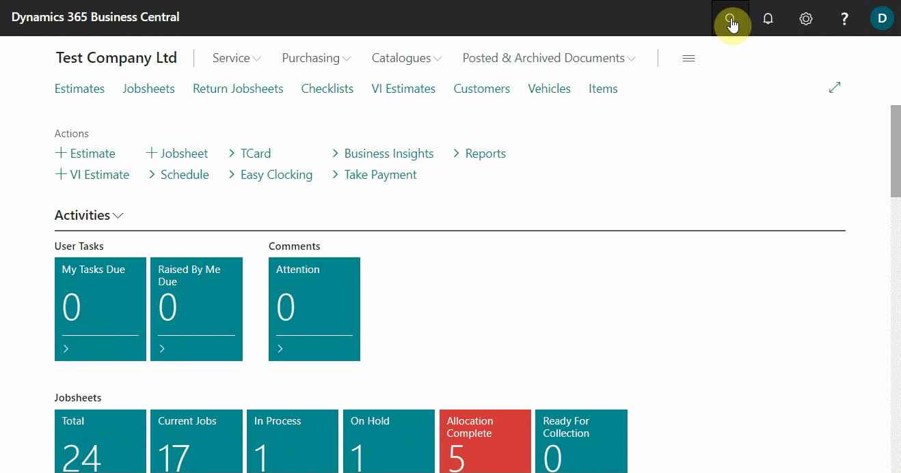
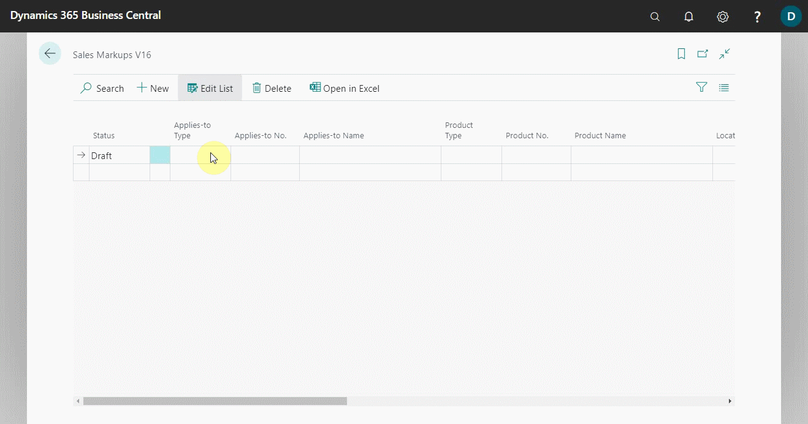
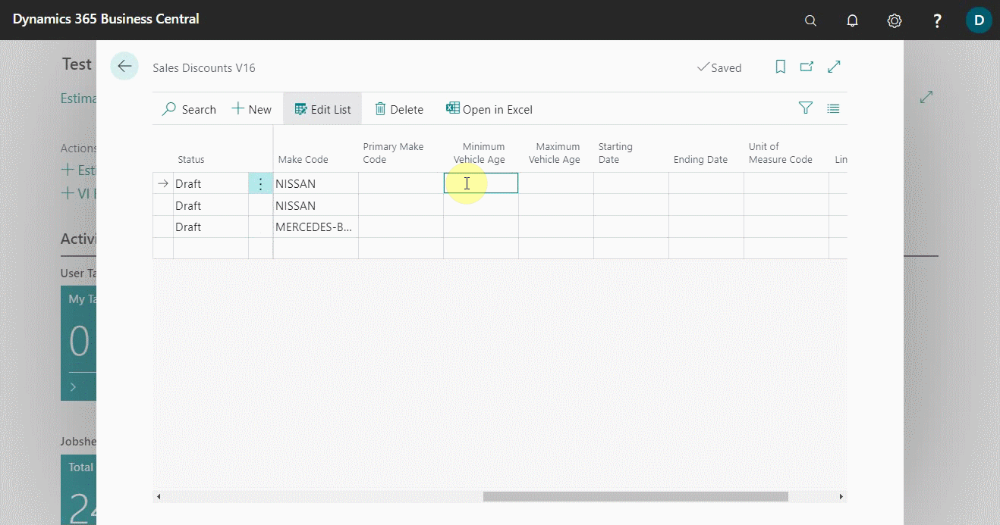

# Extending Price, Markup, and Discount Calculations 

When a company needs to use a specific price, markup, or discount for a particular product, Garage Hive gives the possibility to do so, and even set specific filters, like location, make, vehicle age, and so on. These prices, markups, and discounts supersede the standard prices available in an item or labour card.

## In this article

1. [Extending sales prices calculations](#extending-sales-prices-calculations)
2. [Extending sales markups calculations](#extending-sales-markups-calculations)
3. [Extending sales discounts calculations](#extending-sales-discounts-calculations)

### Extending sales prices calculations
To specify sales price for specific product(s):
1. In the top-right corner, choose the search icon, enter **Sales Prices V16**, and choose the related link. V16 is an abbreviation for Version 16, which was the version when this feature was released.

   

2. There are three statuses on the **Sales Prices V16** page lines:
- **Draft:** For use when you want to edit the lines.
- **Active:** For use when you want to go live with the prices.
- **Inactive:** For use when you want to return to standard pricing.

   Choose **Draft** status when editing the lines.

   

3. On the lines, specify the **Applies-to Type**, and **Applies-to No.** which defines who the price should apply to.
4. Then add the **Product Type**, and the **Product No.** which determines what product the price should apply to. 
5. In this case, we'll set the **Applies-to Type** as **All Customers** (no need to add **Applies-to No.** as all customers customers are covered), **Product Type** as **Labour**, and the **Product No.** as **LAB- Standard Labour Rate**.

   

6. There are several filters that you can use, to be more specific when applying the prices. You can specify the **Location Code**, **Make Code** or **Primary Make Code** for the price.

   

7. You can also use the **Minimum Vehicle Age** and **Maximum Vehicle Age** to filter on how to apply the price according to the age of the vehicle. The vehicle age is calculated from the **Vehicle First Registration Date** field in the **Vehicle** card.

   

8. Add the **Starting Date** and **Ending Date** for the price, which means the price will only be valid for the specified period (this is optional).

   

9. Enter the **Unit of Measure Code** (if you use **Product Type** as **Item** or **Resource**) for the **Product No.** you selected (Where applicable), followed by the **Minimum Quantity** to apply the price and the **Unit Price** to use.
10. You can also specify other fields such as **Allow Line Disc.**, which means that the price you're using can use the discount in the document lines, **Price Includes VAT**, which means that the price includes VAT, and so on.

   
    
   

11. When done editing, make the status to be **Active** from the first column.

   

12. The prices set up will now be active for use.

### Extending sales markups calculations
To specify sales markup for specific product(s):
1. In the top-right corner, choose the search icon, enter **Sales Markups V16**, and choose the related link.

   

2. Choose **Draft** status when editing the lines. 
3. On the lines, specify the **Applies-to Type**, and **Applies-to No.** which defines who the markup should apply to.
4. Then add the **Product Type**, and the **Product No.** which determines what product the markup should apply to. 
5. In this case, we'll set the **Applies-to Type** as **All Customers**, **Product Type** as **Item Category**, and the **Product No.** as **Filters - Filtration**.

   

6. There are several filters that you can use, to be more specific of how to apply the markup. You can specify the **Location Code**, **Make Code** or **Primary Make Code** for the markup.

   

7. You can also use the **Minimum Vehicle Age** and **Maximum Vehicle Age** to filter on how to apply the price according to the age of the vehicle. The vehicle age is calculated from the **Vehicle First Registration Date** field in the **Vehicle** card.

   

8. Add the **Starting Date** and **Ending Date** for the markup, which means the markup will only be valid for the specified period (this is optional).

   

9. Enter the **Minimum Quantity**, **Minimum Unit Cost** and **Maximum Unit Cost** to apply the sales markup (this is also optional).

   

10. Add the **Markup Type** to be either **Amount** or **Percent**, the **Markup Base** to be either **Unit Cost** (which is the unit cost in the document lines) or **Unit Cost in Document** (which is the unit cost for the whole document).
11. Specify the **Markup Value** depending on the **Markup Type** you used. In this case, we'll use a **30% markup value for unit cost**.

   

12. You can also specify other fields, such as **Minimum Markup Amount**, which means that the markup amount should not be less than this amount, and **Allow Line Discount**, which means that the line discount in the document will be used for the price after the markup is set.

   

13. Set the status to **Active** in the first column.
14. The markups set up will now be active for use.

### Extending sales discounts calculations
To specify sales markup for specific item(s) or labour(s):
1. In the top-right corner, choose the search icon, enter **Sales Discounts V16**, and choose the related link.

   

2. Choose **Draft** status when editing the lines. 
3. On the lines, specify the **Applies-to Type**, and **Applies-to No.** which defines who the discounts should apply to.
4. Then add the **Product Type**, and the **Product No.** which determines what product the discounts should apply to. 
5. In this case, we'll set the **Applies-to Type** as **Customer Category**, **Applies-to No.** as **Retail**, **Product Type** as **Item Category**, and the **Product No.** as **Fluids - Fluids, Oils & Anti-Freeze**.

   

4. There are several filters that you can use, to be more specific of how to apply the discounts. You can specify the **Location Code**, **Make Code** or **Primary Make Code** for the markup.

   

5. You can also use the **Minimum Vehicle Age** and **Maximum Vehicle Age** to filter on how to apply the price according to the age of the vehicle. The vehicle age is calculated from the **Vehicle First Registration Date** field in the **Vehicle** card.

   

6. Add the **Starting Date** and **Ending Date** for the discount, which means the discount will only be valid for the specified period (this is optional).
7. Enter the **Unit of Measure Code** (if need be), and the **Line Discount %** to offer, in percentage.

   

8. Set the status to **Active** in the first column.
9. The discounts set up will now be active for use.

 

> **Note:**
>
> This may be a little bit complicated setup, but if you have any questions, please get in touch with our support team.

