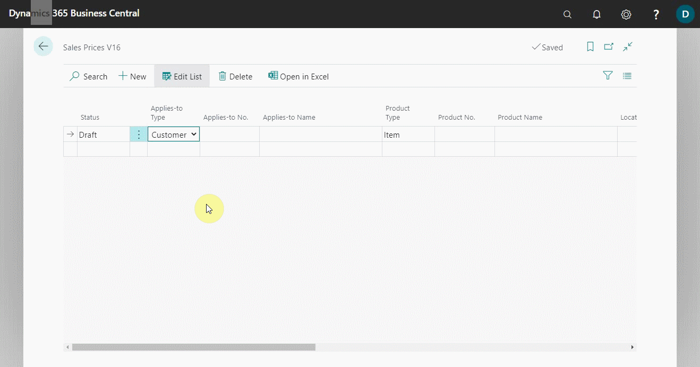
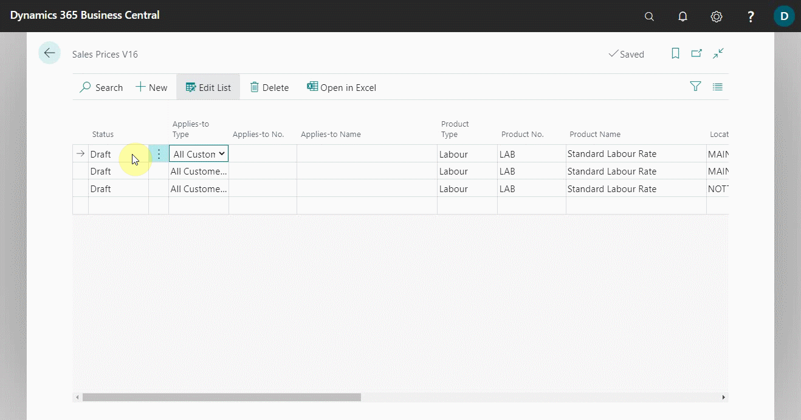
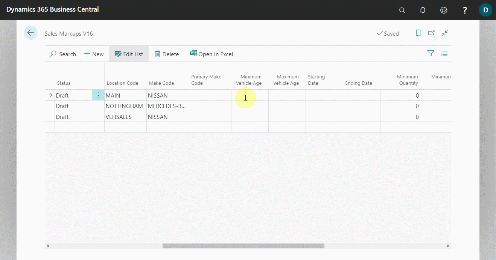
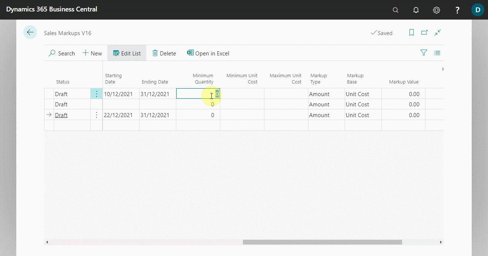

# Extending Price, Markup, and Discount Calculations 

When a company needs to use a specific price, markup, or discount for a specific item or labour, Garage Hive allows them to do so and even specify the time period for which the prices will be used. These prices, markups, and discounts supersede the standard prices available in an item or labour card.

## In this article

1. [Extending sales price calculations](#extending-sales-price-calculations)
2. [Extending sales markup calculations](#extending-sales-markup-calculations)
3. [Extending sales discounts calculations](#extending-sales-discounts-calculations)

### Extending sales price calculations
To specify sales price for specific item(s) or labour(s):
1. In the top-right corner, choose the search icon, enter **Sales Prices V16**, and choose the related link. V16 is an abbreviation for Version 16, which was the version when this feature was released. This will be renamed as time goes on.

   

2. There are three statuses on the **Sales Prices V16** page lines:
- **Draft:** For use when editing lines.
- **Active:** To be used when the prices are ready to go live.
- **Inactive:** Returns to standard pricing.

   Choose **Draft** status when editing the lines.

   

3. On the page lines, specify the **Source Type**, which defines who the pricing should apply to, and the **Asset Type**, which determines what the pricing should apply to. In this case, we'll set the **Source Type** to **All Customers** and the **Asset Type** to **Labour**.

   

4. Then, select the **Product No.** as the number for the item or labour to apply the pricing to. You can also specify the **Location Code** to which the pricing should apply and the **Make Code** or **Primary Code** for which vehicle the pricing should apply.

   

5. You can also specify the **Starting Date** and **Ending Date** for the pricing, which means the pricing will only be valid for the specified period.

   

6. You can now enter the **Unit of Measure Code** for the **Product No.** you selected (Where applicable), followed by the **Minimum Quantity** to apply the price and the **Unit Price** to use.

   

7. You can also specify other fields such as **Allow Line Disc.**, which means that the price you're using can use the discount in the document lines, **Price Includes VAT**, which means that the price includes VAT, and so on.

   

8. Make the status to be **Active**, in the first column.

   

9. The price set up will now be used within the period specified.

### Extending sales markup calculations
To specify sales markup for specific item(s) or labour(s):
1. In the top-right corner, choose the search icon, enter **Sales Markups V16**, and choose the related link.

   

2. Choose **Draft** status when editing the lines. 
3. On the page lines, specify the **Source Type**, which defines who the markups should apply to, and the **Asset Type**, which determines what the markups should apply to. In this case, we'll set the **Source Type** to **All Customers** and the **Asset Type** to **Item Category**.

   

4. Then, select the **Product No.** as the number for the item or labour to apply the markups to. You can also specify the **Location Code** to which the markups should apply and the **Make Code** or **Primary Code** for which vehicle the markups should apply.

   

5. You can also specify the **Starting Date** and **Ending Date** for the markups, which means the markups will only be valid for the specified period.

   

6. You can now enter the **Minimum Quantity**, **Minimum Unit Cost** and **Maximum Unit Cost** to apply the sales markups.

   

7. Add the **Markup Type** to be either **Amount** or **Percent**, the **Markup Base** to be either **Unit Cost** (which is the unit cost in the lines) or **Unit Cost in Document** (which is the unit cost for the document), and the **Markup Value** depending on the **Markup Type** you used. In this case, we'll use a **30% markup value for unit cost in document**.

   

8. You can also specify other fields, such as **Minimum Markup Amount**, which means that the markup amount should not be less than this amount, and **Allow Line Discount**, which means that the line discount in the document will be used for the price after the markup is set.

   

9. Set the status **Active** in the first column.
10. The markups should now be applied in documents, when the specified products are assigned.

 

> **Note:**
>
> This may be a little bit complicated setup, but if you have any questions, please get in touch with our support team.

