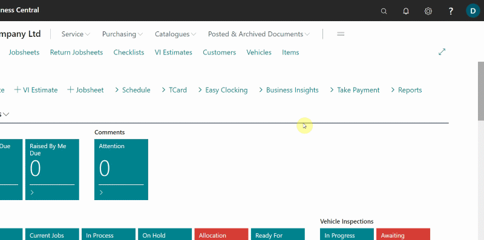
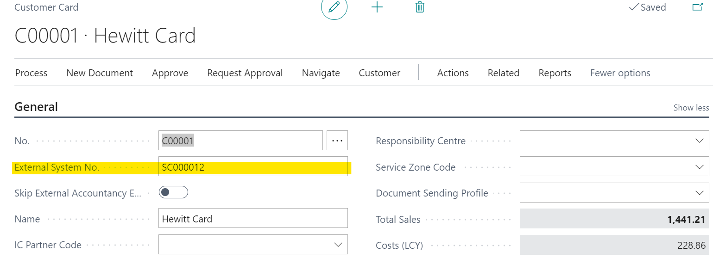
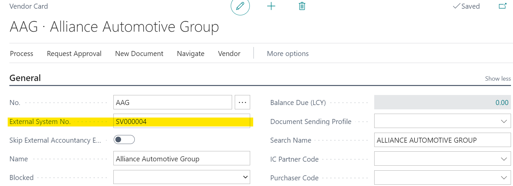
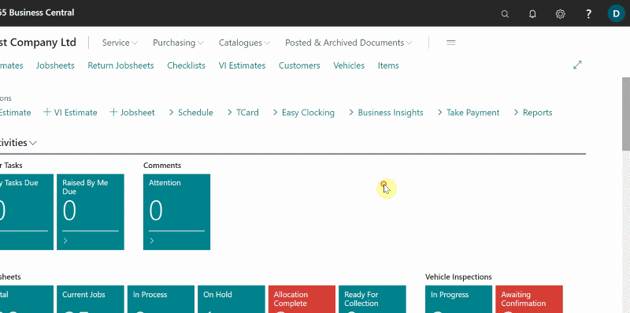
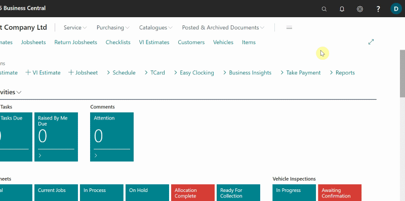

# How to Integrate Garage Hive With Your External Accountancy System
To integrate your external accountancy system with Garage Hive:
1. In the top-right corner, enter **Accountancy Integration Setup** in the search icon, and select the related link.
2. Select the accountancy system that you are using in the **General** FastTab, **Accountancy System** field. We'll use **QuickBooks Online** as an example.

   

3. Turn on the **Integration Enabled** slider and select **Document Date** in both the **Export Customer Ledger by** and **Export Vendor Ledger by** fields.
4. From the actions bar Select **Init. Customers** and **Init. Vendors**, then click **Yes** in the pop-up windows. This generates an **External System No.** for all **Customer** and **Vendor** cards in Garage Hive. Exit the page.

   

5. When you open any **Customer** or **Vendor** card, you will see the **External System No.** as shown below.

   

   

6. You should then integrate the **Chart of Accounts** to the external system. In the search icon, enter **Chart of Accounts** and select the related link.
7. In the **Chart of Accounts** page, select **Edit List** from the actions bar.

   

8. In the **External System No.** column, enter the account numbers for the accounts you want to integrate with the external system. In this case, we'll integrate all of the **4000s** accounts.

   > **Note:**
   >
   > Typically only the **4000's and 5000's** accounts are needed.

   

9.  Finally, add the **External System No.** to the **Payments Methods**. In the search icon, type **Payment Methods** and select the related link.
10. In the **External System No.** column, enter the corresponding code for the **Payment Methods** that you use in your external system.

   

 

### **See Also**

[How to Export to Your External Accountancy System](garagehive-finance-accountancy-export.html) \
[Xero API Integration Setup](xero-api-intergration.html)

