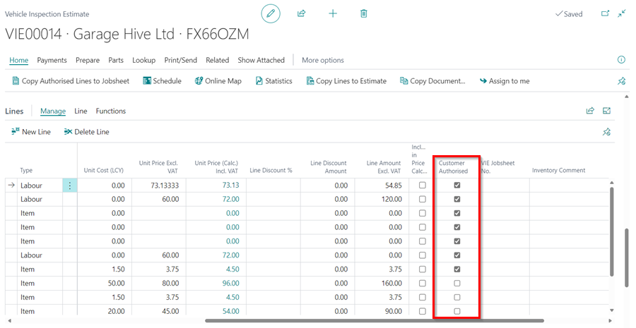
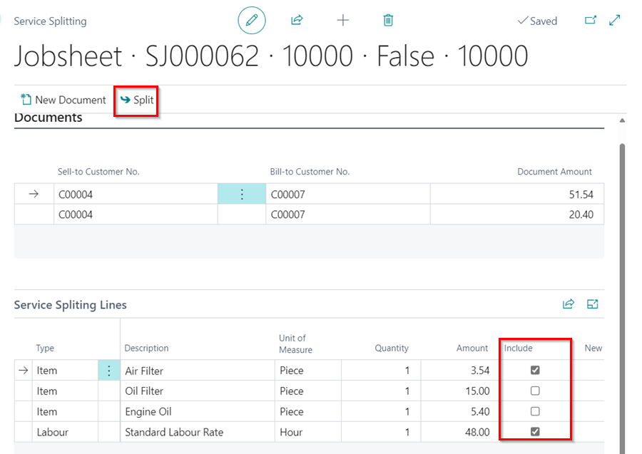

## System Functionality FAQs
This article answers some common questions that you might have about the functionality of the Garage Hive software.

1. [How easy is it to make a booking&#63;](#how-easy-is-it-to-make-a-booking)
2. [Where can I find a Jobsheet which has been invoiced&#63;](#where-can-i-find-a-jobsheet-which-has-been-invoiced)
3. [How can I see if a technician has completed a Vehicle Inspection&#63;](#how-can-i-see-if-a-technician-has-completed-a-vehicle-inspection)
4. [How can I add authorised work from a Vehicle Inspection Estimate&#63;](#how-can-i-add-authorised-work-from-a-vehicle-inspection-estimate)
5. [How can I see how much a customer owes&#63;](#how-can-i-see-how-much-a-customer-owes)
6. [How can I create a service package&#63;](#how-can-i-create-a-service-package)
7. [Does the system send out reminders&#63;](#does-the-system-send-out-reminders)
8. [How can I change a payment method if a Jobsheet has been posted&#63;](#how-can-i-change-a-payment-method-if-a-jobsheet-has-been-posted)
9. [Can I set specific discounts for different customers&#63;](#can-i-set-specific-discounts-for-different-customers)
10. [Can I set up specific markups or margins on parts&#63;](#can-i-set-up-specific-markups-or-margins-on-parts)
11. [Can I split a Jobsheet&#63;](#can-i-split-a-jobsheet)
12. [How can I see ahead of time when the Garage is busy and when it is free in Garage Hive&#63;](#howcan-i-see-ahead-of-time-when-the-garage-is-busy-and-when-it-is-free-in-garage-hive)
13. [Would Garage Hive be accessible offline if the Garage Hive servers went down&#63;](#would-garage-hive-be-accessible-offline-if-the-garage-hive-servers-went-down)
14. [Does Garage Hive calculate VAT on a cash or accrual basis&#63;](#does-garage-hive-calculate-vat-on-a-cash-or-accrual-basis)
15. [Does Garage Hive use Sequential Invoice numbering&#63;](#does-garage-hive-use-sequential-invoice-numbering)
16. [How does Garage Hive manage the numbering of invoices for the integrated accounting software&#63;](#how-does-garage-hive-manage-the-numbering-of-invoices-for-the-integrated-accounting-software)

#### How easy is it to make a booking?

Making a booking with Garage Hive is extremely quick and simple. 

See the article link below for more information. 

> [Creating a booking from the Schedule.](/docs/garagehive-create-a-booking.html "Creating a booking from the Schedule")

[Go back to top](#top)

#### Where can I find a Jobsheet which has been invoiced?

A posted jobsheet can be found by going to the Home Screen and then selecting **Posted & Archived Documents**, followed by **Posted Jobsheets**. 

   

[Go back to top](#top)

#### How can I see if a technician has completed a Vehicle Inspection?

Once a technician has completed a Vehicle Inspection, it will appear in your tiles on the Home Screen as **VI Awaiting Confirmation**.

   

[Go back to top](#top)

#### How can I add authorised work from a Vehicle Inspection Estimate?

Once you've created the quote within the **Vehicle Inspection Estimates** and the customer has approved the extra work, check the **Customer Authorised** box next to all authorised lines. 

   

Then, in the menu bar, choose **Home**, followed by **Copy Authorized Lines** to Jobsheet.

   

This will then prompt you to select which job you want the lines added to; once selected and confirmed, the authorised work will be added to the job.

See the article link below for more information.

> [Adding customer authorisation and copy the authorised lines to Jobsheet.](/docs/garagehive-VHC.html#adding-customer-authorisation-and-copy-the-authorised-lines-to-jobsheet "Adding customer authorisation and copy the authorised lines to Jobsheet")

[Go back to top](#top)

#### How can I see how much a customer owes?

Select the customer from the customer's list by selecting **Customers** from the Home Screen followed, by the customer name. 

Once you find the relevant customer, you will be able to see the customer's **Balance**, together with any costs against them. You can also click on the figure it will open the Customer Ledger Entries, which will show the specifics of this amount.

   

[Go back to top](#top)

#### How can I create a service package?

Select **Catalogues**, then **Service Packages** from the home screen. This will give you the option of editing an existing Service Package or creating a new one. 

See the article link below for more information. 

> [How to Create Service Packages in Garage Hive.](/docs/garagehive-service-packages.html "How to Create Service Packages in Garage Hive")

[Go back to top](#top)

#### Does the system send out reminders?

Yes, Garage Hive can send out automated **MOT**, **Service**, and **Booking Reminders**.

See the article link below for more information. 

> [Types of Customer Notifications in Garage Hive.](/docs/garagehive-customer-notifications.html "Types of Customer Notifications in Garage Hive")

[Go back to top](#top)

#### How can I change a payment method if a Jobsheet has been posted?

If you posted a Jobsheet with the incorrect payment method, you must use the **Correct** document option. See the article link below for more information.

> [Correcting Incorrect Payment Method.](/docs/garagehive-jobsheet-cancel-and-correct.html#correcting-a-jobsheet "Correcting Incorrect Payment Method")

[Go back to top](#top)

#### Can I set specific discounts for different customers?

Yes, you can set specific Labour and Parts discounts for all customers or groups of customers. 

See the article link below for more information. 

> [Setting specific price, markup, or discounts.](/docs/garagehive-automatic-price-markup-and-discount-calculations.html "Setting specific price, markup, or discounts")

[Go back to top](#top)

#### Can I set up specific markups or margins on parts?

Yes, you can setup markups and/or margins for a specific part or an Item Category. 

See the article link below for more information. 

> [Creating an Item Card.](/docs/garagehive-create-an-item-card.html "Creating an Item Card")

[Go back to top](#top)

#### Can I split a Jobsheet? 

Yes, a Jobsheet can be split. See the step-by-step instructions below.

1. From the Jobsheet, select **Home**, and then **Split Document**. This will take you to the Service Splitting page.

   

2. Scroll down to the **Service Splitting Lines** FastTab and untick the lines in the **Include** column that you want to put on a separate Jobsheet.
3. After unticking these, go to the menu bar and select **Split**.

   

4. You will then see a pop-up message informing you of the new Jobsheet number for the lines you have unticked.
5. You will now have two Jobsheets open for this customer/vehicle.

[Go back to top](#top)

#### How can I see ahead of time when the Garage is busy and when it is free in Garage Hive?
Garage Hive helps you manage your workshop by allocating time slots in the schedule, rather than Jobsheets, so you can easily see when the garage is busy and when it is free.

See the article link below for more information.

> [Understanding the Schedule.](/docs/garagehive-understanding-the-schedule.html "Understanding the Schedule")

[Go back to top](#top)

#### Would Garage Hive be accessible offline if the Garage Hive servers went down?
Garage Hive does not have an offline mode. If Microsoft's servers (where the Garage Hive system is hosted) went down, which is extremely unlikely, I'm afraid you'd have to rely on pen and paper until service is restored; but Microsoft has an uptime of 99.99+%. Cloud software is used by millions of small businesses around the world.

[Go back to top](#top)

#### Does Garage Hive calculate VAT on a cash or accrual basis?
There are two methods for calculating VAT, cash and accrual: 
   * With cash, you pay VAT based on payment you receive and claim it back from the payment you make within the VAT period, you can only claim or pay VAT once payments are made either way.
   * With Accrual, VAT is calculated at the point that invoices are raised regardless of when payments are made. 

Accrual is typically preferred for garages because a garage will owe more to its suppliers than it owes to its customers, allowing you to claim VAT on purchases in advance of payment for the goods, which is good for cash flow.

Because Garage Hive is built on Microsoft Dynamics, it only calculates VAT on an accrual basis, even when exporting to external accounting systems. So a business onboarding with Garage Hive that uses cash accounting would need to switch to accrual.

You can switch from cash to accrual at any time without notifying HMRC, but you must report and pay any outstanding VAT (whether your customers have paid you or not). You have 6 months to report and pay any outstanding VAT, ([Source](https://www.gov.uk/vat-cash-accounting-scheme/join-or-leave-the-scheme)).

[Go back to top](#top)

#### Does Garage Hive use Sequential Invoice numbering?

In Garage Hive, we typically use our Jobsheet number series for the associated invoice, for example    job SJ00001 creates invoice SJ00001 and so on. This makes traceability extremely easy. Job numbers are created sequentially, but some jobs are invoiced before others, so job six can be invoiced before job two. Still, every number used can be accounted for even if it's deleted (because it's archived). The method of having gaps in the invoice sequence is acceptable to HMRC.

[Go back to top](#top)

#### How does Garage Hive manage the numbering of invoices for the integrated accounting software?

Here's how Garage Hive manages various accounting software integration:
* **Sage 50** - Sage 50 integration, uses Garage Hive's invoice number as the invoice number in Sage 50 invoice.
* **Sage Accounting** - Sage Accounting integration, assigns its invoice number during the import process and attributes the Garage Hive invoice number as a reference on the invoice.
* **Xero API** - Xero API integration, uses Garage Hive's invoice number as the invoice number in Xero API invoice.
* **QuickBooks Online** - QuickBooks Online integration, uses Garage Hive's invoice number as the invoice number in QuickBooks invoice. 

[Go back to top](#top)