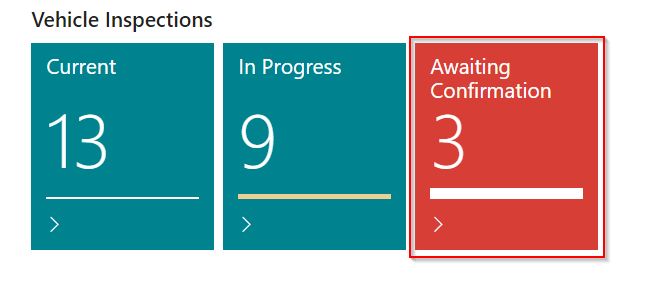

#   Frequently Asked Questions. 

>   How easy is it to make a booking?

It is extremely quick and easy to make a booking within Garage Hive. 

Please see video below. 



>   Where can I find a jobsheet which has been invoiced.

You can find a posted jobsheet within the Home Screen, then select **Posted & Archived Documents** followed by **Posted Jobsheets**. 

>   What does it mean when I see an error message come up which states "*The General Posting Setup does not exist. Identification fields and values: Gen. Bus Posting Group = 'DOMESTIC', Gen. Prod. Posting Groups= 'NO-POST'*" when trying to Post a Jobsheet or Purchase Order. 

Whenever you see "NO-POST" either when attempting to post either a Jobsheet or Purchase Order, this is usually because you have not replaced the MISC number with the actual part number. 

>   How can I see if a technician has completed a Vehicle Inspection?

Once a technician has completed a Vehicle Inspection it will show within your Tiles on the Home Screen within VI Awaiting Confirmation. 

>   How can I add authorised work from a Vehicle Health Check? 

Once you have built the quote up within the Vehicle Health Check and the customer has authorised the additional work, you can tick the Customer Authorised box against all authorised lines. Then select Process in the menu bar followed by Copy Authorized Lines to Jobsheet. 

This will then ask you to choose which job you want the lines adding to, after you have selected this and confirmed the authorised work will be addded to the job. 

See video below as a guide.



>   How can I see how much a customer owes?

If you search for the customer within the home screen. 

Once you find the relevant customer, you will be able to see the customers Balance, together with any costs against them. You can also click on the figure it will open the Customer Ledger Entries, which will show the specifics of this amount 

>   How can I create a service package? 

From within the home screen you need to select catalogues, followed by Service Packages. 

This will give you the option to edit and existing Service Package or Create a New one. 

See video below for guide how to create a Service Package. 



>   When trying to post a Jobsheet I occasionally get a message which says "*Resource information is missing in Jobsheet Line No. ............. Labour ................*" What does this mean?

This is because there is no resource (technician) attached to a Labour Line. 

Technician's should get into the habit of selecting which Labour lines they have completed. This will automatically fill in the Resource Section within the jobsheet lines. 

If they have not done this you can either manually type the technicians user name in the resource column, alternatively select Add Resources to Lines within the Action Bar on the jobsheet. 

>   Does the system send out reminders?

Yes, Garage Hive can send out automated MOT, Service and Booking Reminders out. 

See video below how to set up customer notifications. 



>   How can I change a payment method if a Jobsheet has been posted?

If you have posted a jobsheet with the incorrect payment method, you will need to cancel the document and use the copy document option. See below step by step guide. Alternatively see article link for guide. 

1. Find incorrect jobsheet and take a note of the number. 
2.  Select Posted Documents in the Home Screen. 
3.  Search for posted jobsheet and open. 
4.  Select Cancel Document at the top of the page. 
5.  Go back to the home screen. 
6.  Select Jobsheets. 
7.  Select Service Type within the jobsheet. 
8.  Select Actions tab on the top of the page. 
9.  Choose Copy Document. 
10.  In Document Type selected Posted Order. 
11. In Document No. input the original jobsheet number. 
12. Place a tick in the "Include Header" box. 
13. Select OK. 
14. Select Home tab on the top of the page.
15. You can now go into Take Payment and correct the payment method. 

[Correcting Incorrect Payment Method](/docs/garagehive-jobsheet-cancel-and-correct.html "Correcting Incorrect Payment Method")

>   Can I set specific discounts for different customers? 

Yes you can set specific Labour and Parts discounts for all customers or for groups of customers. 

See video below on how to set this up. 



>   Can I set up specific markups/margins on parts? 

You can set up markups and/or margins for either a specific part or for an Item Category. 

See video below for a guide on how to set this up. 



>   Can I split a Jobsheet? 

Yes a jobsheet can be split. See below step by step guide. 

1.  From within the jobsheet, select Process 
2.  Within Process press Split Document. (This will load a new Service Splitting page). 
3.  At this point you will see Service Splitting Lines. Untick the lines which you want putting on a separate jobsheet/invoice.
4.  Once you have unticked these select Actions within the menu bar and then press Split. 
5.  You will then see a pop up message which will advise you of the new jobsheet number for the lines which you have unticked. 

You will now have 2 jobsheets open for this customer/vehicle.