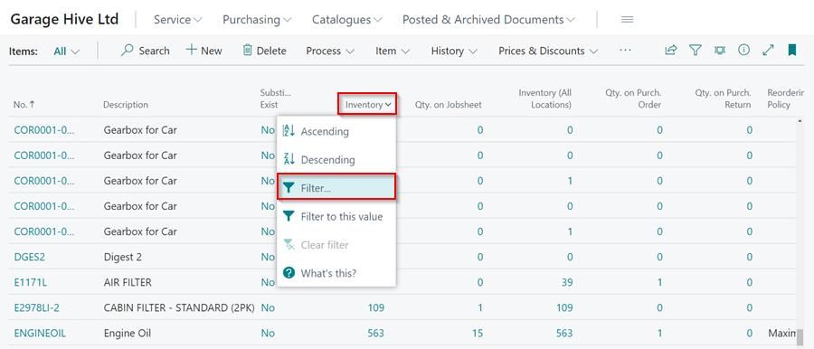
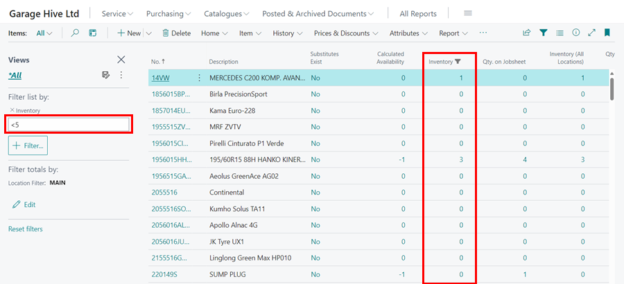
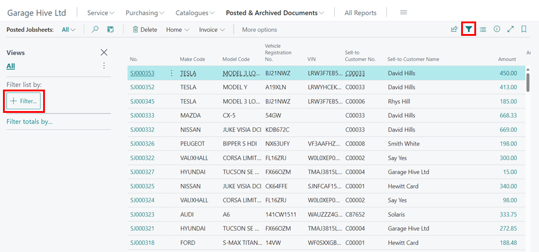
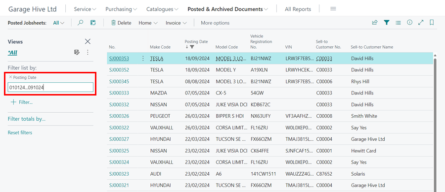

# How to Filter Lists In Garage Hive
Filtering lists in Garage Hive allows users to extract specific information from large datasets, allowing them to focus on relevant data and quickly find what they're looking for. In this article, we will look at some techniques for filtering lists in Garage Hive.

1. **Filtering Data in a Column**
   - To filter list in a column, for example **Inventory** column in **Item List**, click the down arrow (˅)in the header of the column and select **Filter**.
      
      

   - The filter sidebar appears on the left. To filter inventory that is greater than or less than 5, enter the greater than sign (>) or less than sign (<) before 5 in the **filter list by** field, for example **>5** or **<5**. To filter, press the **Enter** or **tab** keys. 

      

   - You can choose any column and apply a filter to get the values you want.

2. **Filtering Data within a Date Range**
   - To filter a list within a date range, for example **Posted Jobsheets** between dates 1st of July 2022 to 31st of September 2022, select **Posted Jobsheets** in the **Posted and Archived Documents** in the Role Centre. Click on the **Filter** icon on the top right corner of the list.
   - The filter sidebar appears on the left. Click on the **Filter** button to add a filter.

      

3. Select **Posting Date** as the filter in the filter field and press the **Enter** or **Tab** keys. Enter the date range as **010722...310922**. This narrows the list to the dates specified.

      
