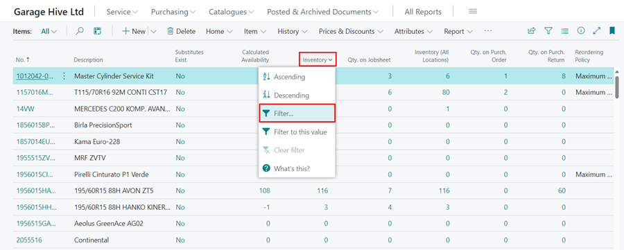
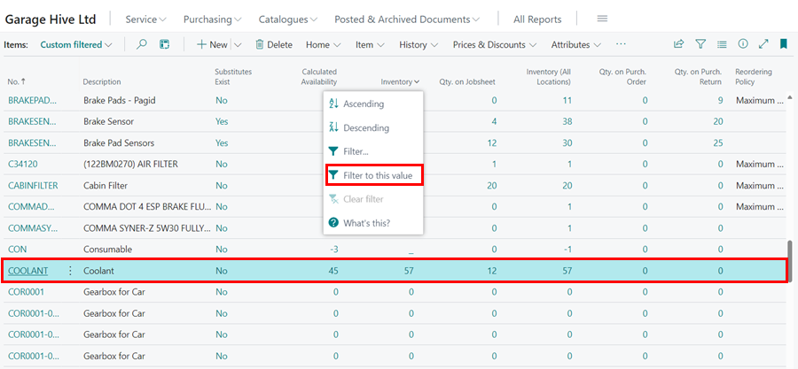
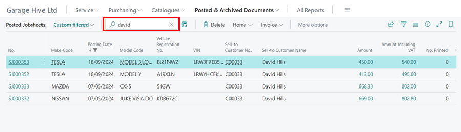

# We are still working on this article!
We are currently reviewing this article before it is published, check back later.

# How to Filter Lists In Garage Hive
Filtering lists in Garage Hive allows users to extract specific information from large datasets, allowing them to focus on relevant data and quickly find what they're looking for. In this article, we will look at some techniques for filtering lists in Garage Hive.

1. **Filtering Data in a Column**
   - To filter list in a column, for example **Inventory** column in **Item List**, click the down arrow (˅)in the column header and select **Filter**.
      
      

   - The filter pane appears on the left. To filter inventory that is greater than or less than 5, enter the greater than sign (>) or less than sign (<) before 5 in the **filter list by** field, for example **>5** or **<5**. To filter, press the **Enter** or **tab** keys. 

      

   - Alternatively, you can select **Filter This Value**, which will filter the specific record that is selected in the list as well as any other record with a similar value to the selected one.

      

2. **Filtering Data within a Date Range**
   - To filter a list within a date range, for example **Posted Jobsheets** between dates 1st of July 2022 to 30st of September 2022, select **Posted Jobsheets** in the **Posted and Archived Documents** in the Role Centre. Click on the **Filter pane** icon on upper right-hand side of the page layout, or using the shortcut **Shift+F3**.
   - The filter sidebar appears on the left. Click on the **Filter** button to add a filter.

      

3. Select **Posting Date** as the filter value in the filter field and press the **Enter** or **Tab** keys. Enter the date range as **010722...300922**. This narrows the list to the dates specified.

      

4. **Using Search in a List page**
   - The **search 🔎** action exists at the top of every list page. This provides a quick and easy way to search for a specific record in the page list. For example if you are interested in searching within the Jobsheets list all the Jobsheets opened for a customer, enter the name of the customer in the search action.

      

5. **Filter expressions for use in filters**
   - Filter expressions can be entered in the filter field to view a set of filtered data. Here is a list of filter expressions that can be used:

      | Filtering Expression | Filtered data                                                                                                                        |
      | :------------------- | :----------------------------------------------------------------------------------------------------------------------------------- |
      | 1000..1300           | Filters numbers 1000 through to 1300                                                                                                 |
      | ..3000               | Filters numbers up to and including 3000                                                                                             |
      | 3000..               | Filters numbers 3000 and up                                                                                                          |
      | 1100&#124;1400       | Filters numbers with 1100 or 1400                                                                                                    |
      | <>0                  | Filters all numbers except 0                                                                                                         |
      | >=1200               | Filters numbers greater than or equal to 1200                                                                                        |
      | >200&<1200           | Filters numbers greater than 200 and less than 1200                                                                                  |
      | 5999&#124;8100..8490 | Filters any records with the number 5999 or a number from the range 8100 through 8490                                                |
      | ..1299&#124;1400..   | Filters records with a number less than or equal to 1299 or a number equal to 1400 or greater (all numbers except 1300 through 1399) |
      | >50&<100             | Filters records with numbers that are greater than 50 and less than 100 (numbers 51 through 99)                                      |
      | 'com'                | Filters text that matches com exactly and is case-sensitive                                                                          |
      | ''                   | Filters text that is empty or blank                                                                                                  |
      | @com*                | Filters text that starts with com and is not case-sensitive                                                                          |
      | &#42;Co&#42;         | Filters text that contains Co and is case-sensitive                                                                                  |
      | &#42;Co              | Filters text that ends with Co and is case-sensitive                                                                                 |
      | Co*                  | Filters text that begins with Co and is case-sensitive                                                                               |
      | Hew?tt               | Filters text such as Hewitt or Hewott                                                                                                |

   The above **filter expressions** should be enter after choosing a filtering value, for example when on the item list you can choose **Qty on Jobsheet** as the filtering value and enter the filter expression **<>0**.

      

6. **Filtering expressions that should contain a single quote before and after the value**
   - If the values to be filtered contain any of the following symbols: **&amp;**, **&#40;**, **&#41;**, **&#61;**, and **&#124;**, then the filtering expressions should include a single quote before and after the value, for example:

      | Filtering Expression      | Filtered data                    |
      | :------------------------ | :------------------------------- |
      | 'D&W'                     | Filters text that matches D&W    |
      | '&#42;(for example)&#42;' | Text that contains (for example) |