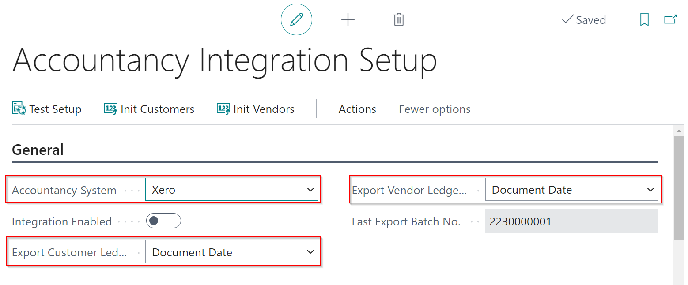



# What you can export via the Xero API

Garage Hive allows you to export your data to Xero via an API. 

You can export the following

* Customer Invoices
* Customer Credit Memos
* Customer Payments
* Customer Refunds
* Vendor Invoices
* Vendor Credit memos

**Please note, we currently don't support exporting vendor payments, it is recommened that this is done in your external accountancy system** 

# Initial Setup

If you wish to use the Xero API, a member of the team will complete the API setup. Once this has been completed you have to complete the final parts of the setup. 

To find the setup for the accountancy integration, search for Accountancy Integration Setup 

You must decide whether to export the data via the posting date, or the document date. 

The typical setup is via document date. Garage Hive users are typically restricted to only posting within the current date, therefore it is possible that the posting date doesn't match the date on the invoice from the supplier, where as the document date should.

You can also dictate the state of the document when it is exported to Xero. The choices are Draft, Submitted or Approved. You can have a different option for Sales and Purchase documents.

**Please note, if you plan to export sales receipts/payments the sales documents must be approved**

# How to run the export 

Once the set up is complete you can run an export by searching for "Export to Accountancy System" 

* **Export Customer Invoices/Credit Memos** - This will export all of the Customer invoices/credit memos within the date range selected. 
* **Export Customer Payments/Refunds** - This will export the Invoice payments/refunds, as well as payments to accounts within the date range selected
* **Export Vendor Invoices/Credit Memos** - This will export all of the posted purchase orders/purchase invoices and the posted purchase return orders/purchase credit memos within the date range selected. 
* **Export Type** - All or New. You can either export **ALL** of the documents within the date range or only the **NEW** documents. Selecting **NEW** will exclude any documents previously exported. This means it is **VITAL** that you keep all previous exported files safe as these can never be re-produced. Once a transaction has been exported it will be flagged and not exported again when using **NEW**
* **Date From/To** Select your date range

### Catalogs

* **Export All Customers** - This will produce an export of every single customer in the system.
* **Export All Vendors** - This will produce an export of every single vendor in the system. 

There is no physical file created when using the Xero integration. The transactions will appear directly in your Xero account. 
