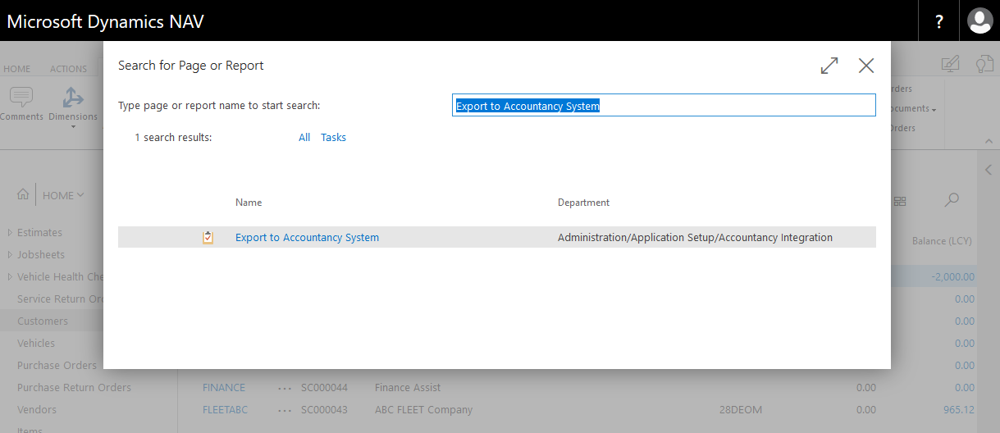
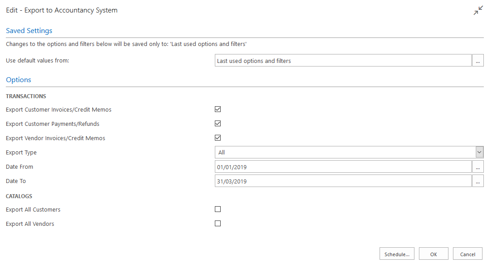

# How to export to your external accountancy system


---

# What you can export

Garage Hive allows you to export to your external accountancy package. 

You can export the following

* Customer Invoices
* Customer Credit Memos
* Customer Payments
* Customer Refunds
* Customer Payments to account
* Customer Refunds to account
* Vendor Invoices
* Vendor Credit memos

**Please note, we currently don't support exporting vendor payments, it is recommended that this is done in your external accountancy system** 

# How to run the export 

To create an export, first you must ensure that you set up is complete, please contact a member of the team to assist you in the set up. Once the set up is complete you can run an export by searching for "Export to Accountancy System" 

Once you have opened the Export page, you have the ability to select from several options. 

* **Export Customer Invoices/Credit Memos** - This will export all of the Customer invoices/credit memos within the date range selected. 
* **Export Customer Payments/Refunds** - This will export the Invoice payments/refunds, as well as payments to accounts within the date range selected
* **Export Vendor Invoices/Credit Memos** - This will export all of the posted purchase orders/purchase invoices and the posted purchase return orders/purchase credit memos within the date range selected. 
* **Export Type** - All or New. You can either export **ALL** of the documents within the date range or only the **NEW** documents. Selecting **NEW** will exclude any documents previously exported. This means it is **VITAL** that you keep all previous exported files safe as these can never be re-produced. Once a transaction has been exported it will be flagged and not exported again when using **NEW**
* **Date From/To** Select your date range

### Catalogs

* **Export All Customers** - This will produce an export of every single customer in the system.
* **Export All Vendors** - This will produce an export of every single vendor in the system. 

Running the export will produce a zip file of the transactions and the customers/vendors related to the transactions. You can export Invoice/Credit memos, Customer Payments and Refunds and Vendor Invoices/Credit memos at the same time. 

To understand how these transactions are imported into your accountancy software, please refer to their documentation. 