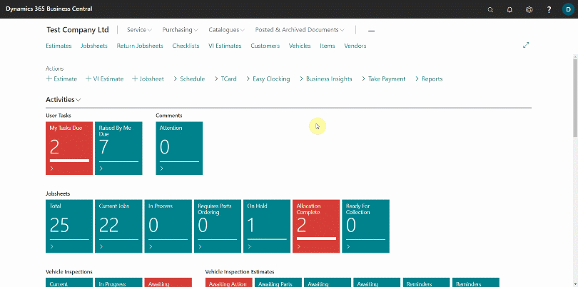
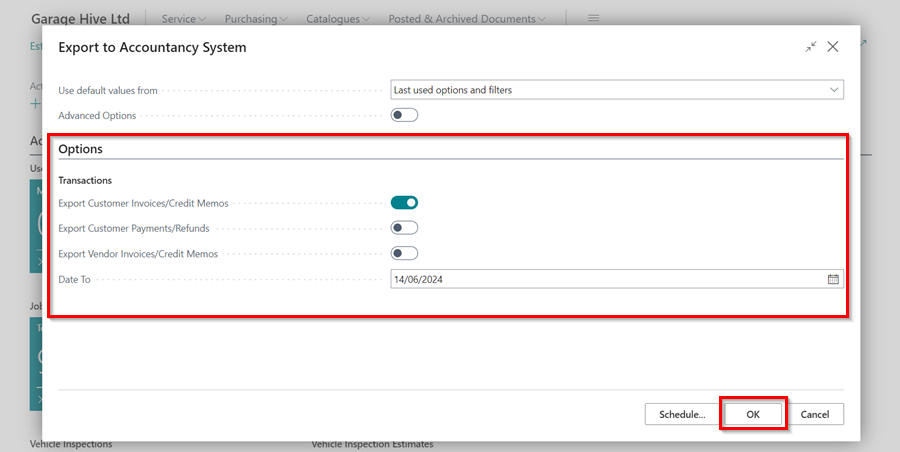

# How to Export to Your External Accountancy System

Garage Hive allows you to export data to your **external accounting system**. You can export the following:

* Customer Invoices
* Customer Credit Memos
* Customer Payments
* Customer Refunds
* Customer Payments to account
* Customer Refunds to account
* Vendor Invoices
* Vendor Credit memos



## How to run the export 

To create an export, first confirm that your setup is complete; please contact a member of the team to assist you with the setup. Once the setup is complete, you can carry out the following:
1. In the top-right corner, choose the search icon, enter **Export to Accountancy System**, and select the related link.

   

2. Once you've opened the **Export to Accounting System** page, you can choose from the following options: 

   * **Export Customer Invoices/Credit Memos** - This will export all of the Customer invoices/credit memos within the date range selected. 
   * **Export Customer Payments/Refunds** - This will export the Invoice payments/refunds, as well as payments to accounts within the date range selected.
   * **Export Vendor Invoices/Credit Memos** - This will export all of the posted purchase orders/purchase invoices and the posted purchase return orders/purchase credit memos within the date range selected. 
   * **Export Type** - All or New. You can either export **All** of the documents within the date range or only the **New** documents. Selecting **New** will exclude any documents previously exported. This means it is important that you keep all previous exported files safe as these can never be re-produced. Once a transaction has been exported it will be flagged and not exported again when using **New**.
   * **Date From/To** - Select your date range.

3. **Catalogs** options:

   * **Export All Customers** - This will produce an export of every single customer in the system.
   * **Export All Vendors** - This will produce an export of every single vendor in the system.

   

4. When you're done, click **OK**. Running the export will generate a zip file containing the transactions and the customers/vendors linked with the transactions. You can export Invoices/Credit Memos, Customer Payments and Refunds, and Vendor Invoices/Credit Memos all at once. 

To understand how these transactions are imported into your accountancy software, please refer to their documentation. 