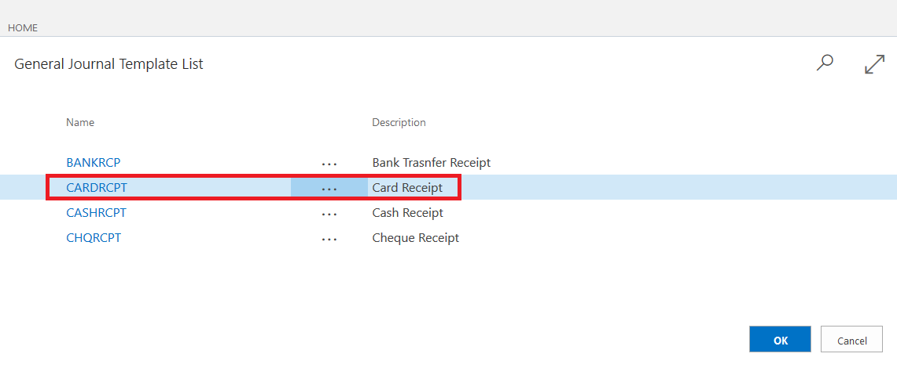
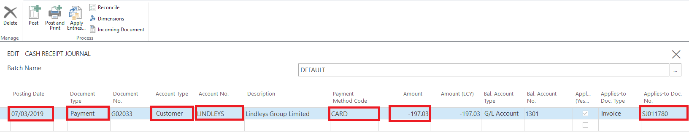

# Cash Receipt Journals
Cash Receipt journals allow the user to record payments against a customers account, typically these payments are recorded to account customers. To record a cash receipt journal, use the search functionality to find "Cash Receipt Journal

Alternatively Cash Receipt Journals can be accessed from the action bar of the customer list. 

Select the payment method of the "Cash Receipt Journal". This will pre-populate the journal with some information, such as the balancing account.

On the Cash Receipt Journal, it is recommend you setup the columns as per the image below. 

You must supply the following information to complete the Cash Receipt Journal

* **Posting Date** - The date of the transaction
* **Document Type** - Must be Payment
* **Document Number** - Will be preset
* **Account Type** - Must be Customer
* **Account Number** - Select the customer No.
* **Payment Method Code** - Select the payment method, essential when using external accountancy.
* **Amount** - Must be a minus figure as you are crediting your customer. 
* **Bal Account Type** - Will be preset
* **Bal Account Number** - Will be preset
* **Applies-to Doc. No.** - If you are applying the payment directly to a document, select which document here. 

 

### See Also
[Registering Customer Payments](garagehive-registering-customer-payments.html)
