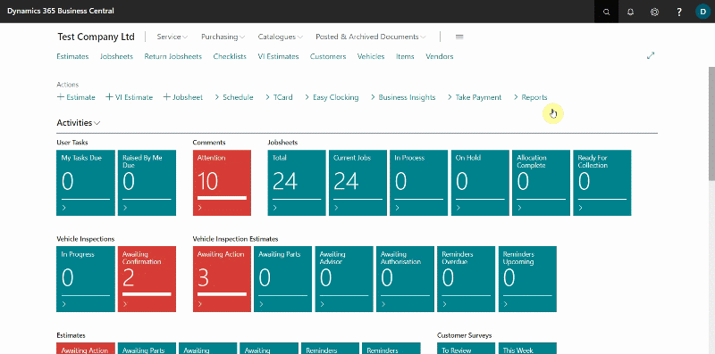
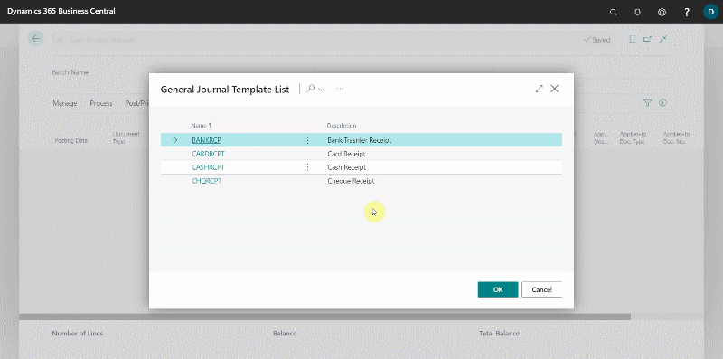
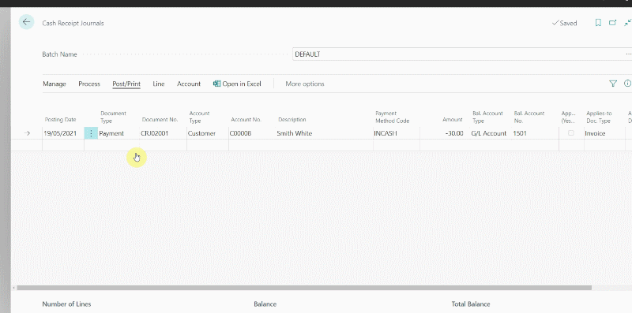

# Cash Receipt Journals
Cash Receipt journals allow the user to record payments made to a customer's account. To record a cash receipt journal, follow these steps:
1. Choose the  icon on the top-right corner, enter **Cash Receipt Journal**, and select the related link.

   

2. Alternatively, you can access Cash Receipt Journal from the customer list's menu bar by selecting **Navigate**, then **Cash Receipt Journal**. 

   

3. Choose the **Cash Receipt** as the journal template. This will fill in certain information in the journal, such as the **Balance Account**.
4. To complete the Cash Receipt Journal, you need to provide the following information:

   * **Posting Date** - This is the transaction date.
   * **Document Type** - Set this to **Payment**.
   * **Document Number** - This will be preset by the system.
   * **Account Type** - Set this to **Customer**.
   * **Account Number** - Select the customer's number in this field.
   * **Payment Method Code** - Select the **Payment Method Code**, essential when using external accountancy.
   * **Amount** - As you are crediting the customer, this should be set to a negative number.
   * **Bal Account Type** - This will be preset by the system.
   * **Bal Account Number** - This will be preset by the system.
   * **Applies-to Doc Type** - If you are applying the payment directly to a document, select the type of document as **Invoice**. 
   * **Applies-to Doc. No.** - Select which document here. 

      

5. Double-check the information you've entered, then select **Post/Print** from the menu bar, followed by **Post** to post the journal.

   

[Go back to top](#top)

 

### See Also
[Registering Customer Payments](garagehive-registering-customer-payments.html){:target="_blank"}
