

# Getting Started with Financial Reporting in Garage Hive
If you are familiar with the **Account Schedules** feature in Garage Hive, you may have noticed some changes in the latest releases. Account Schedules has been renamed to **Financial Reporting**, and the way you create and manage financial reports has been improved.

## In this article
1. [Improvements on Financial Reporting](#improvements-on-financial-reporting)
2. [How to Get Started with Financial Reporting](#how-to-get-started-with-financial-reporting)

### Improvements on Financial Reporting
The new Financial Reporting feature has several improvement for users who want to create customized financial reports in Garage Hive:
1. It makes it easier for new users to get started with financial reporting by using a more intuitive name and interface. To access the **Financial Reports**, search **Financial Reports** In the top right corner  icon, and select the related link.

   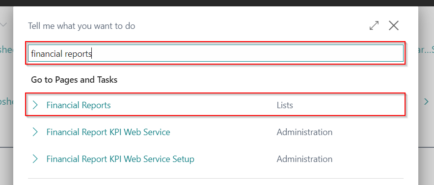

2. It allows users to create multiple financial reports with different names, row definitions, column definitions, and parameters without having to modify existing ones. A **Row Definition** determines which accounts or dimension are to be included in each row of a financial report and a **Column Definition** determines which columns are included in each financial report.

   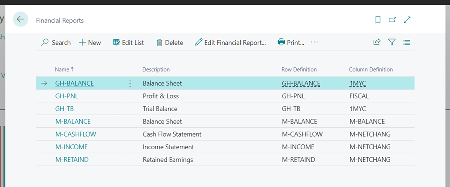

3. It provides more flexibility and control over how data is presented and filtered in financial reports.

   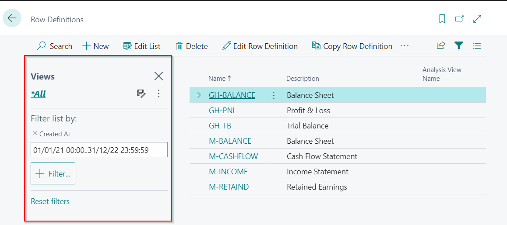

4. It enables users to access their **Row Definitions** or **Column Definitions** directly from the Role Centre by searching on the top right corner  icon, and selecting the related link.

   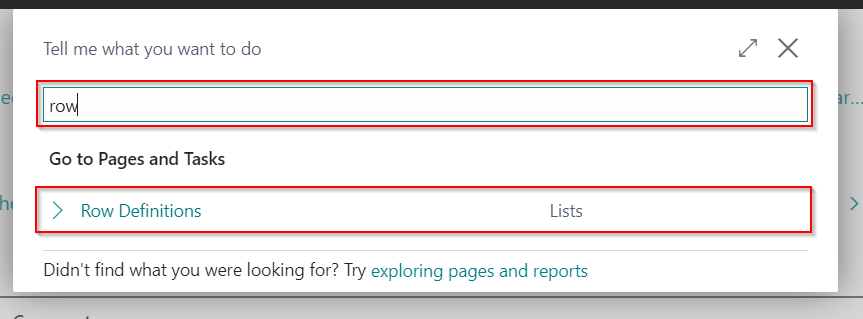

[Go back to top](#top)

### How to Get Started with Financial Reporting
If you want to try out the new Financial Reporting feature in Garage Hive, here are some steps you can follow in creating a new report:

1. Go to your Role Centre and in the top right corner, choose the  icon, enter **Financial Reports**, and select the related link.

   

1. On the **Financial Reports** page, choose **New** to create a new report or **Edit Financial Report** if you want to modify an existing one.
1. On the **New** report page, enter a **Name** and a **Description** for your report and select a **Row Definition** and a **Column Definition** from the drop-down lists in their respective fields. 

    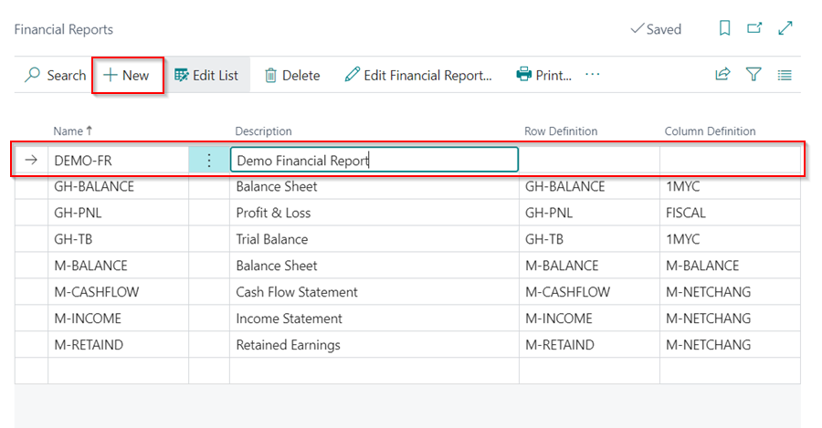

1. If you need to create a new **Row Definition**, choose **New** at the bottom left of the drop-down in the **Row Definition** field.

   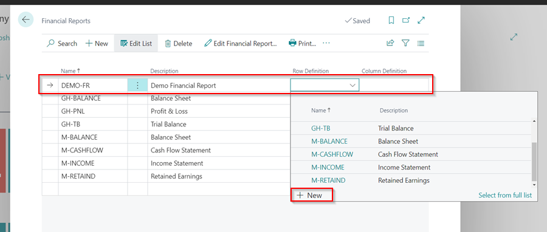

1. Enter a **Name** and a **Description**  for the **Row Definition**.

   

1. Click on the ellipsis (...) in the menu bar, and select **Edit Row Definition**.

   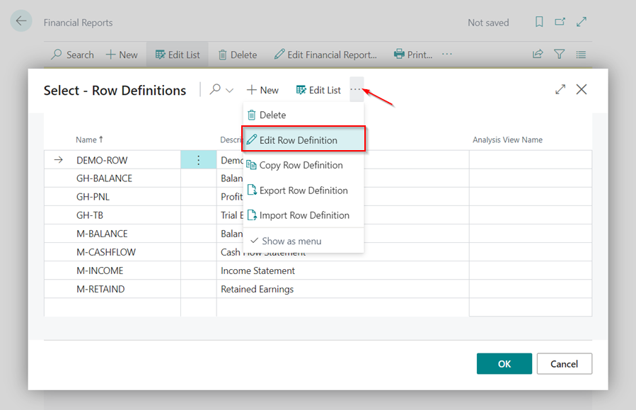

1. This gives you the option to add the accounts you want to put in the Row Definition. Select **Insert** from the menu bar, followed by **Insert G/L Accounts**. You can as well insert the **Cost Types** or **Cash Flow** accounts.

   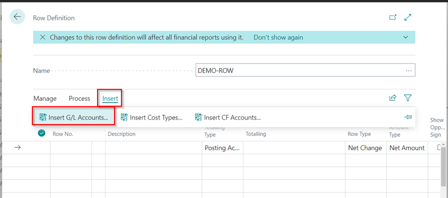

1. In the **G/L Accounts List** you can filter to only **Balance Sheet** accounts or **Income Statement** accounts. Click on the **Income/Balance** column header and select **Filter**.
1. Select either **Balance Sheet** or **Income Statement** depending on the accounts you want to add to the new report, and click **OK**.
1. Hold down the **Ctrl** key and select the accounts you want to add to the report, or select all. Click **OK** to add the accounts in the **Row Definition**.

   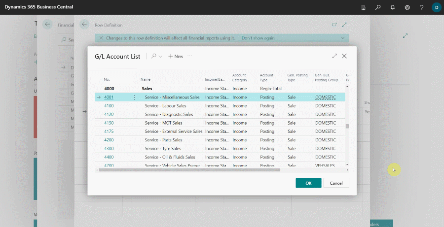

1. Click the back arrow (&#8592;) to exit the **Row Definition** page, and then click **OK** to add the **Row Definition** you have just created in the report.

   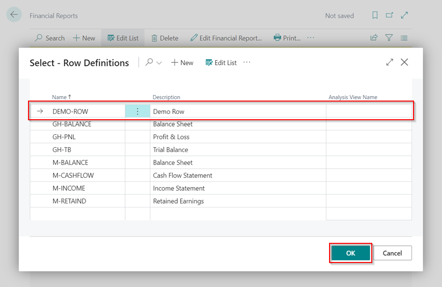

1. To create a new **Column Definition**, choose **New** at the bottom left of the drop-down in the **Column Definition** field.

   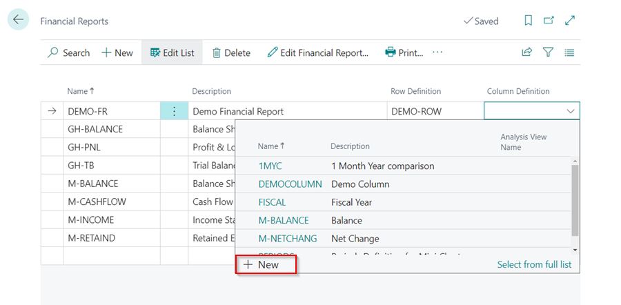

1. Enter a **Name** and a **Description** for the **Column Definition**.

   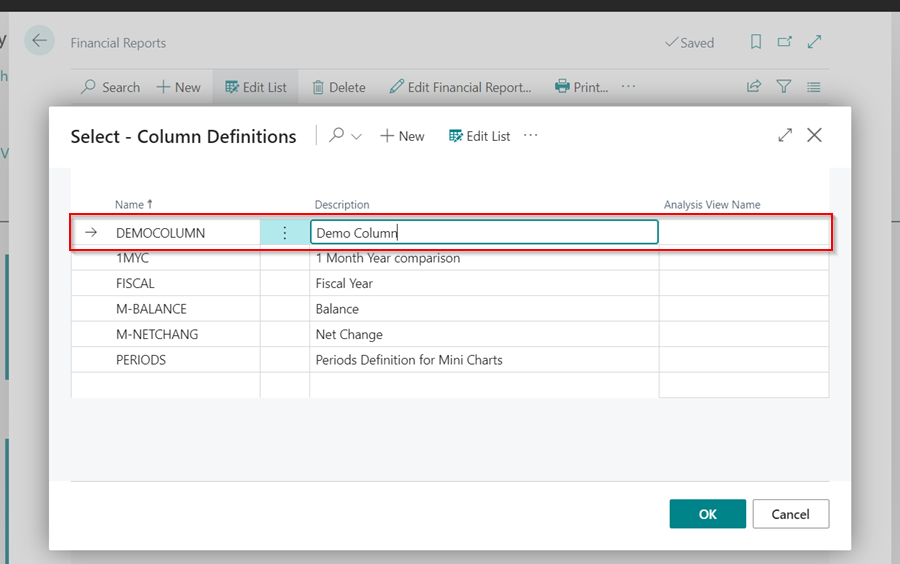

1. Click on the ellipsis (...) in the menu bar, and select **Edit Column Definition**.

   

1. Enter **Column No.**, **Column Header** and select the **Column Type**.

   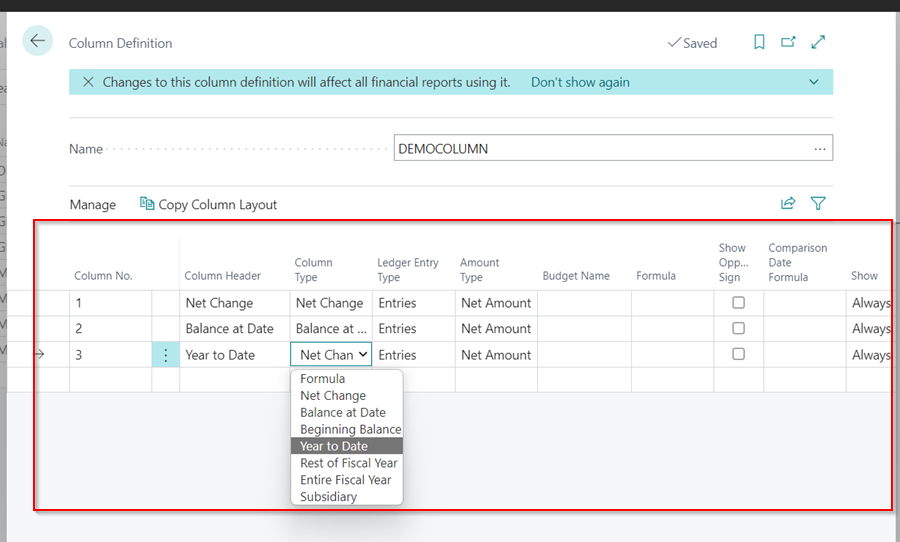

2. You can also introduce a formula between the columns, by selecting the **Column Type** as **Formula**. When done click on the back arrow (&#8592;) to exit the page.

   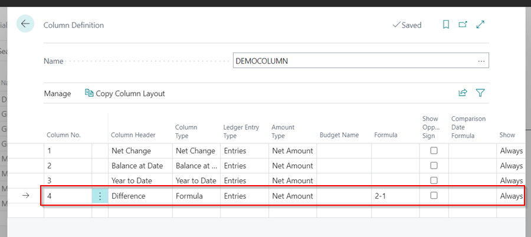

3.  In the **Column Definitions** page, click **OK** to add the **Column Definition** that you have just created.

   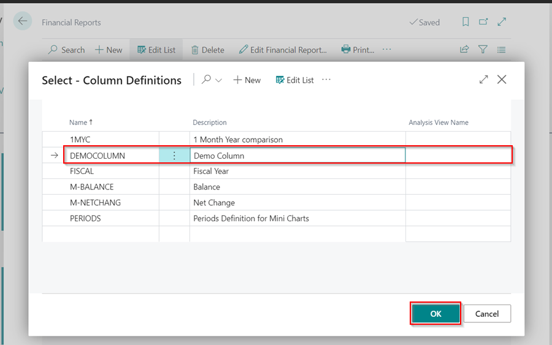

4. You can now **Print** the Report or **Preview** the Report by selecting **Print** from the menu bar. 

   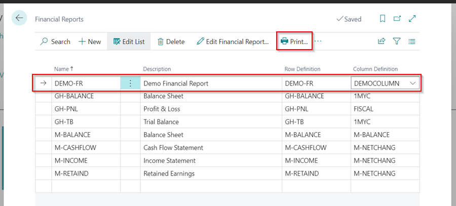

5. Enter the dates to filter the report to that is, the **Starting Date** and **Ending Date**.
6. Select **Print** or **Preview & Close** depending on how you want to view your report.

   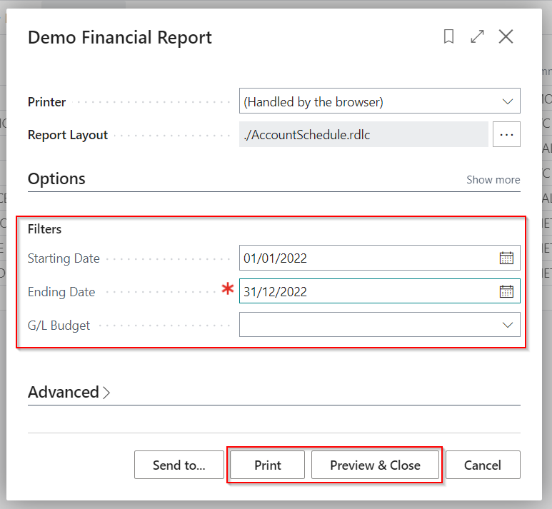

7. You can also save your report as Excel or PDF files by selecting **Send To** and choosing the type of file to save the report.

   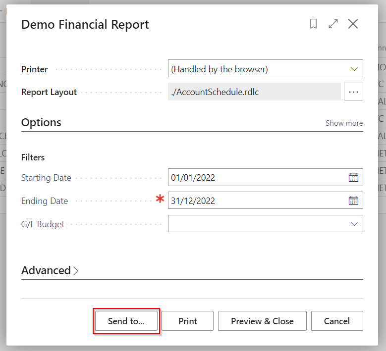

   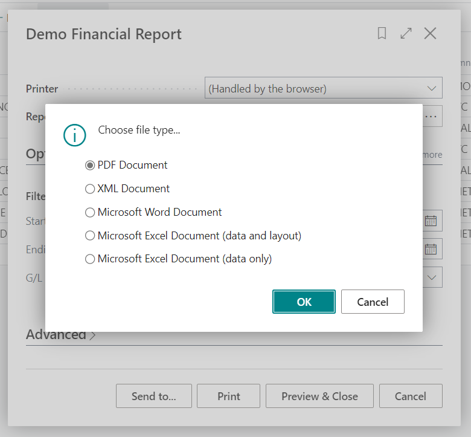

[Go back to top](#top)

