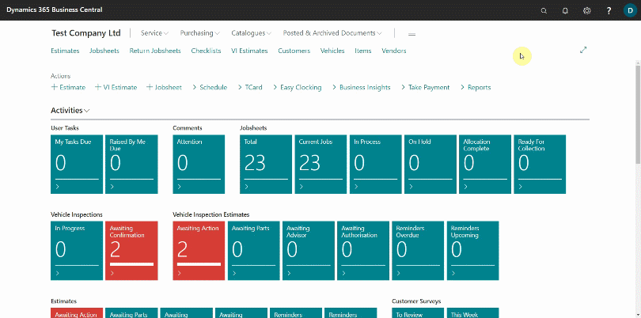
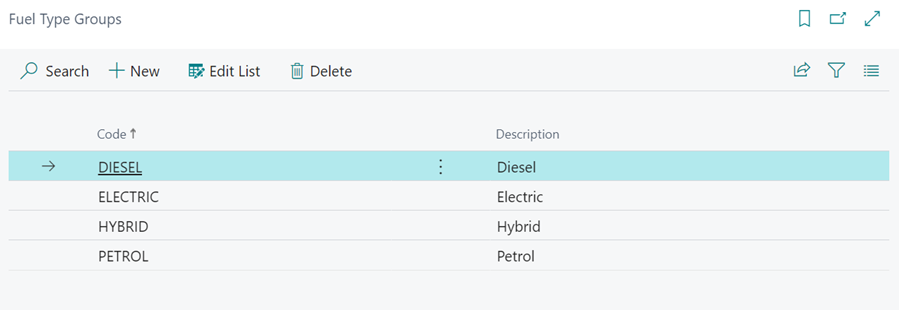
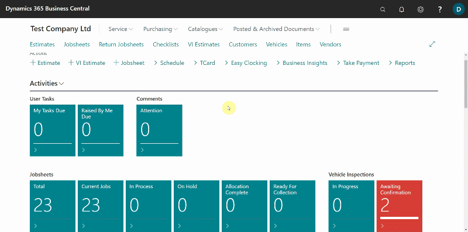

# Adding Fuel Type Group Code
**Fuel type Groups** is a feature in Garage Hive that allows you to categorise vehicle engines based on the type of fuel they use. The various fuel types help in determining which vehicles are the garage's most regular customers, as well as knowing about the different fuel trends that customers are adopting.

To edit the **Fuel Type Groups**:
1. Search for **Fuel Type Groups** in the top right corner search icon and select the related result.
2. In the page that opens, choose **New** to create a new **Fuel Type Group**.

   

3. The following list is already pre-populated in the system.

   

4. Then, in the top right corner search icon, type **Fuel Types** and select the related link to add as many **Fuel Types** as you want.
5. Select **New**, then fill in the table with the **Fuel Type** and a **Fuel Group Code** in the **Group Code** field.

   

6. After adding the **Fuel Type Groups** and **Fuel Types**, select a vehicle from the **Vehicle** list, scroll down to the **Engine** FastTab, and select the fuel type it uses in the **Fuel Type Code** field. Repeat this process for all the vehicles.

   

