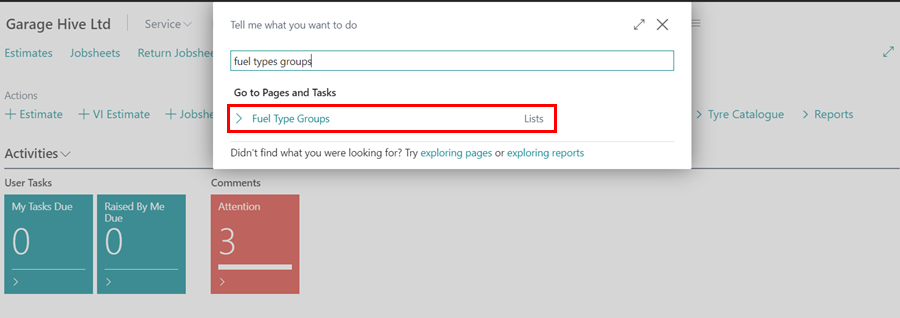
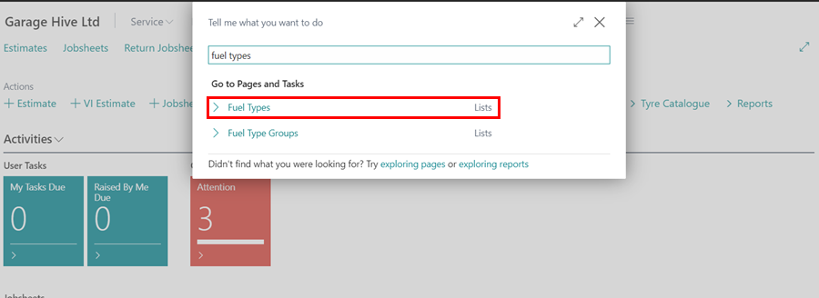
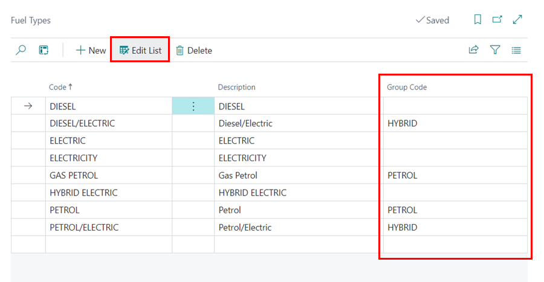
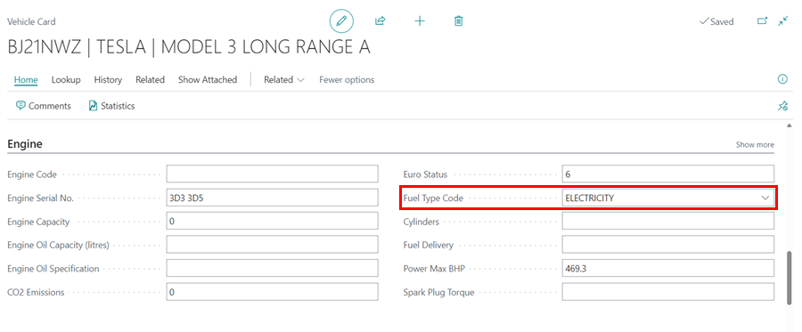

# Adding Fuel Type Group Code
Fuel Type Groups is a feature in Garage Hive that enables you to classify vehicle engines according to their fuel type. By identifying these various fuel types, you can determine which vehicles are the garage's most frequent visitors, as well as gain insights into the evolving fuel trends that customers are embracing through the reports.

To edit the **Fuel Type Groups**:
1. Search for **Fuel Type Groups** in the top right corner  icon and select the related result.

   

2. Once the page opens, click on **New** to create a new **Fuel Type Group**. The system will already have a pre-populated list.

   

3. Next, in the top right corner search icon, type **Fuel Types** and select the related link. **Fuel Types** list is automatically generated when **Vehicle Data Lookup** is done.

   

4. From the **Fuel Type** list, select **Edit List** and add Fuel Group in the **Group Code** field.

   

5. To view a vehicle's **Fuel Type Code**, select a vehicle from the **Vehicle** list and scroll down to the **Engine** FastTab, where you'll find the **Fuel Type Code** field.

   

[Go back to top](#top)