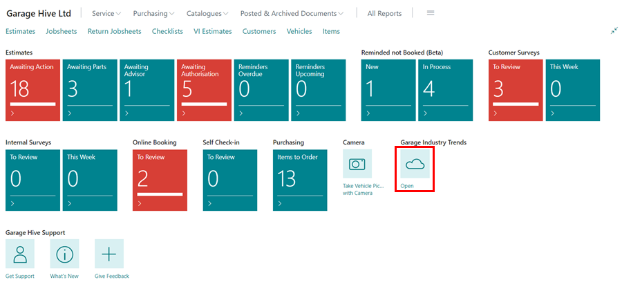

### Garage Industry Trends
[Garage Industry Trends](https://www.garageindustrytrends.com/){:target="_blank"} is an opt-in service for garages in various parts of the United Kingdom in which they agree to share their business performance data anonymously on a regular basis in order for everyone to be aware of industry trends. It combines four key performance indicators (KPIs), namely:
   * **Average Invoice Value**
   * **Labour Rate**
   * **Count of Future Bookings**
   * **NPS**

 In addition to data provided by participating garages, the service collects information from public sources such as the UK government in order to create MOT Data Trends reports, among other reports. 

## In this article
1. [How to opt&ndash; in](#how-to-opt-in)
2. [Accessing Garage Industry Trends Website](#accessing-garage-industry-trends-website)
3. [MOT Data Trends](#mot-data-trends)

### How to Opt-in
Any Garage Hive customer can opt-in to the service and share their data anonymously, as the more garages that participate, the more accurate the industry averages will be. Before you opt-in, please read the **Terms of Service** [here](https://garagehive.co.uk/tos/){:target="_blank"}. The following is the process for opting in:
1. Scroll down to the **Garage Industry Trends** section on the Garage Hive **Home Screen** and select the **Enable** action.

   

2. Select the check box for the locations to share data for in the **Include** column under the **Locations** sub-page, and enter the **Country/Region Code** and **Postcode** for the location.
3. Then, select the **Enabled** slider to enable the service. Click **Yes** on the pop-up notification to confirm that you have read the **Terms of Service**.

   

4. The service is now activated, and your garage's data will be shared and presented as a rolling 30-day average in combination with data from garages that have opted-in.

   

### Accessing Garage Industry Trends Website
1. To open the Garage Industry Trends website, go to the Home Screen and select the **Open** action in the **Garage Industry Trends** section.

   

2. To view the data that is being calculated, stored and shared from your system, search for **Industry Trends Entries** in the top right corner  icon, and select the related link.
3. The page that opens shows the different data that have already been shared from your system.

   



### MOT Data Trends
MOT Data Trends is a comprehensive set of reports that analyses 200 million lines of data over three years for MOT failures and item failures by make, model, year, fuel type, item failure, region, and much more.
1. To access the **MOT Data Trends** webpage, go to [Garage Industry Trends](https://www.garageindustrytrends.com/) and select the **MOT Data Trends** tab in the top-right corner.

   

2. You can now view the **MOT Data Trends** based on the government's most recent MOT data release.

   

3. You can also access the **Full Report Suite** using [this link](https://app.powerbi.com/view?r=eyJrIjoiMjM5NDRiMWItNzQ4MS00N2U1LWJhMzUtYTMwMjEzYmE1NTA4IiwidCI6IjFiZGU4OWFkLWI0Y2UtNDVkZi1hOTE5LWUxZTA4ZTQ3Mjk0ZCIsImMiOjh9) which is optimised for desktop/laptop and filter the data however you need it.

   

4. Use the tabs at the bottom of the page to select the type of **MOT Failure & Item Failures** you want to see, and on the report page, use the filter pane on the left hand side to filter the report.

   
   

[Go back to top](#top)