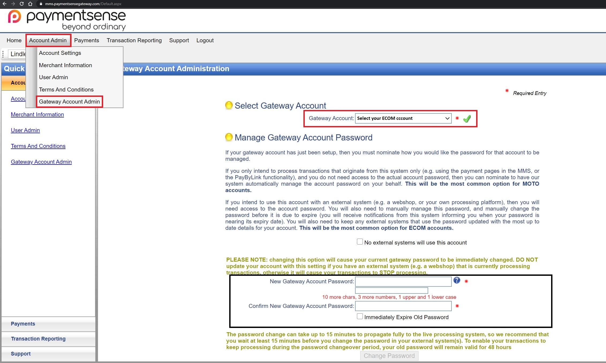
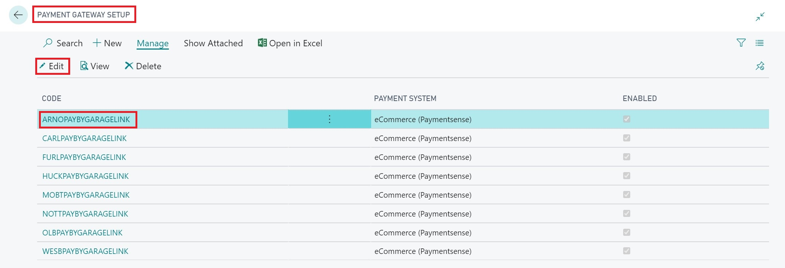
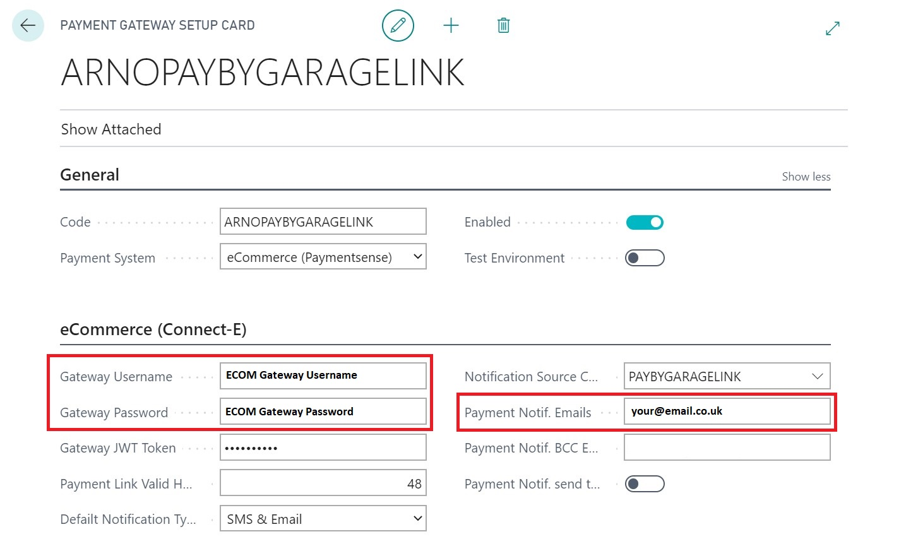

# Payment Gateway Setup

To Setup Pay By Garage Link you first need access to your MMS from Payment Sense, they should email this to you. Once you have access you need to setup your Gateway Account Password for your ECOM account. You can access these settings under Account Admin. 

Once your ECOM Password is setup, go to "Payment Gateway Setup" in Garage Hive, the support team should have already setup your location codes for you. All you need to do is select the location you want to setup. 

On the setup page, the only information you need to enter is the Gateway Username and your Gateway Password. If you want to you can add an email address for payment notifications. 

Please note, your Gateway Username and Password isn't the same as the one you use to log into your PaymentSense MMS, it's the password you setup from within your MMS as per the first image. 

The support team will setup the rest, please don't touch any other setup. 

Once setup, it is recommended that you put a 0.01 pence transaction through as a test. Create a new jobsheet with your personal details on, add a labour or item and then go to the Take Payment screen. Once on the Take Payment screen, select process in the action bar and "Pay By Garage Link"

Make sure the value is set to 0.01, select the notification type and enter your details. Once you receive the test SMS/Email please follow the link and complete the test payment. 

> **Note**
>
> Normally, when requesting payment via the **Pay by GarageLink**, the details automatically picked to send the request are the **Bill-to Customer** details.

You can check the status of the payment in Garage Hive by selecting the "Payment Gateway Entries" from the action bar. 

You should also receive an email confirming the payment has been received. 

