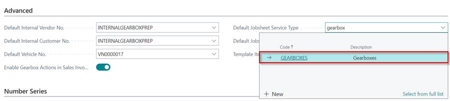
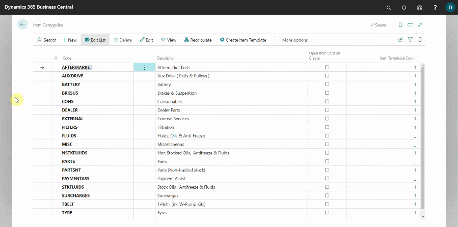

# Gearbox Sales Setup
To start using the **Gearbox Sales** module, there is some setup required in the **Vehicle Sales Setup** Page.
1. In the top right corner, choose the  icon, enter **Vehicle Sales Setup**, and select the related link.

   

1. Scroll down to the **Advanced** FastTab. Create a new **Default Internal Vendor No.** with the following setup:

   | No.                 | Name                         | General Bus. Posting Group | VAT Bus. Posting Group | Vendor Posting Group |
   | :------------------ | :--------------------------- | :------------------------- | :--------------------- | :------------------- |
   | INTERNALGEARBOXPREP | Internal Gearbox Preparation | VEHSALES                   | INTERNAL               | VEHSALES             |

   

1. Create a new payment method in the **Payment Method Code** field with the code **GEARBOXPRP**, Description **Gearbox Prep**, Bal. Account Type **G/L Account**, and Bal Account No. **2902**. 

   

1. After creating the vendor as described above, add the vendor to the **Default Internal Vendor No.** field.

   

1. Now create a new **Default Internal Customer No.** with the following setup:

   | No.                 | Name                         | General Bus. Posting Group | VAT Bus. Posting Group | Customer Posting Group | Promote Sell-to Cust. on Invoice |
   | :------------------ | :--------------------------- | :------------------------- | :--------------------- | :--------------------- | :------------------------------- |
   | INTERNALGEARBOXPREP | Internal Gearbox Preparation | VEHSALES                   | INTERNAL               | VEHSALES               | Enable                           |

   

1. Select the **Service Recharge Item Charge No.** field and add a new one with the **No.** as **GEARBOXPREP**, the **Description** as **Gearbox Sales Preparation**, and the **Gen. Prod. Posting Group** as **VEHSALES**.

   

1. Add the **Corresponding Vendor No.** as the vendor that you created in the **Default Internal Vendor No.** field above.

   

1. Create a new **Service Type** in the field **Recharge Invoice Service Type**, with the code **GEARBOXES**, Description as **Gearboxes**, and the Group Code as **Repairs**.

   
   
1.  Add the new customer card to the **Default Internal Customer No.** field.

   

1. Create a new **Default Vehicle No.** with the **No.**, **Reg. No.**, **VIN**, **Make**, and **Model** fields set to **Gearbox**. Make sure to add a new Make and Model, as it will give you an error if it is not found in the system.

   

1.  Enable the **Gearbox Actions in Sales Invoice** slider.

   

1.  Set the **Default Jobsheet Service Type** as the **Gearbox**, the one you created above.

   

1.  The **Default Jobsheet Comment Type** can be any that you want to use; in this case we'll use **OFFICE**.

   

1.  For the **Template Item Category Code** you'll have to create a new **Item Category**. Search for **Item Categories** In the top right corner  icon.

   

1.  Select **New** and create a category called **GEARBOXES** and the description to be **Gearboxes** as well. Exit the **Item Category Card** page.

   

1.  Select **Create Item Template** on the **Item Categories** page, enter the **Example Template Code** as **Vehicle Sales**, the **New Template Code** as **Gearboxes**, the **New Template Description** as **Gearbox Sales**, and the **Item Category Code** search for the one you just created, **GEARBOXES**. Click the **OK** button.

   

1.  Exit the **Item Categories** page, and enter the **Item Category Code** that you have just created, in the **Template Item Category Code**.

   

1. Scroll down to the **Number Series** FastTab and create a new number series for the **Gearboxes** in the **Gearbox Item Nos.** field. Select **New** on the **No. Series List** page, enter **Code** as **GEARBOXES**, and **Description** as **GEARBOXES**.
1. Click on the **Starting number** field and enter the **Starting Date** as today's date and the **Starting Number** as **00001**. To add the number series, click the **Close** and **OK** buttons.

   

1. Scroll up to the **General** FastTab and select the **Enable** slider to enable the setup in the system.

   

[Go back to top](#top)