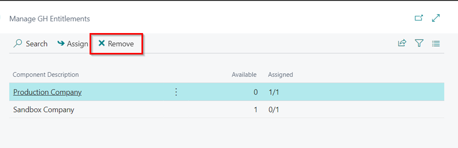
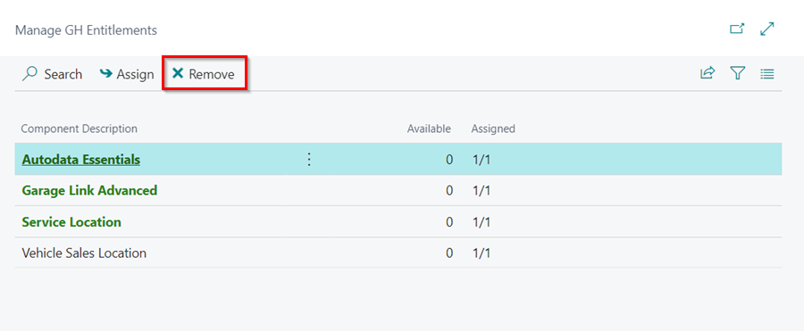
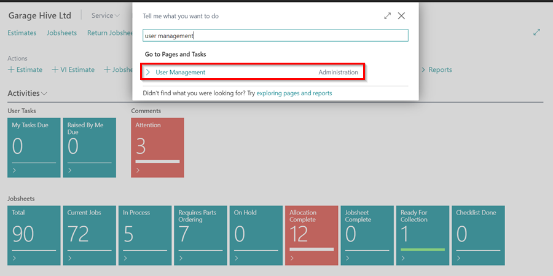
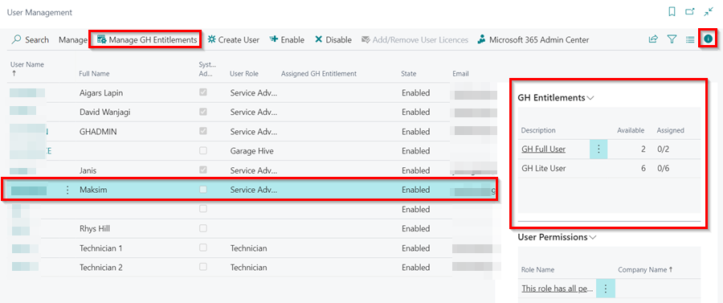
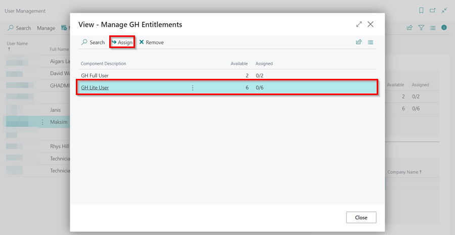
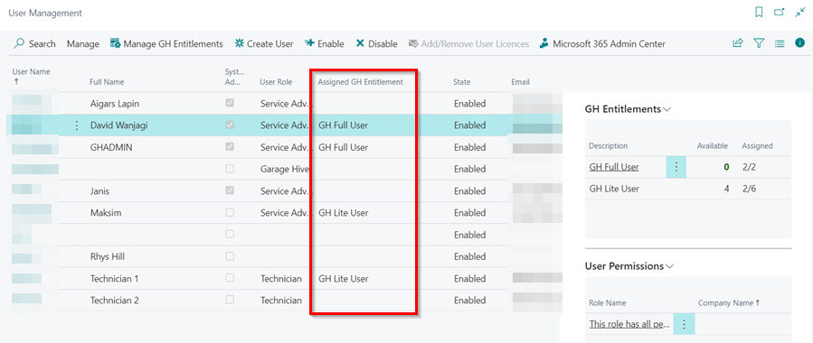
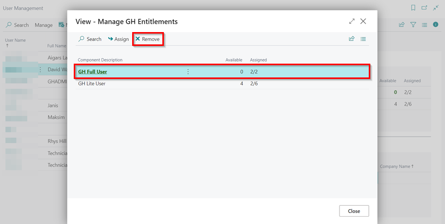

# How to Manage GH Entitlements
GH Entitlements, in Garage Hive, are the services that a customer is entitled to use according to the licence that they have purchased. These entitlements define the specific features, functionalities, and access rights available to the customer. GH Entitlements can be assigned to users, companies, or locations. The service will start working only after the GH Entitlement has been assigned to the respective entity.

## In this article
1. [Assigning GH Entitlements to Companies](#assigning-gh-entitlements-to-companies)
2. [Assigning GH Entitlements to Locations](#assigning-gh-entitlements-to-locations)
3. [Assigning GH Entitlements to Users](#assigning-gh-entitlements-to-users)

### Assigning GH Entitlements to Companies
To assign GH Entitlements to companies in your system, follow these steps if your system is licensed for multiple companies:
1. In the top right corner, choose the  icon, enter **Companies**, and select the related link.

   

2. Choose the desired company to manage the GH Entitlements, then click on **Manage GH Entitlements** in the menu bar.

   

3. In the page opened, choose the component you wish to assign to the company. Then, click on **Assign** in the menu bar to assign it. 

   

4. The company will now have the assigned entitlement.
5. If you want to remove the assignment then in **Manage GH Entitlements** page use the **Remove** actions from the menu bar.

   

[Go back to top](#top)

### Assigning GH Entitlements to Locations
To assign GH Entitlements to locations in your system, follow these steps if your system is licensed for multiple locations:
1. In the top right corner, choose the  icon, enter **Locations**, and select the related link.

   

2. Choose the desired location to manage the GH Entitlements, then click on **Home**, followed by **Manage GH Entitlements** in the menu bar.

   

3. In the page opened, choose the component you wish to assign to the location. Then, click on **Assign** in the menu bar to assign it. You can select multiple GH Entitlements for the location based on availability.

   

4. The location will now have the assigned entitlement(s).

   

5. If you want to remove the assignment then in **Manage GH Entitlements** page use the Remove actions from the menu bar.
 
   

[Go back to top](#top)

### Assigning GH Entitlements to Users
To assign GH Entitlements to Users in your system, follow these steps if your system is licensed for multiple users:
1. In the top right corner, choose the  icon, enter **User Management**, and select the related link.

   

2. You can view both the **available** and **assigned** GH Entitlements by clicking on the information icon (ℹ️) located on the right side.
3. To manage a user's GH Entitlements, on the **User Management** page, select the user from the list and then click on **Manage GH Entitlements** in the menu bar.

   

4. Select the **component** where you want to assign the user, and click **Assign** in the menu bar.

   

5. The user will now have the assigned entitlement.

   

6. If you want to remove an assignment from a user, select the user from the list, click on **Manage GH Entitlements**, choose the component in which the user is assigned, and then select **Remove** from the menu bar.

   

 

### See Also

[How to Create Users, Manage Roles and Enable Data Permissions](garagehive-user-management.html){:target="_blank"} \
[How to Create and Edit Users in Azure Active Directory (AAD) and Reset Password](garagehive-azure-active-directory-user.html){:target="_blank"}