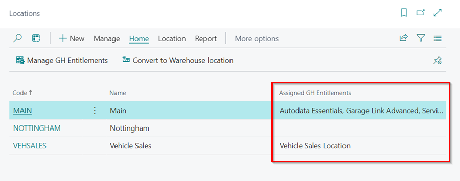

# We are still working on this article!
We are currently reviewing this article before it is published, check back later.

# How to Manage GH Entitlements
GH Entitlements, in Garage Hive, are the services that a customer is entitled to use according to the licence that they have purchased or the role that a user has in the system. These entitlements define the specific features, functionalities, and access rights available to the customer or user. This helps optimise the user experience and ensure that customers can make the most of the services Garage Hive provides.

## In this article
1. [Assigning GH Entitlements to Companies](#assigning-gh-entitlements-to-companies)
2. [Assigning GH Entitlements to Locations](#assigning-gh-entitlements-to-locations)
3. [Assigning GH Entitlements to Users](#assigninggh-entitlements-to-users)

### Assigning GH Entitlements to Companies
To assign GH Entitlements for companies in your system, follow these steps if your system is licensed for multiple companies:
1. In the top right corner, choose the  icon, enter **Companies**, and select the related link.

   

2. Choose the desired company to manage the GH Entitlements, then click on **Manage GH Entitlements** in the menu bar.

   

3. In the page opened, choose the component you wish to assign to the company. Then, click on **Assign** in the menu bar to assign it. 
4. To remove an assignment, select **Remove** from the menu bar.

   

5. The company will now have the assigned entitlement.

[Go back to top](#top)

### Assigning GH Entitlements to Locations
To assign GH Entitlements for companies in your system, follow these steps if your system is licensed for multiple locations:
1. In the top right corner, choose the  icon, enter **Locations**, and select the related link.

   

2. Choose the desired location to manage the GH Entitlements, then click on **Process**, followed by **Manage GH Entitlements** in the menu bar.

   

3. In the page opened, choose the component you wish to assign to the location. Then, click on **Assign** in the menu bar to assign it. You can select multiple GH Entitlements for the location based on availability. 
4. To remove an assignment, select **Remove** from the menu bar.

   

5. The location will now have the assigned entitlements.

   

[Go back to top](#top)