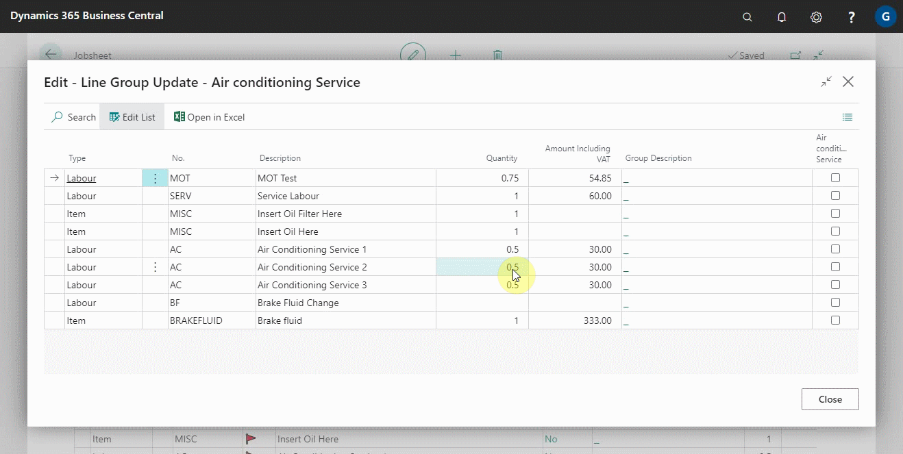
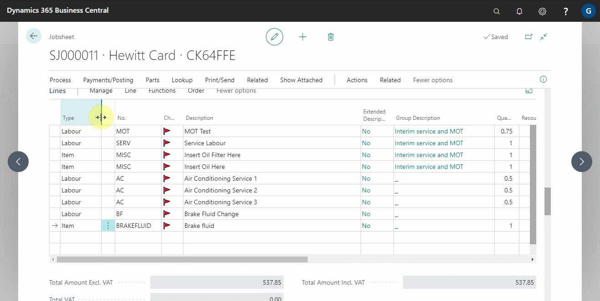
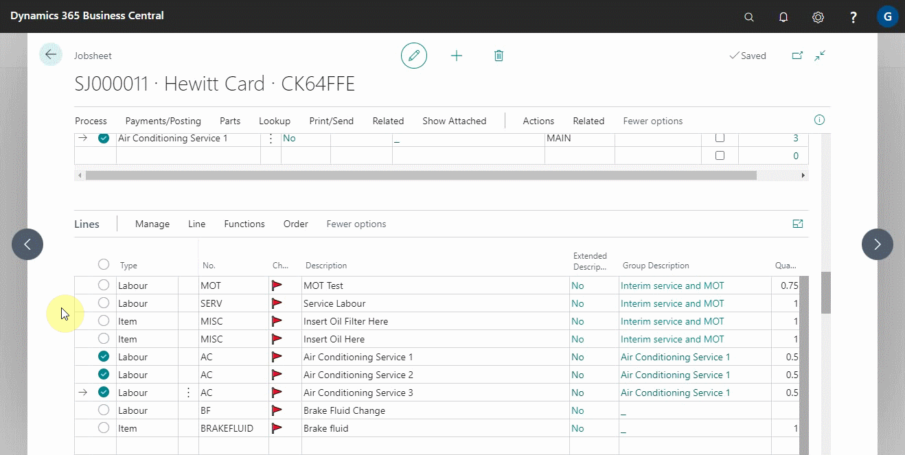
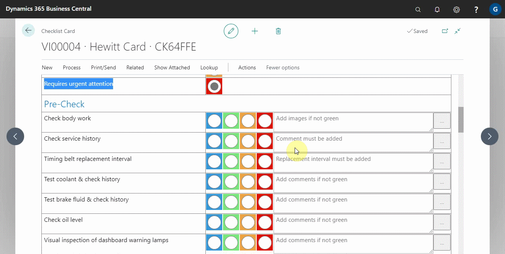
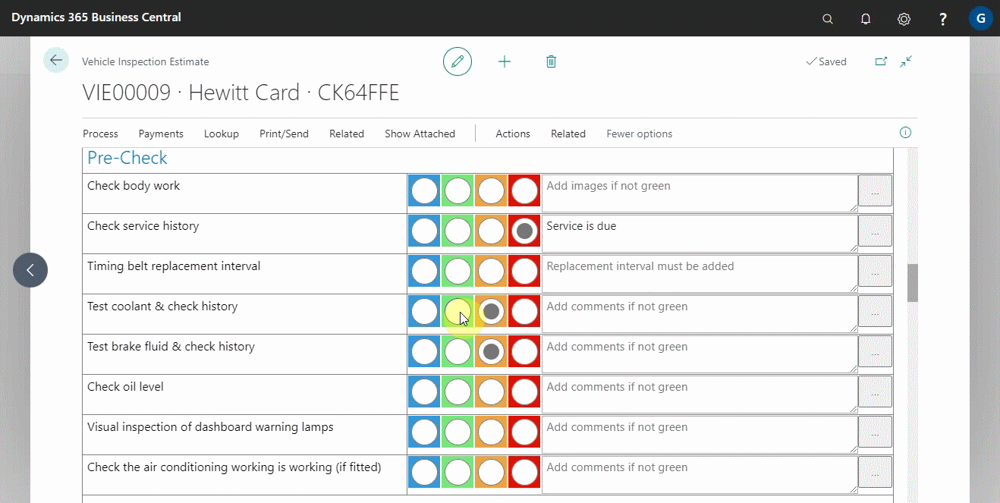
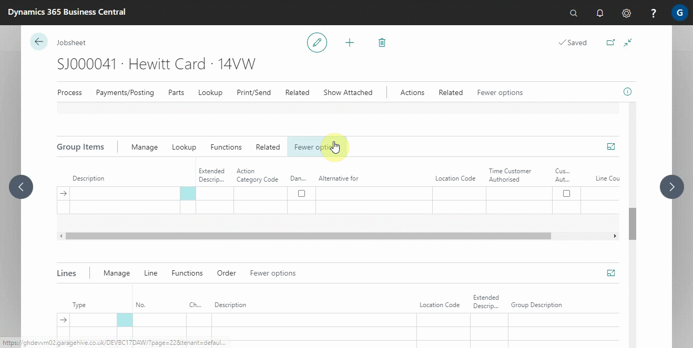
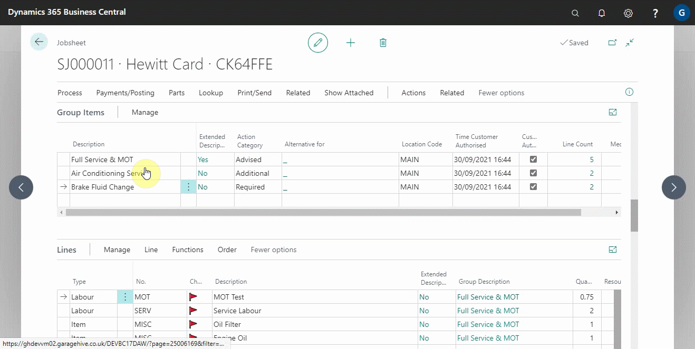

# How to Group Document Lines
Grouping document lines is a feature available in the estimates, vehicle inspection estimates and jobsheets; this feature enables you to group the document lines under the same job or category. In this article, we will look at the various ways of grouping the lines.

## In this article
1. [Grouping document lines by creating a group and then adding the lines](#grouping-document-lines-by-creating-a-group-and-then-adding-the-lines)
2. [Grouping document lines by selecting the lines and then creating a group](#grouping-document-lines-by-selecting-the-lines-and-then-creating-a-group)
3. [Grouping document lines from the checklist attention items](#grouping-document-lines-from-the-checklist-attention-items)
4. [Grouping document lines from the service package card](#grouping-document-lines-from-the-service-package-card)
5. [Print or preview the document](#print-or-preview-the-document)

### Grouping document lines by creating a group and then adding the lines
The grouping feature is located above the **Lines** sub-page in a document and is referred to as **Group Items**. To form a group, do the following:
1. In the **Description** column, enter the name of the group.
2. Click on the cell under **Line Count** along the line where you have created a group.

    

3. From the **Line Group Update** page, select the lines to add to the group (the group name column is at the end of the table with check boxes) and close the window.
4. Click on the cell under the **Line Count** column and select the lines to add to the selected group. The number of lines added to the group is displayed in the line count column.

    

The **Lines** section can also be used to add the document lines in a group:
1. Select the cell in the **Group Description** column.
2. Choose the group to which you want to add the lines.

    

### Grouping document lines by selecting the lines and then creating a group
1. In the **Lines** sub-page, select the lines you want to group.
2. Select **Functions** from the actions bar in the **Lines** sub-page.
3. Click **Create Group Items**. All of the selected lines are grouped together, with the group name being the description of the top selected line.

   

4. You can change the group name from the **Group Items** section.

    

### Grouping document lines from the checklist attention items
While working from a vehicle inspection estimate, there are issues identified in the vehicle which require urgent attention. From these issues, you can create groups to enable you add items and labour. 

> **Example**
>
> Suppose you have identified that the vehicle requires service, based on the mileage since the vehicle was last serviced. In that case, you can create a group under this heading (or rename the group to 'Full Servicing') and add servicing items and labour.

To create a group from the checklist attention items, first work on the checklist lines and identify the 'requires attention' lines. **Confirm** and **Create a VIE**. 

Then carry out the following steps from VIE:
1. Select **Functions** from the **Group Items** sub-page actions bar.
2. Select **Add Checklist Attention Lines** to take the lines marked "requires attention" and create groups with the checklist line description.

    

3. Once the groups have been created, add the necessary items and labour to the document lines and match the lines with the pre-created groups.
4. Using the methods described above, match the lines to the groups.

### Grouping document lines from the service package card
To create a group from a service package:
1. Click **Look Up** and then select **Service Packages** from the document actions bar.
2. Select the service package you want to add and click OK.
3. The service package is automatically added as a group.

    

### Print or preview the document
To preview or print the document with the group names being the headers:
1. Ensure that the you select **Custom Heading** from the **Invoice Print Options** FastTab.
2. Select **Print/Send** from the actions bar, then **Print Invoice**.

    

 

### **See Also**

[Introduction to Online Documents](garagehive-online-documents-introduction.html) \
[Previewing and publishing online documents](garagehive-online-documents-previewing-and-publishing-online-documents.html) \
[Setting up online documents](garagehive-online-documents-setting-up-online-documents.html) \
[Adding and Managing Media in Garage Hive](garagehive-online-documents-adding-and-managing-media.html) \
[Using online documents in estimates, checklists and vehicle inspection estimates](garagehive-online-documents-using-online-documents-in-estimates-checklists-and-vehicle-inspection-estimates.html) \
[What Happens When a Customer Acts on a Sent Online Document?](garagehive-online-documents-what-happens-for-customers-actions.html)
