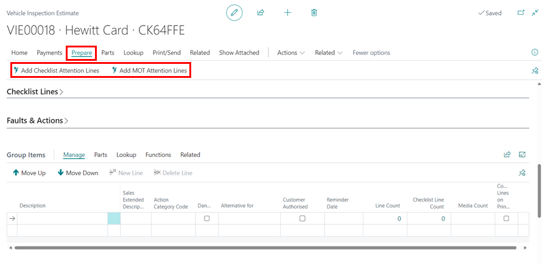
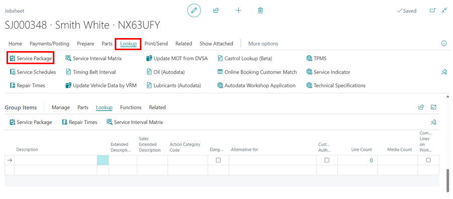

# How to Group Document Lines
Grouping document lines is a feature available in the estimates, vehicle inspection estimates and jobsheets; this feature enables you to group the document lines under the same job or category. In this article, we will look at the various ways of grouping the lines.

## In this article
1. [Creating and Adding Document Lines to a Group](#creating-and-adding-document-lines-to-a-group)
2. [Select Document Lines First and Then Create a Group](#select-document-lines-first-and-then-create-a-group)
3. [Creating Group Items from Checklist Attention Lines](#creating-group-items-from-checklist-attention-lines)
4. [Creating Groups by Inserting Service Packages](#creating-groups-by-inserting-service-packages)
5. [Print or Preview the Document](#print-or-preview-the-document)

### Creating and Adding Document Lines to a Group
The grouping feature is found above the **Lines** sub-page in a document, labelled as **Group Items**. To create a group, follow these steps:
1. In the **Description** column, enter the name of the group.
2. Click on the cell under **Line Count** along the line where you have created a group.

    

3. From the **Line Group Update** page, select the lines you wish to add to the group (you’ll find the group name column with checkboxes at the end of the table), then close the window.

   

4. The **Line Count** column will display the number of lines that have been added to the group.

    

You can also add document lines to a group directly from the **Lines** section:
1. Select the cell in the **Group Description** column.

   

2. Choose the group to which you want to add the lines.

   

[Go back to top](#top)

### Select Document Lines First and Then Create a Group
1. In the **Lines** sub-page, select the lines you want to group.
2. Select **Functions** from the menu bar in the **Lines** sub-page, and choose the **Create Group Items** option. 

   

3. All of the selected lines are grouped together, with the group name being the description of the top selected line. You can change the group name from the **Group Items** section.

    

[Go back to top](#top)

### Creating Group Items from Checklist Attention Lines
While working from a Vehicle Inspection Estimate, you may identify issues in the vehicle which require urgent attention. From these issues, you can create groups to enable you add items and labour. 

> **Example**
>
> Suppose you have identified that the vehicle requires service, based on the mileage since the vehicle was last serviced. In that case, you can create a group under this heading (or rename the group to 'Full Servicing') and add servicing items and labour.

To create a group from the Checklist attention items, first work on the Checklist lines and identify the 'requires attention' lines. **Confirm** and **Create a VIE**. 

   

Then carry out the following steps from VIE:
1. Select **Prepare** from the menu bar, then choose **Add Checklist Attention Lines**.

   

2. This action will take the lines marked as "requires attention" and automatically create groups named after the Checklist line descriptions.

   

3. After the groups are created, add the necessary items and labour to the document lines, and match them with the pre-created groups.

[Go back to top](#top)

### Creating Groups by Inserting Service Packages
To create a group from a service package:
1. Click **Look Up** and then select **Service Packages** from the document menu bar. For more details about Service Packages, refer to [How to create service packages](garagehive-service-packages.html){:target="_blank"}.

   

2. Choose the desired **Service Package** and click **OK**.

   

3. The selected service package will be automatically added as a group.

   

[Go back to top](#top)

### Print or Preview the Document
To preview or print the document with the group names being the document headers:
1. Ensure that the you select **Custom Grouping** from the **Invoice Print Options** FastTab.
2. Select **Print/Send** from the menu bar, then **Print Invoice**.

    

3. The other option is to change the setting, so that all documents in future will have the **Custom Grouping** as default. Search for **Sales & Receivables Setup** from the  icon, at the top-right corner.

   

4. In the **Document Print Options** FastTab, select **Custom Grouping** option in the **Line Layout** Field. Press **Esc** to exit the page.

   

[Go back to top](#top)

 

### **See Also**

[Introduction to Online Documents](garagehive-online-documents-introduction.html){:target="_blank"} \
[Previewing and publishing online documents](garagehive-online-documents-previewing-and-publishing-online-documents.html){:target="_blank"} \
[Setting up online documents](garagehive-online-documents-setting-up-online-documents.html){:target="_blank"} \
[Adding and Managing Media in Garage Hive](garagehive-online-documents-adding-and-managing-media.html){:target="_blank"} \
[Using online documents in estimates, checklists and vehicle inspection estimates](garagehive-online-documents-using-online-documents-in-estimates-checklists-and-vehicle-inspection-estimates.html){:target="_blank"} \
[What Happens When a Customer Acts on a Sent Online Document?](garagehive-online-documents-what-happens-for-customers-actions.html){:target="_blank"}
